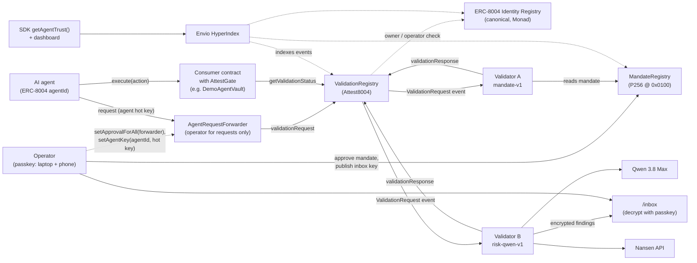
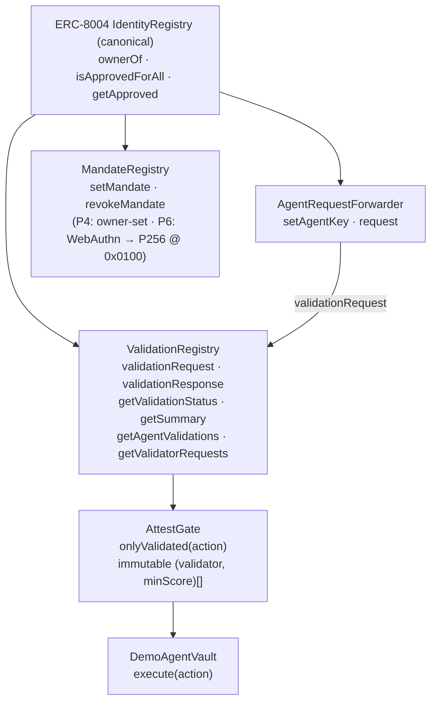
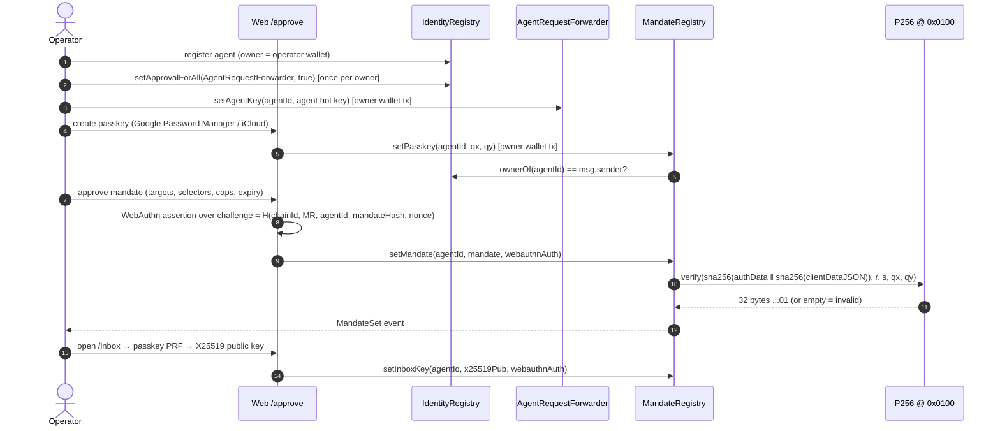
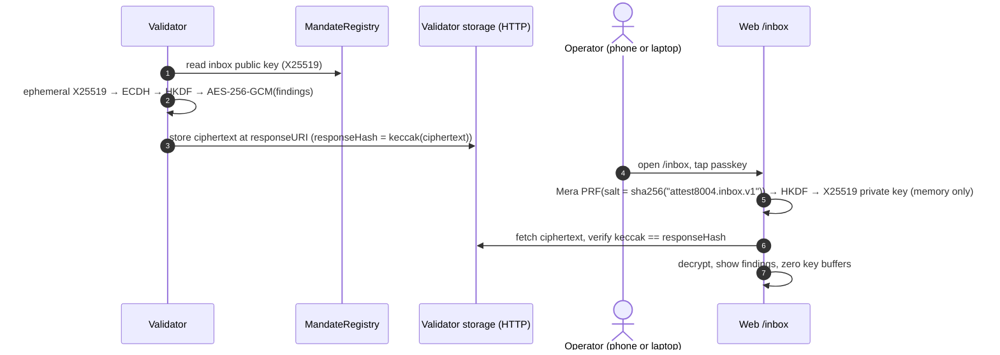

# Attest8004 — Architecture

> **Status:** design reference v0.1 (2 Oct 2026), kept in sync with the code as it is built (P3, 3 Oct 2026: the forwarder, the SDK client and validator base).
> **Rule:** any change to an interface, flow, data format or trust assumption updates this file **in the same commit**.
> Build scope and acceptance criteria live in [`SPEC.md`](./SPEC.md). This file explains *how the system works and why*.

---

## 1. What it is

AI agents on Monad already have identity through the canonical **ERC-8004 Identity Registry**, and feedback through the **Reputation Registry**. What's missing is the third ERC-8004 piece, the **Validation Registry**: a neutral, onchain record that *an independent party checked this agent's action, and here is the verdict*. Monad's docs list it as "coming soon", and there is no canonical deployment on any chain. Attest8004's spec-conformant (non-canonical) registry is live on Monad testnet; see `docs/deployments.md`.

Attest8004 provides that layer:

1. **ValidationRegistry**: implements the EIP-8004 validation interface and authorises callers through the canonical Identity Registry.
2. **Passkey-approved mandates**: the agent's operator states what the agent may do (targets, functions, spend caps, expiry) and approves it with a passkey, verified onchain by Monad's P256 precompile (`0x0100`).
3. **Validators**:
   - `mandate-v1`: deterministic; anyone can re-run it and get the same verdict.
   - `risk-qwen-v1`: agentic; Qwen 3.8 Max plans tool calls over simulation, Nansen data and ERC-8004 reputation.
4. **AttestGate**: a modifier that lets any contract refuse an action unless every validator it requires has given a sufficient verdict for *exactly that action*, which then runs once.
5. **Private findings inbox**: detailed findings are encrypted to a key derived from the operator's passkey (Mera PRF). It's never stored, and can be re-derived on any device.
6. **Trust API**: Envio indexes everything into per-agent and per-validator summaries for the SDK and dashboard.

---

## 2. System context



---

## 3. Components

| Layer | Component | Path | Responsibility |
|---|---|---|---|
| Onchain | `ValidationRegistry` | `contracts/src/` | Stores validation requests and responses. EIP-8004 interface. Authorises requesters via the canonical Identity Registry. No admin, not upgradeable. |
| Onchain | `AgentRequestForwarder` | `contracts/src/` | The agent owner's ERC-721 operator for validation requests only. Forwards `validationRequest` for the hot key the agent's owner registered, while that owner still owns the agent. No admin, not upgradeable, holds no funds. |
| Onchain | `MandateRegistry` | `contracts/src/` | The current spending mandate per agent (targets, selectors, value caps, expiry). P4: owner-set, via `setMandate`/`revokeMandate`, both routed through an internal `_authorize` hook. P6 replaces that hook's body with a WebAuthn assertion verified via `0x0100`, and adds the passkey public key and the inbox public key. |
| Onchain | `AttestGate` (abstract contract with the `onlyValidated` modifier) | `contracts/src/` | For each required validator, recomputes that validator's `requestHash` from the call and checks its verdict: the named validator, the agentId and the minimum score. Every requirement must pass, and each action runs once. |
| Onchain | `DemoAgentVault` | `contracts/src/` | Example consumer, bound to one agentId: holds that agent's test funds; `execute(Action)` is gated. |
| Offchain | `@attest8004/sdk` client | `packages/sdk/` | Builds actions, computes `requestHash`, submits requests, waits for verdicts, reads trust summaries. |
| Offchain | `@attest8004/sdk` validator base | `packages/sdk/` | Polls `ValidationRequest` logs from a saved block cursor, verifies each request (data: URI only, hash, validator, agent, chain, deadline), runs `check()`, and posts a response with evidence, once, with an explicit gas limit. |
| Offchain | `mandate-v1` | `validators/mandate/` | Deterministic mandate and permission checks plus simulation at a pinned block. Ships a `verify` CLI for re-execution. |
| Offchain | `risk-qwen-v1` | `validators/qwen/` | Agentic risk assessment: Qwen 3.8 Max with tools (simulation, Nansen, ERC-8004 reputation, permission history). Outputs JSON validated against a schema. |
| Data | Envio indexer | `indexer/` | Indexes requests, responses, mandates, inbox keys and Identity Registry permission events. Derives agent and validator summaries. Serves GraphQL. |
| Client | Web app | `web/` | `/approve` (passkey and mandate), `/inbox` (Mera decrypt), `/dashboard` (trust data). |
| Stretch | CRE workflow | `cre/` | Chainlink CRE orchestration of a validator: log trigger, HTTP call, EVM write. |

---

## 4. Onchain design

### 4.1 Contract relationships



- **ValidationRegistry** reads the Identity Registry only to check that `msg.sender` is the owner or approved operator of `agentId` (`ownerOf`, `isApprovedForAll`, `getApproved`). It never trusts its own callers for this. The Identity Registry address is a **constructor argument** stored as an `immutable`. The EIP describes an `initialize(address)` instead, as used by the reference's upgradeable proxy; we have no proxy, owner or `initialize`, and `getIdentityRegistry()` returns the address. Because the Identity Registry address is part of the init code, the registry's CREATE2 address depends on it: testnet and mainnet use different Identity Registries, so their addresses differ. All differences from the EIP are in [`docs/spec-notes.md`](./docs/spec-notes.md).
- **AgentRequestForwarder** takes the ValidationRegistry as its only constructor argument and reads that registry's Identity Registry (`getIdentityRegistry()`), so the two can't disagree about who owns an agent. The owner approves it as an ERC-721 operator. Its `request` checks the caller is the agent's registered key and that the owner who registered it still owns the agent, then makes exactly one call, `validationRequest`, which the registry accepts because the forwarder is the owner's operator (§7).
- **MandateRegistry** reads the Identity Registry to authorize every mandate change. P4: `setMandate`/`revokeMandate` route through an internal `_authorize(agentId, changeHash)` hook, called before any write, that requires `msg.sender == identityRegistry.ownerOf(agentId)` — the record stores that owner, so a mandate goes stale the moment the agent is transferred, even to an owner who already approved other operators. P6 replaces `_authorize`'s body with a WebAuthn assertion over the agent's passkey; because the hook is internal, that is a new deployment, not an upgrade, and after P6 every mandate or inbox-key change requires the passkey.
- **AttestGate** reads the ValidationRegistry. It holds an **immutable list of `(validator, minScore)` requirements** (1 to 4), chosen by whoever deploys the consumer contract, not by Attest8004, and fixed at deployment. Every requirement must pass.

### 4.2 Canonical addresses used

| Contract | Monad testnet (10143) | Monad mainnet (143) |
|---|---|---|
| ERC-8004 IdentityRegistry | `0x8004A818BFB912233c491871b3d84c89A494BD9e` | `0x8004A169FB4a3325136EB29fA0ceB6D2e539a432` |
| ERC-8004 ReputationRegistry (read only) | `0x8004B663056A597Dffe9eCcC1965A193B7388713` | `0x8004BAa17C55a88189AE136b182e5fdA19dE9b63` |
| P256VERIFY precompile | `0x0100` | `0x0100` |
| Attest8004 contracts | see `docs/deployments.md` | see `docs/deployments.md` |

### 4.3 The action and its hashes (single source of truth)

```solidity
struct Action {
    uint256 agentId;
    address target;
    uint256 value;
    bytes   data;
    uint64  deadline;
    bytes32 salt;
}

// One per validator: the ERC-8004 requestHash submitted to that validator.
requestHash = keccak256(abi.encode(
    block.chainid, gate, validatorAddress, agentId, target, value, keccak256(data), deadline, salt
));

// The same action, whoever validates it. The gate marks it consumed.
actionHash = keccak256(abi.encode(
    block.chainid, gate, agentId, target, value, keccak256(data), deadline, salt
));
```

- A verdict is bound to **one chain, one gate, one validator and one exact action**, with an expiry.
- `validatorAddress` is in `requestHash` because EIP-8004 records exactly one validator per `requestHash` (spec-notes, row 5). An action that needs two validators gets two requests with two hashes.
- `actionHash` leaves the validator out, so consumption is per action: an action runs at most once, however many validators judged it.
- `salt` makes otherwise identical actions distinct.
- The ABI encoding is the "request payload" that the EIP says `requestHash` commits to (spec-notes, row 6). The request JSON at `requestURI` (§6) carries the same fields, and validators recompute the hash from it.
- It's defined once in `contracts/src/ActionHash.sol` and once in `packages/sdk/src/action.ts`. Both are checked against `packages/sdk/test/vectors.json`, whose expected values come from `cast` (`vectors.sh`), so neither implementation grades itself.

### 4.4 Gate check (in order)

`DemoAgentVault.execute` first requires `action.agentId` to be the vault's own agent. Then `onlyValidated`:

1. `block.timestamp <= deadline`.
2. `actionHash` has not been consumed.
3. For each requirement `(validator, minScore)`, in list order (every one must pass):
   1. Recompute `requestHash` for that validator from the call arguments.
   2. `getValidationStatus(requestHash)` must exist. The registry reverts for an unknown hash, and the gate reports `ValidationNotFound`.
   3. The stored `validatorAddress` must be that validator, and the stored `agentId` must be the action's. Anyone who owns an agent can claim a `requestHash` first and name any validator (spec-notes, row 12), so the score alone proves nothing.
   4. `response >= minScore`. `minScore` is at least 1, because a pending request reads as response 0. The latest response counts, so a validator can withdraw a pass, but only if the withdrawal lands before someone executes the action (see below).
4. Mark `actionHash` consumed and emit `ActionConsumed`, **then** make the external call. `execute` also runs under a reentrancy guard (OpenZeppelin `ReentrancyGuardTransient`).

If the call reverts, the whole transaction reverts, consumption included, so the action can be retried until its deadline. `execute` is permissionless: the validated, deadline-bound action is the authorisation, and to cancel it the agent lets it expire. The requirements are packed into immutables, so the check costs one registry read per validator and one storage write.

**For integrators, because anyone can submit a validated action, with any gas limit:**
- A withdrawn pass (a validator lowering its score) can be front-run by someone executing the action first.
- If the target tolerates a failed sub-call (a `try`/`catch`, or a router that skips a failed hop), a submitter can make it fail on purpose with a low gas limit, and the action still counts as executed and consumed. Gate such targets only if a partial execution is acceptable, or restrict who may call the gated function.

`DemoAgentVault`'s actions (native and ERC-20 transfers) don't have the second problem: the call either succeeds or reverts the whole execute.

---

## 5. Key flows

### 5.1 Operator setup (one time per agent)



> **P4 vs. P6.** This diagram is the P6 target. As built in P4, there is no passkey yet: the operator's own wallet calls `setMandate(agentId, mandate)` and `revokeMandate(agentId)` directly on `MandateRegistry`, authorized by `_authorize` requiring `msg.sender == IdentityRegistry.ownerOf(agentId)`. The `setPasskey`, WebAuthn-assertion and `setInboxKey` steps above (and `/inbox`) arrive in P6, which replaces `_authorize`'s owner check with WebAuthn verification.

### 5.2 Validated action (happy path)

```mermaid
sequenceDiagram
  autonumber
  participant A as Agent hot key
  participant F as AgentRequestForwarder
  participant VR as ValidationRegistry
  participant VA as mandate-v1
  participant VB as risk-qwen-v1
  participant G as DemoAgentVault (AttestGate)
  A->>A: build Action; rhA = requestHash(VA), rhB = requestHash(VB)
  A->>F: request(VA, agentId, requestURI_A, rhA)
  F->>VR: validationRequest(VA, agentId, requestURI_A, rhA)
  A->>F: request(VB, agentId, requestURI_B, rhB)
  F->>VR: validationRequest(VB, agentId, requestURI_B, rhB)
  VR-->>VA: ValidationRequest event (rhA)
  VR-->>VB: ValidationRequest event (rhB)
  VA->>VA: load request JSON, recompute rhA, check mandate + permissions, simulate at block N
  VA->>VR: validationResponse(rhA, 100, evidenceURI, evidenceHash, "mandate-v1")
  VB->>VB: Qwen plans → tools (simulate, Nansen, reputation) → JSON verdict
  VB->>VR: validationResponse(rhB, 92, evidenceURI, evidenceHash, "risk-qwen-v1")
  A->>G: execute(action)
  G->>VR: getValidationStatus(rhA), getValidationStatus(rhB)
  G->>G: check validator, agentId and score for each; consume actionHash
  G-->>A: executed
```

> **One request per validator.** EIP-8004 keys a request by `requestHash` and records one validator per request, so each validator gets its own `requestHash` (§4.3) and its own request JSON (§6). The gate recomputes both hashes and consumes the validator-independent `actionHash`. Until P5 the testnet `DemoAgentVault` requires `mandate-v1` (validator A) only, so the flow has a single request.
>
> **Who sends `validationRequest` (decided in P3): the agent's hot key, through `AgentRequestForwarder`.** The registry accepts a request only from the agent's owner or an ERC-721 operator (`isApprovedForAll` / `getApproved`); the `agentWallet` alone is not enough. Making the hot key itself an operator would also let it transfer the agent NFT. So the owner approves the forwarder as operator once (`setApprovalForAll`) and registers the hot key with `setAgentKey(agentId, key)`. The forwarder forwards `request(...)` from that key, and only while the owner who registered it still owns the agent, as exactly one `validationRequest` call. The owner can still call the registry directly. The trade-off of the blanket approval is in §7.
>
> Details: [`docs/spec-notes.md`](./docs/spec-notes.md), rows 5, 7, 10 and 12.

### 5.3 Blocked attack (demo: the Grok/Bankr pattern)
1. A permission change happens outside the mandate: a new operator approval on the agent in the Identity Registry.
2. The agent is induced to transfer funds to an unknown address.
3. `mandate-v1` sees (a) a target not on the allowlist or above the cap, and (b) a permission change after the last passkey-approved mandate. It scores 0, with machine-readable reasons.
4. `risk-qwen-v1` explains the risk using Nansen data on the counterparty, and scores it low.
5. `execute(action)` reverts at the gate.
6. The full detail goes to the operator's encrypted inbox. Only the score and evidence hash are public.

### 5.4 Private findings, any device



The same synced passkey gives the same PRF output on every device, so the phone decrypts exactly what the laptop does. Nothing secret is ever written to storage.

### 5.5 Re-execute a verdict (why `mandate-v1` is "trust", not "opinion")

```
pnpm attest8004 verify <requestHash> [--rpc-url URL] [--json]
```
Anyone can run this from the repo root. It re-runs a `mandate-v1` verdict from chain data alone, at the block its evidence pinned, and compares the result with what the validator posted. It is read-only and needs no `.env`: the RPC is `--rpc-url`, else `MONAD_TESTNET_RPC_URL`, else the public testnet RPC. The CLI's own output never prints the URL it was given; errors show viem's short message only. **pnpm itself echoes the command line it runs**, so a URL with an API key belongs in the environment, not in `--rpc-url`: `MONAD_TESTNET_RPC_URL=<url> pnpm attest8004 verify <requestHash>` (or set it in `.env`), or `pnpm -s attest8004 verify … --rpc-url <url>`. The code is `verifyRequest` in `validators/mandate/src/verify.ts`, behind the CLI in `src/cli.ts`. There is no `npx attest8004` command: the package is private, has no `bin` and runs as TypeScript source, so shipping a CLI package is a later decision.

It stops at the first problem:
1. **Status.** It reads `getValidationStatus(requestHash)` at the finalized head. If the registry has no such request, that's `REQUEST_NOT_FOUND`; if the request has no response yet, `RESPONSE_NOT_FOUND`; if the tag isn't `mandate-v1`, `NOT_MANDATE_V1`.
2. **Response log.** It finds the `ValidationResponse` log through the status's `lastUpdate` timestamp: an interpolation search for the blocks with that timestamp, then one `eth_getLogs`. This is the same lookup spend accounting uses. If none is found, that's `RESPONSE_NOT_FOUND`.
3. **Keccak check.** The evidence must be inline JSON that `verify` decodes: a `data:` URI of at most 128 KiB (`verify` never fetches). If it isn't, nothing was compared (`EVIDENCE_NOT_DECODED`). The decoded bytes must hash to the onchain `responseHash` (`EVIDENCE_HASH_MISMATCH` otherwise). The evidence must also name a pinned block and the request's block; a document that doesn't is no `mandate-v1` evidence at all (`RESPONSE_HASH_MISMATCH`).
4. **The pin.** `P` is the evidence's `block.number`. It must be at or after the evidence's request block and at or before the block the response landed in. It must also be at or after the MandateRegistry's deployment block, recorded in the SDK's `DEPLOYMENTS` (testnet: 67,842,487). Before that the mandate can't be read (the address has no code, so the read returns no data), so no honest run pins there, and `verify` says so without reading at `P`. Any of these fails as `PIN_OUT_OF_RANGE`.
5. **Request log.** It reads the `ValidationRequest` log in the evidence's request block.
   - **A block before the ValidationRegistry existed is wrong, with no read** (`REQUEST_BLOCK_WRONG`). The deployment block is recorded in the SDK's `DEPLOYMENTS` (testnet: 67,604,893, the deploy transaction's block). Before it the registry has no code, so a status read there returns no data instead of reverting, and couldn't prove anything.
   - **If no log is returned, state decides.** The registry refuses to reuse a `requestHash` (`RequestExists`), so a request was made in exactly one block: the first at which its status exists. If the status exists at the evidence's request block and reverts `UnknownRequest` one block before it (no second read when that block is the deployment block itself), the block is right and only the log is missing (`REQUEST_NOT_FOUND`: lag, not evidence). Otherwise the evidence names the wrong block (`REQUEST_BLOCK_WRONG`). So a validator can't turn its verdict into "could not verify" by misstating that one field. Only the registry's `UnknownRequest` revert, in any of the shapes viem reports it, counts as "not made yet"; any other failure of these reads is an error (exit 2), never a mismatch.
   - The log's request JSON must hash to `requestHash` and name the validator and agent the registry records. If not (`REQUEST_INVALID`), the validator answered a request it must refuse; the SDK's base never answers one. `MandateValidator` pins its request size limit to the SDK's 16 KB (`MAX_REQUEST_URI_BYTES`), the same limit `verify` decodes, so it never answers a request `verify` would call invalid.
6. **Re-run.** It runs `runMandateV1` at `P`, as that validator, with an **empty cache**: every past approval's amount is rebuilt from its own posted evidence, as a restarted validator would. It uses the contracts in the SDK's `DEPLOYMENTS` for the chain, so evidence that names other contracts doesn't reproduce. Then it rebuilds the document with `buildEvidence` and hashes its canonical JSON.
7. **Compare.** The score must match (`SCORE_MISMATCH`), and so must the `responseHash` (`RESPONSE_HASH_MISMATCH`). The report lists the top-level evidence keys whose canonical JSON differs (`differingKeys`), such as `block` for a moved pin or `params` for another contract.

| Exit | Verdict | When |
|---|---|---|
| 0 | `match` | The same score and the same `responseHash`. |
| 1 | `mismatch` | `SCORE_MISMATCH`, `RESPONSE_HASH_MISMATCH`, `EVIDENCE_HASH_MISMATCH`, `PIN_OUT_OF_RANGE`, `REQUEST_BLOCK_WRONG` or `REQUEST_INVALID`. This is public proof that the validator misbehaved, because it signed both the score and the evidence's hash, and the facts compared against are onchain. |
| 2 | could not verify | A usage or RPC error (an `eth_call` answered with no hex result counts as one, never as chain state), `REQUEST_NOT_FOUND`, `RESPONSE_NOT_FOUND`, or an input log the re-run can't find. A missing log is lag, not evidence. `EVIDENCE_NOT_DECODED` lands here too: evidence that isn't an inline `data:` URI, is over 128 KiB or is malformed was never compared. So does `NOT_MANDATE_V1`: another validator's verdict, such as an agentic `risk-qwen-v1` one, isn't re-executable by design, and its tag proves nothing against it. |

The output starts with the verdict (`match`, `MISMATCH` or `could not verify`), then shows the validator, the pinned block (number, hash and time), the posted and recomputed score and `responseHash`, the reasons, the spend entries, the number of permission events, the problems and the differing keys. `--json` prints the same report as one line, with bigints as decimal strings. Errors show viem's short message only.

**History.** Every input is re-read from state at `P`, so the RPC must still serve that block. The public testnet RPC serves about 51 days of history (measured 3 Oct 2026); older blocks fail with `-32602`. Older verdicts need an archive RPC: `MONAD_TESTNET_RPC_URL=<archive url> pnpm attest8004 verify <requestHash>`.

---

## 6. Data formats

**Request JSON v1.** Referenced by `requestURI` as a `data:application/json` URI (base64 or percent-encoded), so no hosting is needed. There is one per validator, because `validator` is part of `requestHash`.
```json
{
  "schema": "attest8004.request.v1",
  "chainId": 10143,
  "gate": "0x…",
  "validator": "0x…",
  "agentId": "42",
  "action": { "target": "0x…", "value": "0", "data": "0x…", "deadline": "1760000000", "salt": "0x…" }
}
```
`agentId`, `value` and `deadline` are decimal strings without leading zeros, so values above 2^53 survive JSON; `chainId` is a JSON number (a safe integer). Addresses may be lower-case or EIP-55 checksummed. The schema is strict: an unknown key anywhere rejects the request, so everything a validator reads is covered by the hash. It is defined once, in zod, in `packages/sdk/src/request.ts` (`buildRequestJson`, `parseRequestUri`).

`requestURI` is attacker-controlled. `parseRequestUri` accepts only a `data:application/json[;charset=utf-8][;base64],…` URI of at most **16 KB (16,384 bytes)**, printable ASCII, that decodes to valid UTF-8 JSON. It **never fetches** anything: an `https://` or `ipfs://` request URI is rejected, not followed.

Validators **must** recompute `requestHash` from this JSON (§4.3) and reject it on mismatch. They must also reject it if `validator` isn't themselves, or if `agentId` differs from the `agentId` in the `ValidationRequest` event (someone else's agent may have claimed the hash first; spec-notes, row 12). The hash commits to the ABI encoding of these fields, not to the JSON bytes, so whitespace and key order don't matter.

**How the SDK's `ValidatorBase` applies this** (`packages/sdk/src/validator.ts`):
1. It finds requests by polling `eth_getLogs` for `ValidationRequest` with its own `validatorAddress`, from a saved block cursor (the last block it fully processed), at most 100 blocks per query, up to the `finalized` head. A crash at any point re-reads blocks rather than skipping them.
2. If `getValidationStatus` shows a response already (a non-zero `responseHash` or a tag; its own responses always have both), it does nothing more: `ALREADY_RESPONDED`.
3. It **doesn't respond at all**, and logs one of these reasons, when the URI isn't an acceptable `data:` URI (`URI_NOT_DATA`, `URI_TOO_LARGE`, `URI_MALFORMED`), the JSON is invalid (`JSON_INVALID`, `SCHEMA_INVALID`), the JSON hashes to another `requestHash` (`HASH_MISMATCH`), names another validator (`WRONG_VALIDATOR`), another agent than the event (`AGENT_MISMATCH`) or another chain (`WRONG_CHAIN`), or the deadline is before the head block's time (`DEADLINE_PASSED`) or more than `maxDeadlineAheadSeconds` (default 3,600) after it (`DEADLINE_TOO_FAR`).
4. A subclass may turn a valid request away with `accepts()`. Returning `false` declines it silently: no response, no retries, logged as `DECLINED` with no detail. Returning `{ decline: "<reason>" }` does the same but carries that reason: it becomes the outcome's `detail` and is logged once at `warn` (e.g. a per-agent rate limit or a daily gas budget exhausted). The e2e's stub validator declines every request except its own this way.
5. Otherwise it runs the subclass's `check()` and builds the evidence JSON v1 with `buildEvidence()` (the base's fields, then the subclass's own), publishes it as **canonical JSON** so `responseHash = keccak256` of those exact bytes, checks the status again, and sends `validationResponse` with a gas limit resolved from either a literal or an evidence-sized headroom policy (`writeWithGasGuard`), after the estimate guard. Once the send lands, it calls the subclass's `onResponded()` once with the block the response landed in and the gas limit that was sent — never when the status check alone found it already answered, since nothing landed through that call. A subclass can use the hook to record spend or update a rate-limit counter; a throw from it is logged and swallowed, because the response already landed and retrying would double-post. A failed send is retried, after checking that it didn't land. A request that keeps failing stops the cursor just before its block, and the next cycle retries it after a wait that doubles each time (2 s, 4 s, 8 s, … by default); after 5 failed cycles it is logged as given up and skipped. Errors are logged with viem's short message, never the full one, which can contain the RPC URL and its API key.

**Evidence JSON v1.** Referenced by `responseURI`, as **canonical JSON** (the "Reproducibility" constraint: sorted keys, no whitespace, integers above 2^53 as decimal strings — `packages/sdk/src/canonical.ts`; in practice every `bigint` in code, such as a block number, a timestamp, a wei amount or a gas figure, is written as a decimal string, while `chainId` and `logIndex` are JSON numbers). `responseHash = keccak256` of those exact bytes, so a `verify` command can recompute a `CheckResult`, rebuild the document byte for byte with the same `buildEvidence()` the base used, and get the same hash. Every validator's document starts with the base's keys (`schema`, `validator`, `requestHash`, `score`, `reasons`); the validator adds its own after them and may not reuse those. `mandate-v1`'s document (`mandateEvidence()` in `validators/mandate/src/evidence.ts`) is shown here with whitespace for readability; the real bytes have none, and sort these keys alphabetically.
```json
{
  "schema": "attest8004.evidence.v1",
  "validator": "mandate-v1",
  "requestHash": "0x…",
  "score": 0,
  "reasons": ["TARGET_NOT_ALLOWED", "VALUE_OVER_TX_CAP"],
  "block": { "number": "67900000", "hash": "0x…", "timestamp": "1790000000" },
  "request": {
    "block": "67899990", "chainId": 10143, "gate": "0x…", "agentId": "1984", "target": "0x…",
    "value": "3000000000000000", "dataHash": "0x…", "selector": "0x00000000", "deadline": "1790000600", "salt": "0x…"
  },
  "params": {
    "permissionWindowBlocks": "6000", "spendWindowSeconds": "90000", "maxDeadlineAheadSeconds": "3600",
    "simulationGas": "1000000", "identityRegistry": "0x…", "agentRequestForwarder": "0x…", "mandateRegistry": "0x…"
  },
  "mandate": {
    "allowedTargets": ["0x…"], "allowedSelectors": ["0x00000000"], "maxValuePerTx": "2000000000000000",
    "maxValuePerDay": "5000000000000000", "validUntil": "1793404800", "mandateHash": "0x…", "owner": "0x…",
    "setAtBlock": "67890000", "currentOwner": "0x…"
  },
  "spend": {
    "since": "1789910000", "total": "1000000000000000",
    "entries": [{ "requestHash": "0x…", "approvedAt": "1789990000", "gate": "0x…", "value": "1000000000000000",
                  "deadline": "1789990600", "consumed": true, "counted": true }]
  },
  "permissions": { "fromBlock": "67894001", "toBlock": "67900000", "events": [] },
  "simulation": { "ok": true }
}
```
- `block` is the pinned block `P`. Every input is read at `P`, and the verdict's clock is `P`'s timestamp. `P` is the finalized head when the check ran, but never below the request's own block, the block this validator process's last response landed in, or the MandateRegistry's deployment block, and it waits until the process's last approval is visible there; so two requests checked back to back see each other's approval, and `P` always falls between the request's block and the response's. This assumes one validator process per key.
- `request` is the action as its `requestHash` commits to it: `dataHash` instead of the raw `data`, plus the request's block and its `selector` (`0x00000000` for empty data, `null` when the data holds no selector an allowlist can match: 1–3 bytes, or non-empty data starting with `0x00000000`). Spend accounting reads past approvals back from this object (`parseApprovalParts`), so its form is strict: it must recompute to `requestHash`.
- `params` are `mandate-v1`'s constants and the contracts it read; changing any of them means a new tag.
- `mandate` is the record at `P` plus the agent's `currentOwner` there, or `null` when there is none.
- `spend` lists this validator's `mandate-v1` approvals of the agent in the 25 h window, each with whether it counts toward the daily cap (`counted`); it is `{ "unreadable": "…" }` when an approval's evidence was found but failed its checks, and `null` without a mandate.
- `permissions` covers the window `(P − 6,000, P]`, each event with whether it came after the current mandate (`afterMandate`).
- `simulation` is `{ "ok": true }` or `{ "ok": false, "error": "REVERTED" | "INSUFFICIENT_FUNDS" | "OUT_OF_GAS", "revertSelector": "0x…" | null }`.

Because spend accounting and `verify` read it, `mandate-v1`'s evidence stays public plaintext at `responseURI`.

**Findings envelope.** Encrypted to the operator's inbox key.
```json
{ "schema": "attest8004.findings.v1", "epk": "<x25519 ephemeral pub>", "nonce": "…", "ct": "…" }
```

**Tags:** `mandate-v1` and `risk-qwen-v1`. The tag goes in `validationResponse(..., tag)` and is used by `getSummary` and the indexer.

---

## 7. Trust model

| Component | Trusted for | Not trusted for | How it's checked |
|---|---|---|---|
| ValidationRegistry | Faithfully storing requests and responses | Judging anything | Open source, no admin, test suite |
| AgentRequestForwarder | Forwarding `validationRequest` for an agent only from the key its current owner registered | Any other action on the agents it operates for | Open source, immutable, no admin, no funds. Tests pin that `request` makes exactly one call (`validationRequest` on the fixed registry), that the compiled ABI has nothing else, and that ERC-721 calls sent to it fail |
| Canonical Identity Registry | Who owns or operates an `agentId` | — | Canonical ERC-8004 deployment. **It is an upgradeable (UUPS) proxy with an owner**, so its owner can change ownership and approval logic. Our ValidationRegistry pins its address as an `immutable` and inherits that trust. |
| P256 precompile `0x0100` | Raw ECDSA P-256 verification | WebAuthn semantics, low-s | Our contract checks the challenge, flags, rpIdHash and low-s, and checks the return length |
| `mandate-v1` | A deterministic verdict | — | **Anyone can re-execute it** (§5.5) |
| `risk-qwen-v1` | Advisory risk score and explanation | Being "correct". LLMs can be wrong or manipulated | Evidence hash committed onchain, full trace in the evidence, never the only gate |
| Validator storage (HTTP) | Availability | Integrity | `responseHash` onchain |
| Consumer (gate deployer) | Choosing which validators to require and each one's minimum score | — | Fixed at deployment in immutables, readable with `requirements()` |

**The forwarder's approval covers all of the owner's agents (trade-off).** `setApprovalForAll(forwarder, true)` is the only ERC-721 approval that lets a contract act for an agent without a per-token `approve`, but it makes the forwarder an operator for **every** agent that owner holds, now and later, with the power to transfer them. The forwarder never uses that power: its only functions are `setAgentKey` (current owner only) and `request`, which makes one call, `validationRequest`, on a registry fixed at deployment. It has no admin, no upgrade path, no `delegatecall` and no payable function. What remains:
- **A bug in the forwarder** would expose every agent of every owner who approved it. That is why it is about 30 lines and pinned by tests (one call per request, the ABI, ERC-721 calls refused, fuzzed calldata).
- **A stolen hot key** can create validation requests for its own agent only, spending its own MON. It can't move the agent or touch the owner's other agents, and a validator still judges each request. The owner revokes it with `setAgentKey(agentId, address(0))`, or revokes the forwarder entirely with `setApprovalForAll(forwarder, false)`.
- **Ownership changes:** a key stops working when the agent leaves the owner who registered it, even if the new owner also approved the forwarder. If the agent comes back to that owner, the key works again until revoked.
- **Owners who don't want a blanket operator** can approve the forwarder for one agent instead: `approve(forwarder, agentId)`. The registry accepts the token-approved address too (`getApproved`), so the forwarder works unchanged. The exposure is then that one agent, and a transfer clears the approval (pinned by `test_Request_WorksWithPerTokenApproval_OnlyForThatAgent`). The cost is one approval per agent, renewed after any transfer. Owners can also call `validationRequest` from the owner wallet directly. The demo uses the blanket approval, so it also covers the deployer's test agent 1982.

**Two trust modes:**
- **Verifiable** (`mandate-v1`): anyone can reproduce the verdict.
- **Advisory** (`risk-qwen-v1`): adds context but must never be the only check.

The recommended gate policy is *require `mandate-v1` = 100 **and** `risk-qwen-v1` ≥ threshold*.

---

## 8. Keys and secrets

| Key | Type | Lives in | Who controls it | Onchain footprint |
|---|---|---|---|---|
| Operator passkey | P-256 WebAuthn credential | Authenticator (Google Password Manager / iCloud Keychain) | Operator | Public key `(qx, qy)` in MandateRegistry |
| Inbox key | X25519, derived from passkey PRF | **Nowhere.** Derived on demand in the browser, buffers zeroed after use | Operator | Public key in MandateRegistry |
| Operator wallet | secp256k1 | Operator's wallet | Operator | Agent owner in the Identity Registry |
| Agent hot key | secp256k1 | Agent runtime (demo: `.env`, made by `scripts/src/hot-keys.ts`, funded for a few requests) | Agent | Registered with `AgentRequestForwarder.setAgentKey`. Calls `forwarder.request` for its own agent only. It is not an ERC-721 operator, so it can't transfer the agent NFT. `execute` is permissionless, so it may also submit validated actions. |
| Validator A / B keys | secp256k1 | Validator service env (`.env`, never committed) | Validator operator | `validatorAddress` in requests and responses |
| Deployer | secp256k1 | `.env` | Builder | Deploys only. No admin rights afterwards. |
| API keys (Qwen, Nansen, Envio) | Bearer tokens | Validator or indexer env | Builder | None |

The LLM never sees or holds any private key. Validators sign; the model only proposes a structured verdict, which is checked against a schema.

---

## 9. Security design decisions

- **The P256 return check:** `0x0100` returns *empty bytes* for an invalid signature. We require `returndata.length == 32 && uint256(returndata) == 1`.
- **Low-s enforced** (the precompile doesn't), so a passkey signature can't be altered into a second valid form.
- **WebAuthn binding:** the challenge commits to the chain, the contract, the agent, the payload hash and a nonce. Checks cover `type == "webauthn.get"`, the UP and UV flags, and the rpIdHash.
- **Replay:** a per-agent nonce on mandate and inbox changes. At the gate, each `actionHash` is single use, marked before the external call, under a reentrancy guard.
- **Verdict reuse** across actions, gates, chains or validators is impossible: the gate recomputes each validator's `requestHash` from the call. It also checks the stored validator and `agentId`, so a hash that another agent claimed first doesn't pass. Execution is permissionless, so a validator's withdrawn pass can be front-run (§4.4).
- **Agent requests:** an agent's hot key never becomes an ERC-721 operator. The owner approves `AgentRequestForwarder`, which forwards only `validationRequest`, only from the key the current owner registered (§5.2, §7).
- **Gas:** Monad charges on the *gas limit*, so every transaction sets an explicit, tight limit.
- **LLM output** is untrusted data: schema-validated, capped tool calls and tokens, temperature 0–0.2, full trace kept.
- **Secrets:** gitleaks runs as a pre-commit hook and over the full history before the repo goes public. Only `.env.example` is committed.
- **No upgradeability or admin** in our registries, so nothing can be swapped out after deployment. The canonical Identity Registry they read *is* upgradeable by its owner (§7).

---

## 10. Why Monad

- **The native P256 precompile (`0x0100`)** makes passkey-approved mandates cheap to verify onchain (6,900 gas).
- **Canonical ERC-8004 Identity and Reputation registries are live on Monad**, so Attest8004 completes the trio rather than inventing a parallel identity system.
- **Sub-second finality and low fees** make *per-action* validation practical: request, verdict and gated execution fit inside an agent's normal latency budget.
- **Monad's agent focus** (ERC-8004 docs, an x402 facilitator, Mera passkeys) means the first users are already building here.

---

## 11. Environments

| Env | Chain | Used for |
|---|---|---|
| Local | Anvil (fork of Monad testnet) | Unit and fork tests |
| Testnet | Monad testnet `10143` | Main deployment, demo, external integrations |
| Mainnet | Monad `143` | Only if Envio requires it for indexing |

The web app is deployed early to a **fixed domain**, because passkeys are bound to the rpId. Demo passkeys are created on that domain, not on localhost.

---

## 12. Extension points and roadmap

- **Canonical registry migration:** the same EIP-8004 interface, so offchain clients only switch the address when the official Validation Registry ships. An `AttestGate` consumer has the registry as an immutable and no owner, so it is redeployed pointing at the new registry.
- **Economic security:** validator staking and slashing for provably wrong `mandate-v1` verdicts (proved by re-execution).
- **More validator types:** TEE-attested validators and zk proofs of model inference, using the ERC-8004 `supportedTrust` modes.
- **Paid validations:** validators charge per request via x402 (Monad facilitator).
- **Orchestration:** a Chainlink CRE workflow as a decentralised validator runner.
- **BTX encrypted mempool (future):** submit validation requests encrypted until ordering, so attackers can't front-run a pending verdict. *Not live; design note only.*
- **Red-team attestations:** security audit and red-team results posted as validations, so an agent's "audited" status becomes machine-checkable.

---

## 13. Repo map

```
attest8004/
  ARCHITECTURE.md   ← this file
  SPEC.md           build scope + acceptance criteria
  CLAUDE.md         rules for the AI coding agent
  STATUS.md         progress log
  contracts/        Foundry: src/, test/, script/
  packages/sdk/     @attest8004/sdk (client + validator base)
  validators/       mandate/, qwen/
  indexer/          Envio HyperIndex
  web/              /approve, /inbox, /dashboard
  cre/              (stretch) Chainlink CRE workflow
  scripts/          @attest8004/scripts: operational scripts (round trip, hot keys, demo agents, end to end)
  docs/             quickstart, API ref, threat model, deployments, spec-notes.md, nansen.md, mera.md, security-review.md
```
