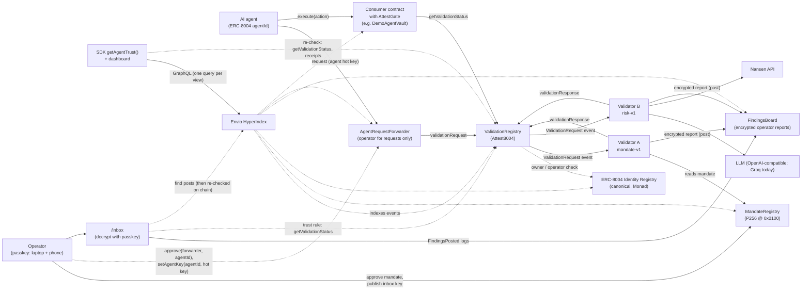
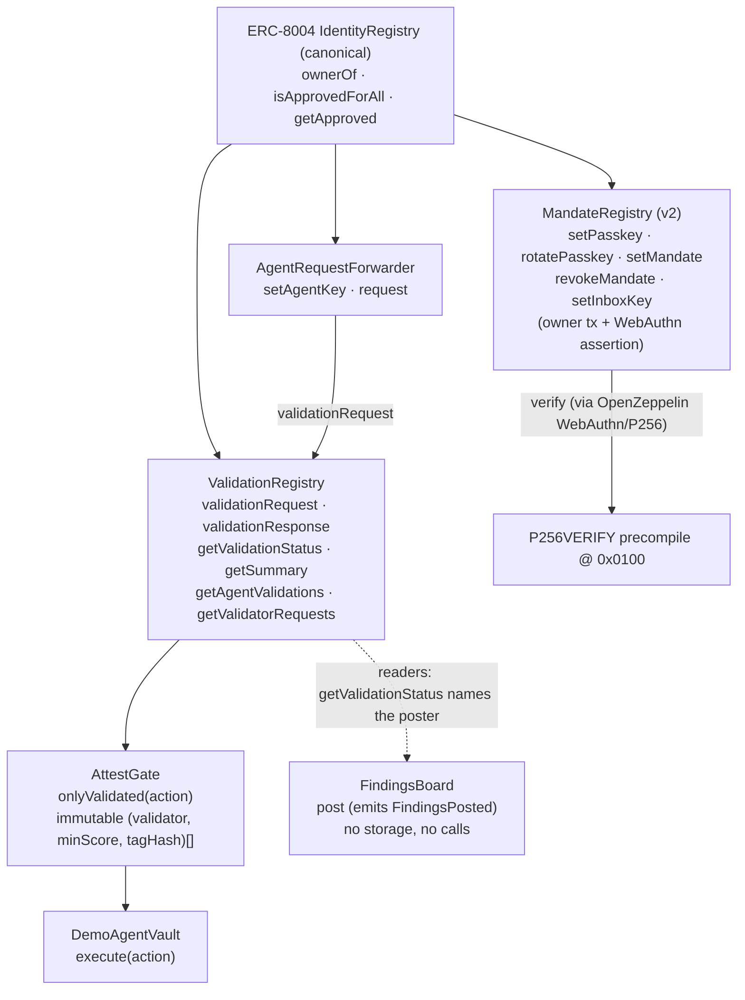
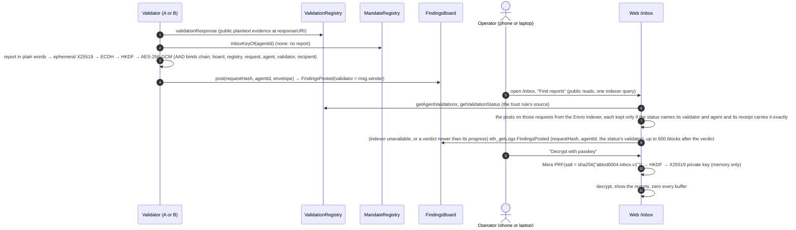
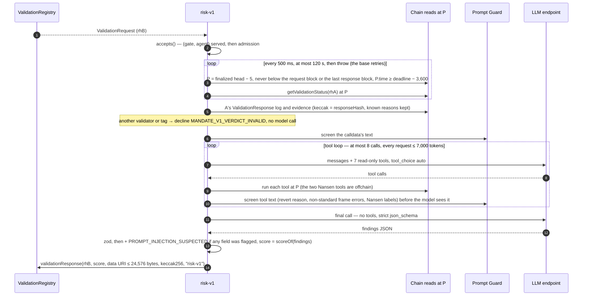
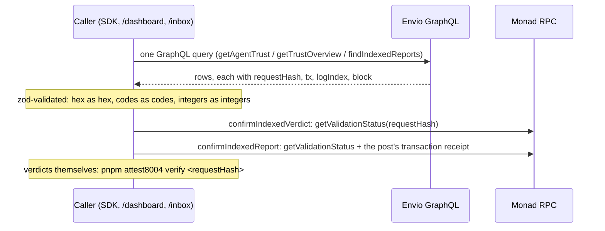

# Attest8004 — Architecture

> **Status:** design reference v0.1 (2 Oct 2026), kept in sync with the code as it is built (P4, 3 Oct 2026: the owner-set MandateRegistry, the `mandate-v1` validator and `verify`, and per-agent forwarder approvals in the demo; P5, 4 Oct 2026: `risk-v1` is built (§5.6, its evidence in §6) and tested against fakes and recorded Groq runs; the gate's tag requirement (§4.1, §4.4), the two-validator vault and the demo "risky but mandated" target `DemoPassThrough` are **deployed**; the `verify` CLI now lives in `packages/cli` and re-checks both validators' tags (§5.5); agent 1984's mandate now allowlists `DemoPassThrough` next to the deployer. **The live end-to-end run with both validators passed** on 4 Oct 2026: `risk-v1`'s first testnet verdicts, and all six verdicts `match` under `verify` (docs/deployments.md)). P6, in progress: MandateRegistry v2 (every mandate, passkey and inbox-key change needs the owner's transaction **and** a passkey assertion verified through `0x0100`, §4.1, §7, §9) is **deployed** on testnet at `0x2Ee5f78149762DE630c6bFF8CD81166010D0454B` (block 68,196,462), with P4's registry kept in the history for older verdicts (§6); the `/approve` page is live (§5.1). On 5 Oct 2026 a real Google Password Manager passkey approved agent 1984's mandate from laptop Chrome and, synced, from Chrome on Android, and the e2e passed against v2 (docs/deployments.md). P7: the Mera findings inbox is built: `FindingsBoard` is **deployed** on testnet at `0xa7d52B3B08FAB0cd0527c6242ca678f9Feee6a1c` (block 68,296,810), the validators post encrypted operator reports (§5.4, §6), and `/approve` (section 4) and `/inbox` are live. On 5 Oct 2026 agent 1984's passkey published its inbox key from laptop Chrome, the e2e posted six trusted reports, and laptop Chrome and, synced, Android Chrome both decrypted them (docs/deployments.md, docs/mera.md). P8: the Envio trust API is live (hosted on Envio Cloud, `DEPLOYMENTS[10143].trustApi`, docs/deployments.md): an indexer of every Attest8004 contract and the canonical Identity Registry's ownership events for our agents (§6), the SDK's trust API with its chain re-checks (§5.7), `/inbox` finding reports through it (§5.4) and `/dashboard` (§9). It is a convenience, never a trust root (§7). P11 (6 Oct 2026): **validator C**, a Chainlink CRE workflow orchestrating `mandate-v1` (§5.8), is live on testnet as `CreValidator` `0x6D12F00870cB6edA2d8e389696f6B5d050423B95` behind CRE's mock forwarder: a CRE workflow (simulation forwarder, not a trust root); no gate requires it (§7, §9; docs/cre.md).
> **Rule:** any change to an interface, flow, data format or trust assumption updates this file **in the same commit**.
> Build scope and acceptance criteria live in [`SPEC.md`](./SPEC.md). This file explains *how the system works and why*.

---

## 1. What it is

AI agents on Monad already have identity through the canonical **ERC-8004 Identity Registry**, and feedback through the **Reputation Registry**. What's missing is the third ERC-8004 piece, the **Validation Registry**: a neutral, onchain record that *an independent party checked this agent's action, and here is the verdict*. Monad's docs list it as "coming soon", and there is no canonical deployment on any chain. Attest8004's spec-conformant (non-canonical) registry is live on Monad testnet; see `docs/deployments.md`.

Attest8004 provides that layer:

1. **ValidationRegistry**: implements the EIP-8004 validation interface and authorises callers through the canonical Identity Registry.
2. **Passkey-approved mandates**: the agent's operator states what the agent may do (targets, functions, spend caps, expiry) and approves it with a passkey, verified onchain by Monad's P256 precompile (`0x0100`).
3. **Validators**:
   - `mandate-v1`: deterministic; anyone can re-run it and get the same verdict.
   - `risk-v1`: agentic; an OpenAI-compatible LLM (Groq today) plans tool calls over simulation, Nansen data and ERC-8004 reputation.
4. **AttestGate**: a modifier that lets any contract refuse an action unless every validator it requires has given a sufficient verdict for *exactly that action*, which then runs once.
5. **Private findings inbox**: detailed findings are encrypted to a key derived from the operator's passkey (Mera PRF). It's never stored, and can be re-derived on any device.
6. **Trust API**: Envio indexes everything into per-request, per-agent and per-validator records for the SDK, the dashboard and the inbox. It is a convenience: every record links back to the chain, and no verdict ever reads it (§7).

---

## 2. System context



---

## 3. Components

| Layer | Component | Path | Responsibility |
|---|---|---|---|
| Onchain | `ValidationRegistry` | `contracts/src/` | Stores validation requests and responses. EIP-8004 interface. Authorises requesters via the canonical Identity Registry. No admin, not upgradeable. |
| Onchain | `AgentRequestForwarder` | `contracts/src/` | The agent owner's ERC-721 operator for validation requests only. Forwards `validationRequest` for the hot key the agent's owner registered, while that owner still owns the agent. No admin, not upgradeable, holds no funds. |
| Onchain | `MandateRegistry` | `contracts/src/` | The current spending mandate per agent (targets, selectors, value caps, expiry), the agent's passkey public key and its inbox public key. v2 (P6): every change needs the owner's transaction and a WebAuthn assertion from the agent's passkey, verified via `0x0100`; revoking needs the owner only. (P4's live deployment is owner-set.) |
| Onchain | `FindingsBoard` | `contracts/src/` | Carries validators' encrypted operator reports: `post(requestHash, agentId, envelope)` emits `FindingsPosted` with the poster as `validator`. Stores nothing and judges nothing; envelopes are capped at 8,192 bytes. A reader trusts a post only when `getValidationStatus(requestHash)` names that validator and agent (§6). No admin, no storage, no constructor arguments, holds no funds. |
| Onchain | `AttestGate` (abstract contract with the `onlyValidated` modifier) | `contracts/src/` | For each required validator, recomputes that validator's `requestHash` from the call and checks its verdict: the named validator, the agentId and the minimum score. Every requirement must pass, and each action runs once. |
| Onchain | `DemoAgentVault` | `contracts/src/` | Example consumer, bound to one agentId: holds that agent's test funds; `execute(Action)` is gated. |
| Offchain | `@attest8004/sdk` client | `packages/sdk/` | Builds actions, computes `requestHash`, submits requests, waits for verdicts, reads trust summaries. |
| Offchain | `@attest8004/sdk` validator base | `packages/sdk/` | Polls `ValidationRequest` logs from a saved block cursor, verifies each request (data: URI only, hash, validator, agent, chain, deadline), runs `check()`, and posts a response with evidence, once, with an explicit gas limit. |
| Offchain | `mandate-v1` | `validators/mandate/` | Deterministic mandate and permission checks plus simulation at a pinned block. `verifyRequest` re-executes a posted verdict (§5.5). |
| Offchain | `risk-v1` | `validators/risk/` | Agentic risk assessment: an OpenAI-compatible LLM (Groq today) with read-only onchain tools (simulation, ERC-8004 reputation, permission history) and Nansen. Outputs JSON validated against a schema and scored by code. `verifyRiskRequest` re-checks a posted verdict without re-running the model (§5.5). |
| Offchain | `attest8004` CLI | `packages/cli/` | `pnpm attest8004 verify <requestHash>`: reads the response's tag and re-runs a `mandate-v1` verdict or re-checks a `risk-v1` one (model output recorded, not re-run). Read-only. |
| Data | Envio indexer | `indexer/` | Envio HyperIndex V3 (`config.yaml`, `schema.graphql`, handlers in `src/handlers/`): indexes every Attest8004 contract from its deploy block (both MandateRegistries each in its own epoch), and the canonical Identity Registry's `Transfer`/`Approval`/`ApprovalForAll` for agents that use our contracts. Derives per-request, per-validator and per-agent summaries; serves GraphQL. **A convenience, never a trust root** (§7). |
| Client | Web app | `web/` | `/approve` (passkey and mandate), `/inbox` (Mera decrypt), `/dashboard` (trust data). |
| Onchain | `CreValidator` (validator C, P11) | `contracts/src/` | Chainlink CRE's `IReceiver`: accepts a report only from its forwarder (CRE's mock forwarder on testnet), checks the report's workflow owner and name, refuses a request that already has a response, and posts `validationResponse` under the fixed tag `mandate-v1`. No owner, setters, funds or upgrade path. **CRE workflow (simulation forwarder, not a trust root)** (§7). |
| Offchain | `mandate-v1` `/evaluate` (P11) | `validators/mandate/src/evaluate*.ts` | Read-only `POST /evaluate` on 127.0.0.1: `mandate-v1`'s verdict and canonical evidence at a given pin (`evaluateAtPin`: verify's `requestAt`, `runMandateV1`, `buildEvidence`), as a memoized long-poll. No keys; validator A's (gate, agent) allowlist. |
| Orchestration | Validator C's CRE workflow (P11) | `cre/validator-c/` | Chainlink CRE (TypeScript SDK, `cre workflow simulate --broadcast`): log trigger on `ValidationRequest` naming C, its own EVM reads, `/evaluate` through identical-aggregation consensus, evidence cross-checks, a gas-guarded write through the forwarder, a landing check (§5.8; docs/cre.md). |

---

## 4. Onchain design

### 4.1 Contract relationships



- **ValidationRegistry** reads the Identity Registry only to check that `msg.sender` is the owner or approved operator of `agentId` (`ownerOf`, `isApprovedForAll`, `getApproved`). It never trusts its own callers for this. The Identity Registry address is a **constructor argument** stored as an `immutable`. The EIP describes an `initialize(address)` instead, as used by the reference's upgradeable proxy; we have no proxy, owner or `initialize`, and `getIdentityRegistry()` returns the address. Because the Identity Registry address is part of the init code, the registry's CREATE2 address depends on it: testnet and mainnet use different Identity Registries, so their addresses differ. All differences from the EIP are in [`docs/spec-notes.md`](./docs/spec-notes.md).
- **AgentRequestForwarder** takes the ValidationRegistry as its only constructor argument and reads that registry's Identity Registry (`getIdentityRegistry()`), so the two can't disagree about who owns an agent. The owner approves it as an ERC-721 operator. Its `request` checks the caller is the agent's registered key and that the owner who registered it still owns the agent, then makes exactly one call, `validationRequest`, which the registry accepts because the forwarder is the owner's operator (§7).
- **MandateRegistry** (v2, P6) reads the Identity Registry to authorize every change, and calls the P256 precompile (through OpenZeppelin's `WebAuthn`/`P256`) for the passkey-approved ones. Its constructor takes the Identity Registry and `rpIdHash` (`sha256("attest8004.vercel.app")`), both immutable. The owner binds a passkey to the agent once (`setPasskey`, owner only, the key must be on the curve). After that, `setMandate`, `rotatePasskey` and `setInboxKey` each need **two factors**, checked by one internal hook, `_authorize(agentId, changeHash, auth)`, before any write: `msg.sender == identityRegistry.ownerOf(agentId)` (an operator or approved address is not enough), then a WebAuthn assertion from the agent's passkey over `challengeFor(agentId, changeHash, nonce)` (§9). Success increments the agent's nonce. `revokeMandate` needs the owner only and also increments the nonce (§7). The mandate record still stores the owner who set it, so a mandate goes stale the moment the agent is transferred, even to an owner who already approved other operators. `MandateSet` and `MandateRevoked` keep P4's exact signatures, so one ABI decodes both registries. v2 replaced P4's source in place (P4's deployed source is at commit `6e08223`); it is a new deployment, not an upgrade.
- **FindingsBoard** (P7) calls nothing and stores nothing. `post(requestHash, agentId, envelope)` emits `FindingsPosted(requestHash indexed, agentId indexed, validator indexed = msg.sender, envelope)` and reverts `EnvelopeTooLarge` above `MAX_ENVELOPE_BYTES = 8192`. Anyone can post; the board doesn't check the registry, so the trust rule lives in readers: a post counts only when `ValidationRegistry.getValidationStatus(requestHash)` names that post's validator and agent, and every reader asks the RPC only for posts whose indexed `validator` and `agentId` match the status, then checks again in code (§6). It has no constructor arguments, so its CREATE2 address is the same wherever the factory exists. Validators' public plaintext evidence stays at their `responseURI`; the board carries only ciphertext for the agent's inbox key.
- **AttestGate** reads the ValidationRegistry. It holds an **immutable list of `(validator, minScore, tagHash)` requirements** (1 to 4), chosen by whoever deploys the consumer contract, not by Attest8004, and fixed at deployment. Every requirement must pass, including the tag: `requestHash` already binds one validator to one exact action, but not to any particular check that validator ran for it, so the gate also requires the stored tag to hash to the requirement's `tagHash` — a verdict from some other check that same validator happens to run for the same action doesn't satisfy it. The constructor rejects a zero `tagHash`, because no real tag hashes to the zero value, so it would be a requirement nothing could ever satisfy.

### 4.2 Canonical addresses used

| Contract | Monad testnet (10143) | Monad mainnet (143) |
|---|---|---|
| ERC-8004 IdentityRegistry | `0x8004A818BFB912233c491871b3d84c89A494BD9e` | `0x8004A169FB4a3325136EB29fA0ceB6D2e539a432` |
| ERC-8004 ReputationRegistry (read only) | `0x8004B663056A597Dffe9eCcC1965A193B7388713` | `0x8004BAa17C55a88189AE136b182e5fdA19dE9b63` |
| P256VERIFY precompile | `0x0100` | `0x0100` |
| Attest8004 contracts | see `docs/deployments.md` | see `docs/deployments.md` |

### 4.3 The action and its hashes (single source of truth)

```solidity
struct Action {
    uint256 agentId;
    address target;
    uint256 value;
    bytes   data;
    uint64  deadline;
    bytes32 salt;
}

// One per validator: the ERC-8004 requestHash submitted to that validator.
requestHash = keccak256(abi.encode(
    block.chainid, gate, validatorAddress, agentId, target, value, keccak256(data), deadline, salt
));

// The same action, whoever validates it. The gate marks it consumed.
actionHash = keccak256(abi.encode(
    block.chainid, gate, agentId, target, value, keccak256(data), deadline, salt
));
```

- A verdict is bound to **one chain, one gate, one validator and one exact action**, with an expiry.
- `validatorAddress` is in `requestHash` because EIP-8004 records exactly one validator per `requestHash` (spec-notes, row 5). An action that needs two validators gets two requests with two hashes.
- `actionHash` leaves the validator out, so consumption is per action: an action runs at most once, however many validators judged it.
- `salt` makes otherwise identical actions distinct.
- The ABI encoding is the "request payload" that the EIP says `requestHash` commits to (spec-notes, row 6). The request JSON at `requestURI` (§6) carries the same fields, and validators recompute the hash from it.
- It's defined once in `contracts/src/ActionHash.sol` and once in `packages/sdk/src/action.ts`. Both are checked against `packages/sdk/test/vectors.json`, whose expected values come from `cast` (`vectors.sh`), so neither implementation grades itself.

### 4.4 Gate check (in order)

`DemoAgentVault.execute` first requires `action.agentId` to be the vault's own agent. Then `onlyValidated`:

1. `block.timestamp <= deadline`.
2. `actionHash` has not been consumed.
3. For each requirement `(validator, minScore, tagHash)`, in list order (every one must pass):
   1. Recompute `requestHash` for that validator from the call arguments.
   2. `getValidationStatus(requestHash)` must exist. The registry reverts for an unknown hash, and the gate reports `ValidationNotFound`.
   3. The stored `validatorAddress` must be that validator, and the stored `agentId` must be the action's. Anyone who owns an agent can claim a `requestHash` first and name any validator (spec-notes, row 12), so the score alone proves nothing.
   4. `response >= minScore`. `minScore` is at least 1, because a pending request reads as response 0. The latest response counts, so a validator can withdraw a pass, but only if the withdrawal lands before someone executes the action (see below).
   5. (3.5) `keccak256(bytes(storedTag)) == tagHash`, checked **after** the score so a pending or low-scoring request still reverts `ScoreTooLow` first. A sufficient score under the wrong tag reverts `TagMismatch(validator, requestHash, expected, actual)` — a validator key signs only its own tag, so this is what makes that a contract rule rather than a convention (§9).
4. Mark `actionHash` consumed and emit `ActionConsumed`, **then** make the external call. `execute` also runs under a reentrancy guard (OpenZeppelin `ReentrancyGuardTransient`).

If the call reverts, the whole transaction reverts, consumption included, so the action can be retried until its deadline. `execute` is permissionless: the validated, deadline-bound action is the authorisation, and to cancel it the agent lets it expire. The requirements are packed into immutables, so the check costs one registry read per validator and one storage write.

**For integrators, because anyone can submit a validated action, with any gas limit:**
- A withdrawn pass (a validator lowering its score) can be front-run by someone executing the action first.
- If the target tolerates a failed sub-call (a `try`/`catch`, or a router that skips a failed hop), a submitter can make it fail on purpose with a low gas limit, and the action still counts as executed and consumed. Gate such targets only if a partial execution is acceptable, or restrict who may call the gated function.

`DemoAgentVault`'s actions (native and ERC-20 transfers) don't have the second problem: the call either succeeds or reverts the whole execute.

**The SDK's mirror of this check** (`Attest8004Client.isValidated`, `packages/sdk/src/client.ts`) reads the tag-aware `requirements()` (`{validator, minScore, tagHash}`). Against a pre-P5 gate, whose `Requirement` has two fields (`{validator, minScore}`: the P2 and P3 vaults), the decode fails and `isValidated` rejects with viem's decoding error (with viem 2.57, `PositionOutOfBoundsError`, or `IntegerOutOfRangeError` once a misread field is out of range): safe, since it never returns a wrong `true`, but such gates need their own ABI, as `scripts/src/gated-execute.ts` has.

---

## 5. Key flows

### 5.1 Operator setup (one time per agent)

```mermaid
sequenceDiagram
  autonumber
  actor Op as Operator
  participant W as Web /approve
  participant ID as IdentityRegistry
  participant F as AgentRequestForwarder
  participant MR as MandateRegistry
  participant P as P256 @ 0x0100
  Op->>ID: register agent (owner = operator wallet)
  Op->>ID: approve(AgentRequestForwarder, agentId)  [per agent; the demo's choice, §7]
  Op->>F: setAgentKey(agentId, agent hot key)  [owner wallet tx]
  Op->>W: create passkey (ES256 only, PRF requested; Google Password Manager / iCloud)
  W-->>Op: registration file (public: qx, qy, credential id)
  Op->>MR: set-passkey → setPasskey(agentId, qx, qy)  [owner wallet tx; once; key on the P-256 curve]
  MR->>ID: ownerOf(agentId) == msg.sender?
  Op->>W: Mera PRF check (fingerprint of a check-only salt; equal on every device)
  Op->>W: approve mandate (shown in plain words; nonce and passkey read from chain)
  W->>W: WebAuthn assertion over challenge = sha256(abi.encode(chainId, MR, agentId, mandateHash, nonceOf(agentId))); low-s; verified locally against the onchain key
  W-->>Op: approval file (public)
  Op->>MR: submit-approval → setMandate(agentId, mandate, webauthnAuth)  [owner wallet tx]
  MR->>ID: ownerOf(agentId) == msg.sender?
  MR->>MR: passkey set? authenticatorData starts with rpIdHash?
  MR->>MR: type "webauthn.get", challenge, UP + UV flags, low-s (OpenZeppelin WebAuthn)
  MR->>P: verify(sha256(authData ‖ sha256(clientDataJSON)), r, s, qx, qy)
  P-->>MR: 32 bytes ...01 (or empty = invalid)
  MR-->>Op: MandateSet event; nonce + 1
  Op->>W: /approve section 4: Mera PRF (salt sha256("attest8004.inbox.v1")) → HKDF → X25519; the page keeps only the public key
  W->>W: WebAuthn assertion over challengeFor(agentId, keccak256(abi.encode(SET_INBOX_KEY, x25519Pub)), nonce), allowCredentials = that same credential; verified locally against the onchain key
  W-->>Op: approval file (public, change.kind "setInboxKey")
  Op->>MR: submit-approval → setInboxKey(agentId, x25519Pub, webauthnAuth)  [owner wallet tx; same two factors]
```

> **P4 vs. P6.** The `MandateRegistry` steps above are MandateRegistry v2 as built in P6 (`contracts/src/MandateRegistry.sol`), deployed on testnet at `0x2Ee5f78149762DE630c6bFF8CD81166010D0454B` from block 68,196,462. P4's registry (`0x2523…D17c`), where the owner's wallet alone called `setMandate(agentId, mandate)` and `revokeMandate(agentId)` with no passkey, now only serves verdicts pinned before that block (§6). In v2, `revokeMandate(agentId)` stays owner-only (no passkey) and also increments the nonce (§7). `/approve` is built (P6; P7 adds its inbox-key section), and so is `/inbox` (P7, §5.4).
>
> **`/approve`, as built (P6; `web/src/approve/`).** A client-only page: no server, and nothing stored (no localStorage, sessionStorage, IndexedDB or cookie).
> - **What it does.** It creates the passkey and exports its public registration. It runs the Mera PRF check. It reads the agent's owner, passkey, nonce and current mandate from the public RPC. It shows the new mandate in plain words next to the current one. "Prepare approval" reads the agent fresh and cross-checks the page's own `mandateHash` and challenge against the registry's `mandateHashOf` and `challengeFor`. "Sign with passkey" then asks for the assertion straight away and verifies it locally against the agent's onchain key, refusing to export on any mismatch (the wrong passkey picked, flags, rpId, challenge). Finally it exports the signed approval (§6, "Passkey files"). Changing the agent id or the mandate drops everything read, prepared or signed before, so what is shown is always what would be signed.
> - **Section 4, the inbox key (P7).** Two ceremonies, because Mera evaluates one salt per ceremony. (a) **Derive inbox key** runs Mera's `getPasskeyPrfOutput` with the inbox salt and `inboxPublicKeyFromPrf`, which zeroes the PRF output and the private key before it returns: the page keeps only the credential id and the X25519 public key, and says so when it is already the agent's key. (b) **Prepare** reads the agent fresh and cross-checks the challenge with the registry's `challengeFor`; **Sign with passkey** asks for an assertion with `allowCredentials` set to (a)'s credential, then verifies it against the agent's **onchain** passkey, so the key provably comes from the agent's own passkey (a stray passkey picked in (a) is refused here). It exports an `attest8004.approval.v1` with `change.kind: "setInboxKey"` for `submit-approval`.
> - **It never sends a transaction.** The owner's wallet does, through `set-passkey` and `submit-approval`, and both re-check everything first. Both are dry runs by default: `submit-approval` prints the new mandate next to the current one in plain words (the owner's own check of what the passkey signed, since a WebAuthn prompt shows no content), and each sends only with `--confirm <first 8 hex digits>` of the value it binds (the changeHash, or the passkey's qx). Neither factor alone can change a mandate.
> - **Ceremonies run only on `attest8004.vercel.app`** (`isApproveHost`). Anywhere else the buttons are disabled, so a passkey is never created on a preview URL or on localhost.
> - **Security headers** come from `web/vercel.json`, and `vite preview` serves the same ones:
>   - a CSP of `default-src 'self'; connect-src 'self' https://testnet-rpc.monad.xyz; frame-ancestors 'none'; object-src 'none'; base-uri 'none'; form-action 'none'`, so the page loads no third-party code, talks only to the testnet RPC, submits no form and can't be framed (clickjacking);
>   - `X-Frame-Options: DENY`;
>   - `Referrer-Policy: no-referrer`;
>   - `X-Content-Type-Options: nosniff`;
>   - `Cross-Origin-Opener-Policy: same-origin`.
>
>   zod runs `jitless`, so its `new Function` probe doesn't trip the CSP.
> - **No URL input.** The page never reads a value from the query string or the fragment. The agent, the mandate and everything else come from presets, typed input or the chain, so a phishing link can't pre-fill a malicious mandate. A query or fragment is stripped unread, with a notice, and `web/test/no-url-input.test.ts` enforces this on the source.
> - **The build's commit is in the footer** (`VERCEL_GIT_COMMIT_SHA`), so production can be matched to a commit before anyone uses a passkey on it.
>
> **Per-token approval in the demo.** The diagram's `approve(forwarder, agentId)` is a per-token ERC-721 approval, scoped to one agent, which is what the demo uses for both demo agents (§7 has the trade-off against the alternative, a blanket `setApprovalForAll`). An owner with many agents can still choose the blanket approval instead; either way the forwarder only ever calls `validationRequest`.

### 5.2 Validated action (happy path)

```mermaid
sequenceDiagram
  autonumber
  participant A as Agent hot key
  participant F as AgentRequestForwarder
  participant VR as ValidationRegistry
  participant VA as mandate-v1
  participant VB as risk-v1
  participant G as DemoAgentVault (AttestGate)
  A->>A: build Action; rhA = requestHash(VA), rhB = requestHash(VB); simulate both
  Note over A,F: both signed first, then sent on nonces n and n+1 before any receipt (P12, AUD-01)
  A->>F: request(VA, agentId, requestURI_A, rhA)
  A->>F: request(VB, agentId, requestURI_B, rhB)
  F->>VR: validationRequest(VA, agentId, requestURI_A, rhA)
  F->>VR: validationRequest(VB, agentId, requestURI_B, rhB)
  VR-->>VA: ValidationRequest event (rhA)
  VR-->>VB: ValidationRequest event (rhB)
  VA->>VA: load request JSON, recompute rhA, check mandate + permissions, simulate at block N
  VA->>VR: validationResponse(rhA, 100, evidenceURI, evidenceHash, "mandate-v1")
  VB->>VR: getValidationStatus(rhA) at its pinned block: waits until VA has answered (§5.6)
  VB->>VB: LLM plans → read-only tools (simulate, Nansen, reputation) → JSON findings → code scores
  VB->>VR: validationResponse(rhB, 100, evidenceURI, evidenceHash, "risk-v1")
  Note over VA,VB: after each response lands (onResponded), if the agent has an inbox key: an encrypted operator report to FindingsBoard (§5.4)
  A->>G: execute(action)
  G->>VR: getValidationStatus(rhA), getValidationStatus(rhB)
  G->>G: check validator, agentId and score for each; consume actionHash
  G-->>A: executed
```

> **One request per validator.** EIP-8004 keys a request by `requestHash` and records one validator per request, so each validator gets its own `requestHash` (§4.3) and its own request JSON (§6). The gate recomputes both hashes and consumes the validator-independent `actionHash`. The testnet `DemoAgentVault` now requires both `mandate-v1` and `risk-v1` (the two-validator redeploy, 2026-10-04), so the flow above has two requests; the earlier single-validator vault, which only ever required `mandate-v1` and holds the recorded P4 executes, is superseded.
>
> **Who sends `validationRequest` (decided in P3): the agent's hot key, through `AgentRequestForwarder`.** The registry accepts a request only from the agent's owner or an ERC-721 operator (`isApprovedForAll` / `getApproved`); the `agentWallet` alone is not enough. Making the hot key itself an operator would also let it transfer the agent NFT. So the owner approves the forwarder, per agent with `approve(forwarder, agentId)` (what the demo agents use) or once for all its agents with `setApprovalForAll`, and registers the hot key with `setAgentKey(agentId, key)`. The forwarder forwards `request(...)` from that key, and only while the owner who registered it still owns the agent, as exactly one `validationRequest` call. The owner can still call the registry directly. The trade-off between the two approvals is in §7.
>
> Details: [`docs/spec-notes.md`](./docs/spec-notes.md), rows 5, 7, 10 and 12.

### 5.3 Blocked attack (demo: the Grok/Bankr pattern), and recovery
As built in P9 and played live by `pnpm demo` scenes 3 and 3b ([docs/demo.md](./docs/demo.md)):
1. **A permission change happens outside the mandate.**
   - **What changes:** the owner's wallet registers a new forwarder key for the agent (`AgentRequestForwarder.setAgentKey`, event `AgentKeySet`), with no passkey approval.
   - **Why not an Identity Registry approval,** which mandate-v1 treats as the same kind of event: `approve` would replace the forwarder's own per-token approval, and `setApprovalForAll` would let a key kept in `.env` move every agent the owner holds.
2. **The new key asks to send funds to an unknown address:** 0.001 MON to `address(keccak256("attest8004.demo.unknown"))`, which nobody controls.
3. **`mandate-v1` scores it 0**, with machine-readable reasons:
   - `TARGET_NOT_ALLOWED`: the target isn't on the allowlist;
   - `PERMISSION_CHANGED_AFTER_MANDATE`: the `AgentKeySet` came after the last passkey-approved `MandateSet`;
   - `DAILY_CAP_EXCEEDED` as well, when the counted spend leaves no room.
4. **`risk-v1` runs anyway and explains the risk** from its tools: simulation, the mandate, permission history, the counterparty and ERC-8004 reputation, and Nansen data only when a key is set. Live, it scored 0, with high `MANDATE_VIOLATION` and `PERMISSION_CHANGE` findings.
5. **`execute(action)` reverts at the gate:** `ScoreTooLow` at `mandate-v1`, the vault's first requirement. The demo simulates it and never sends it.
6. **Both verdicts are public;** each validator also posts an encrypted operator report to the agent's inbox (§5.4).
7. **Recovery is the same two factors:**
   - the owner restores the agent's own key (`setAgentKey(agentId, hotKey)`, which revokes the rogue one);
   - the owner approves the mandate again with the passkey.

   `mandate-v1` compares the window's events with the **newest** `MandateSet`, so a mandate approved after the changes is clean at once, with no 6,000-block wait. The owner approved it with the changes in view. If `risk-v1` reads the permission history, it sees those older events marked `afterMandate: false`, and its rubric rates only a change after the mandate as a finding. In the recorded reset fixture and in both live checks (docs/deployments.md, P9), it scored the benign action 100 without opening that tool. So how the model weighs `afterMandate: false` events is still untested; docs/demo.md says what to do if a take's scene 2 ever scores below 80.

   `pnpm demo --scene 3b` does exactly this, which is also how the demo resets between takes. The e2e still waits 6,000 blocks after any new mandate before it starts.

### 5.4 Private findings, any device



The same synced passkey gives the same PRF output on every device, so the phone decrypts exactly what the laptop does. Nothing secret is ever written to storage.

> **`/inbox`, as built (P7; `web/src/inbox/`).** Client-only, with `/approve`'s CSP, headers and no-URL-input rule (it reuses `approve/url.ts`), and nothing stored (`web/test/no-storage.test.ts` forbids web storage, IndexedDB, cookies, the Cache API and service workers in every page's source).
> - **Find reports** (no passkey): `inboxKeyOf`, then `discoverInbox` (P8) through `viemInboxReader` on the page's one RPC client (rate-limited to 8 requests a second) and the trust API recorded in `DEPLOYMENTS` (`web/src/trust-api-url.ts`). The page says how the reports were found: "through the Envio indexer (indexed to block N); every report re-checked onchain", or on chain within 600 blocks of each verdict, with the reason (the indexer unavailable, and which failure, or none recorded); a post the indexer listed that the chain doesn't carry is dropped with a warning. Each answered verdict is shown with its validator (labelled from `DEPLOYMENTS`, otherwise its address), its tag and score, its `requestHash` linked to the `ValidationResponse` transaction on `monad-testnet.socialscan.io` (the public evidence), and `pnpm attest8004 verify <requestHash>`; then "encrypted report found (n bytes, block b)", or "no report indexed for this verdict (indexed to block N)" / "no report found on chain up to block N". Every explorer link comes from `web/src/explorer.ts`, which accepts only well-formed hex.
> - **Decrypt with passkey** (only on `attest8004.vercel.app`): Mera's `getPasskeyPrfOutput` with the inbox salt, then `withInboxKey`, inside which `openInbox` opens every report; the key and the PRF output are zeroed when it returns, and each decrypted plaintext is wiped once decoded. A passkey whose key isn't the agent's onchain key is refused before anything is opened ("this passkey derives 0x…, but the agent's inbox key is 0x…"). Each report shows "matches the verdict onchain" (or "for an earlier response"), its summary, its items (severity, code, text, recommended action) and its notes, all as plain text. **Forget decrypted reports** drops them; so does a reload. Posting a report happens in the validator's `onResponded`, after its response landed: it can't change the verdict, and a failure is logged and swallowed (§6).

### 5.5 Re-check a verdict (why `mandate-v1` is "trust", not "opinion", and what `risk-v1`'s re-check proves)

```
pnpm attest8004 verify <requestHash> [--rpc-url URL] [--json]
```
Anyone can run this from the repo root. **It reads the response's tag once and sends the verdict to that tag's verifier:** a `mandate-v1` verdict is re-run from chain data alone, at the block its evidence pinned, and compared with what the validator posted (below); a `risk-v1` verdict is re-checked from its public evidence without re-running the model ([`risk-v1`: re-check, not re-run](#risk-v1-re-check-not-re-run)); any other tag prints `could not verify: UNKNOWN_TAG "<tag>"` and exits 2. A request with no response yet, or no request at all, goes to the `mandate-v1` verifier, which reports `RESPONSE_NOT_FOUND` or `REQUEST_NOT_FOUND` (exit 2). It is read-only and needs no `.env`: the RPC is `--rpc-url`, else `MONAD_TESTNET_RPC_URL`, else the public testnet RPC. The CLI's own output never prints the URL it was given; errors show viem's short message only. **pnpm itself echoes the command line it runs**, so a URL with an API key belongs in the environment, not in `--rpc-url`: `MONAD_TESTNET_RPC_URL=<url> pnpm attest8004 verify <requestHash>` (or set it in `.env`), or `pnpm --loglevel silent attest8004 verify … --rpc-url <url>` (pnpm 12 has no `-s` for `pnpm run`; `--loglevel silent` drops the echoed line, though pnpm still prints one `[ELIFECYCLE]` line, without the arguments, on a non-zero exit). The verifiers are `verifyRequest` in `validators/mandate/src/verify.ts` and `verifyRiskRequest` in `validators/risk/src/verify.ts`. The CLI is its own private package, `packages/cli` (`@attest8004/cli`): `src/cli.ts` (arguments, the RPC, the dispatch by tag; `chainVerifiers` wires both verifiers to one reader and the SDK's `DEPLOYMENTS`) and `src/text.ts` (the output). It is separate because it imports both validators, and `validators/risk` already depends on `validators/mandate`, so leaving it in `mandate` would make a dependency cycle. The root script runs it through a plain-JavaScript entry, `packages/cli/bin/attest8004.mjs`. The CLI is TypeScript run through Node's type stripping, on by default from Node 22.18; the entry refuses an older Node, and turns a load failure or an uncaught error into exit 2 with a fixed message (Node itself would exit 1, which means "mismatch"). There is no `npx attest8004` command: the package is private, declares no `bin` in its `package.json` and runs as TypeScript source, so shipping a CLI package is a later decision.

**`mandate-v1`: re-run.** It stops at the first problem:
1. **Status.** It reads `getValidationStatus(requestHash)` at the finalized head. If the registry has no such request, that's `REQUEST_NOT_FOUND`; if the request has no response yet, `RESPONSE_NOT_FOUND`; if the tag isn't `mandate-v1`, `NOT_MANDATE_V1` (the CLI sends `risk-v1` to its own verifier and stops at any other tag first, so through the CLI this only happens for a response with an empty tag).
2. **Response log.** It finds the `ValidationResponse` log through the status's `lastUpdate` timestamp: an interpolation search for the blocks with that timestamp, then one `eth_getLogs`. This is the same lookup spend accounting uses. If none is found, that's `RESPONSE_NOT_FOUND`.
3. **Keccak check.** The evidence must be inline JSON that `verify` decodes: a `data:` URI of at most 128 KiB (`verify` never fetches). If it isn't, nothing was compared (`EVIDENCE_NOT_DECODED`). The decoded bytes must hash to the onchain `responseHash` (`EVIDENCE_HASH_MISMATCH` otherwise). The evidence must also name a pinned block and the request's block; a document that doesn't is no `mandate-v1` evidence at all (`RESPONSE_HASH_MISMATCH`).
4. **The pin.** `P` is the evidence's `block.number`. It must be at or after the evidence's request block and at or before the block the response landed in. It must also be at or after the first MandateRegistry in the SDK's `DEPLOYMENTS` history (`mandateRegistries[0].fromBlock`, §6; testnet: 67,842,487, P4's registry). Before that there is no mandate to read (the address has no code, so the read returns no data), so no honest run pins there, and `verify` says so without reading at `P`. Any of these fails as `PIN_OUT_OF_RANGE`. A pin in a later registry's range is in range: the re-run reads the registry valid there (step 6).
5. **Request log.** It reads the `ValidationRequest` log in the evidence's request block.
   - **A block before the ValidationRegistry existed is wrong, with no read** (`REQUEST_BLOCK_WRONG`). The deployment block is recorded in the SDK's `DEPLOYMENTS` (testnet: 67,604,893, the deploy transaction's block). Before it the registry has no code, so a status read there returns no data instead of reverting, and couldn't prove anything.
   - **If no log is returned, state decides.** The registry refuses to reuse a `requestHash` (`RequestExists`), so a request was made in exactly one block: the first at which its status exists. If the status exists at the evidence's request block and reverts `UnknownRequest` one block before it (no second read when that block is the deployment block itself), the block is right and only the log is missing (`REQUEST_NOT_FOUND`: lag, not evidence). Otherwise the evidence names the wrong block (`REQUEST_BLOCK_WRONG`). So a validator can't turn its verdict into "could not verify" by misstating that one field. Only the registry's `UnknownRequest` revert, in any of the shapes viem reports it, counts as "not made yet"; any other failure of these reads is an error (exit 2), never a mismatch.
   - The log's request JSON must hash to `requestHash`, name the validator and agent the registry records and the chain `verify` reads, and have a deadline at most 3,600 s after `P`'s time. If not (`REQUEST_INVALID`), the validator answered a request it must refuse: the SDK's base never answers one (`WRONG_CHAIN`, `DEADLINE_TOO_FAR`), and `MandateValidator` never pins where the deadline is further ahead than that (§6, `block`). `MandateValidator` pins its request size limit to the SDK's 16 KB (`MAX_REQUEST_URI_BYTES`), the same limit `verify` decodes, so it never answers a request `verify` would call invalid.
6. **Re-run.** It runs `runMandateV1` at `P`, as that validator, with an **empty cache**: every past approval's amount is rebuilt from its own posted evidence, as a restarted validator would. It uses the contracts in the SDK's `DEPLOYMENTS` for the chain **at `P`** (`mandateAddressesAt(contracts, P)`): the MandateRegistry is the one in the history whose range holds `P` (§6), the switch block itself included, so a verdict pinned on P4's registry re-runs against P4's registry after v2 is appended, and one pinned on v2 against v2. Evidence that names other contracts doesn't reproduce. The MandateRegistry is the only contract with a history: if another contract is ever redeployed, it needs one too before older verdicts re-verify. Then it rebuilds the document with `buildEvidence` and hashes its canonical JSON.
7. **Compare.** The score must match (`SCORE_MISMATCH`), and so must the `responseHash` (`RESPONSE_HASH_MISMATCH`). The report lists the top-level evidence keys whose canonical JSON differs (`differingKeys`), such as `block` for a moved pin or `params` for another contract.
8. **The pin didn't skip an approval (P12, AUD-02).** A verdict re-runs to the same bytes at whatever `P` its evidence names, so the range in step 4 alone would let a validator pin before its own earlier approval of the agent landed, leave that approval out of the daily spend, and still "match". So `verify` also lists this validator's `mandate-v1` approvals (score 100) of the agent that are answered at the response's block but weren't at `P` (`approvalsAfterPin`: the agent's list and each status, at both blocks; the request itself left out). Any is `PIN_SKIPS_APPROVAL`, a mismatch, and the report names them (`skippedApprovals`). Validator A applies the same predicate before it pins, up to the finalized head, so even a restarted process (whose in-memory floor is empty) waits for its own last approval of the agent. Validator C is exempt: its documented pin is the request's own block (§9, `pinAtRequestBlock` in `verifyContextFor`). What's left: a response still in flight from a crashed process can land after a new pin; `verify` then reports it, which is right, since the cap was overrun.

| Exit | Verdict | When |
|---|---|---|
| 0 | `match` | The same score and the same `responseHash`. |
| 1 | `mismatch` | `SCORE_MISMATCH`, `RESPONSE_HASH_MISMATCH`, `EVIDENCE_HASH_MISMATCH`, `PIN_OUT_OF_RANGE`, `PIN_SKIPS_APPROVAL`, `REQUEST_BLOCK_WRONG` or `REQUEST_INVALID`. This is public proof that the validator misbehaved, because it signed both the score and the evidence's hash, and the facts compared against are onchain. |
| 2 | could not verify | A usage or RPC error, a Node older than 22.18, a CLI that fails to load or an uncaught error (an `eth_call` answered with no hex result counts as one, never as chain state), `REQUEST_NOT_FOUND`, `RESPONSE_NOT_FOUND`, or an input log the re-run can't find. A missing log is lag, not evidence. `EVIDENCE_NOT_DECODED` lands here too: evidence that isn't an inline `data:` URI, is over 128 KiB or is malformed was never compared. So does `NOT_MANDATE_V1`: a verdict under another tag isn't a `mandate-v1` run to repeat, and its tag proves nothing against it. |

For `mandate-v1`, the output starts with the verdict (`match`, `MISMATCH` or `could not verify`), then shows the validator, the pinned block (number, hash and time), the posted and recomputed score and `responseHash`, the reasons, the spend entries, the number of permission events, any skipped approvals, the problems and the differing keys. `--json` prints the same report as one line, with bigints as decimal strings. Errors show viem's short message only.

#### `risk-v1`: re-check, not re-run

A `risk-v1` verdict can't be re-executed: the model isn't deterministic, and `verify` never calls it (or Prompt Guard). So `verify` re-checks everything in the evidence that doesn't depend on trusting the model. **A match proves three things: the score follows from the recorded findings; every onchain fact shown to the model was true at `P`; the injection rule was applied.** **It does not prove that the recorded output came from the model.** Trusting `risk-v1` means trusting validator B's operator, which is why the gate also requires `mandate-v1`, which anyone can fully reproduce (§7). The CLI prints the row `model output: recorded, not re-run` on every `risk-v1` report, whatever the verdict, and `--json` carries `"modelOutput": "recorded, not re-run"`. The classifier's scores are likewise recorded, not re-run, but its coverage and the rule are re-checked: "the injection rule was applied" means that every untrusted text the model was shown has a classifier result of its own, and that the flags and the `PROMPT_INJECTION_SUSPECTED` finding follow from those results.

It stops at the first problem:
1. **Status, response log, keccak check, strict parse.** As `mandate-v1`'s steps 1–3 (`REQUEST_NOT_FOUND`, `RESPONSE_NOT_FOUND`, `EVIDENCE_NOT_DECODED`, `EVIDENCE_HASH_MISMATCH`). The evidence must then parse with `parseRiskEvidence` and be exactly the canonical JSON of what it parses to: no honest run writes other bytes, and this rules out duplicate keys. Its tool-call records must also pair one to one with the tool calls in its recorded model responses (each record takes the first unpaired call with its id, which must have its name; Nansen and `TOOL_CALL_LIMIT` records included), because the agent records exactly one answer for every call it is sent. Anything else is `EVIDENCE_INVALID`.
2. **The pin and the request.** `P` must be at or after the evidence's request block and the first MandateRegistry's `fromBlock`, and at or before the block the response landed in (`PIN_OUT_OF_RANGE`, with no read at `P`). The request log and JSON are read exactly as `mandate-v1`'s step 5 reads them, by the same function (`requestAt`: `REQUEST_BLOCK_WRONG`, `REQUEST_INVALID`, `REQUEST_NOT_FOUND`). Block `P`'s hash and timestamp on the chain must be the evidence's `block` (`PIN_MISMATCH`).
3. **The request fields.** The evidence's `request` must be `requestEvidence` of that request JSON, and its `requestHash` the request's (`REQUEST_FIELDS_MISMATCH`).
4. **The params.** The whole `params` object must be `riskParams` with the contracts in the SDK's `DEPLOYMENTS` at `P` (`riskAddressesAt(contracts, P)`: the MandateRegistry whose range holds `P`, as `mandate-v1`'s re-run picks it) and validator A's address, and `classifier.model` and `classifier.threshold` must be `RISK_V1`'s guard model and `"0.5"` (`PARAMS_MISMATCH`). So a verdict pinned before v2's block must name P4's registry (naming v2 there is `PARAMS_MISMATCH`), and one pinned at or after it must name v2. Only the MandateRegistry has a history: if another contract or validator A is ever redeployed, it needs one too before older verdicts re-verify.
5. **The prerequisite.** `rhA` is `computeRequestHash` of the same action for validator A (`DEPLOYMENTS[chainId].validators.mandateV1`). `readPrerequisite` at `P`, the function validator B ran, must give exactly the recorded `prerequisite`; A pending or invalid at `P` is `PREREQUISITE_MISMATCH`. A's response log not being found is lag: `verify` rejects (exit 2), never a mismatch.
6. **The injection rule.** First, coverage: every untrusted text the model was shown must have a classifier result of its own. The texts are derived as validator B screened them: the calldata's text with `calldataFields` (the function `runRiskV1` uses), every label in a recorded Nansen answer with `untrustedFromProfile` / `untrustedFromFlows` (those `runTool` uses), and, at step 9, each re-run onchain tool's own text (a simulation's revert reason). Validator B also screens a simulation's frame `error` texts that aren't callTracer's standard outcome strings (§9); `verify` derives no field from those (evidence written before that screening has none), so their results are extras: coverage doesn't protect them, but a recorded flagged one still forces the code finding below. Each text needs a distinct result with the same source and a non-empty `text`. For the calldata's text and a re-run tool's text, which are derived exactly, that `text` must be one of the field's guard chunks (`chunkText`, 400 characters with a 40-character overlap: the guard records the highest-scoring chunk), so a harmless fragment of a flagged text can't stand in for it. For a Nansen label read back from the record, the `text` must be a substring of it, or it a prefix of the `text` (a string the output cap shortened after screening). Validator B now screens a Nansen answer's strings as the output cap left them (read from the capped output, so the recorded string is exactly what was screened); the looser match still accepts runs that screened before the cap. Extra results are allowed (a simulation's non-standard frame errors, and labels an older run screened before the cap removed them), and no order is required. An answer recorded as `TOOL_CALL_LIMIT` was never screened, so nothing is derived from it. Coverage protects a Nansen answer only as recorded: Nansen outputs are unchecked (step 9), so a forger could delete a flagged label from the recorded answer together with its classifier result and its finding. Then each recorded score, parsed with `parseGuardScore` (the grammar `classify()` checked), must give the recorded `flagged` at the 0.5 threshold, and code's findings must be exactly `injectionFinding` of the recorded results (`FINDINGS_MISMATCH`). The guard's scores themselves aren't re-run.
7. **The model's findings.** `finalOutput.raw` must be the content of the last recorded model response, and `parseModelOutput(raw, called)`, with `called` the tools that ran (not answered `TOOL_CALL_LIMIT`) plus `request` and `mandate_v1_verdict`, must give exactly the model's findings; the findings must be the model's, then code's (`FINDINGS_MISMATCH`).
8. **The score.** `scoreOf(findings)` must be the posted score and the evidence's `score`, and `reasons` the findings' codes in order (`SCORE_MISMATCH`).
9. **The onchain facts.** Every onchain tool call whose answer the model saw is re-run in order with `runTool` at `P`: from the model's raw argument string, found by tool-call id in `modelOutputs`, and with the address scope rebuilt from `initialScope` at `P` plus every earlier recorded output (Nansen's included), exactly as `runTool` adds addresses. The re-run's capped output, and the arguments it records, must equal the recorded ones as canonical JSON; every index that differs is listed (`mismatchedToolCalls`, `TOOL_OUTPUT_MISMATCH`). Then step 6's coverage is checked again with each re-run's own untrusted text added (`FINDINGS_MISMATCH`). Nansen calls are offchain and advisory: they are listed as unchecked, never a problem. Calls answered `{"error": "TOOL_CALL_LIMIT"}` aren't re-run: the model never saw that tool's answer, and nothing runs after one.

| Exit | Verdict | When |
|---|---|---|
| 0 | `match` | Every check above passed: the three things above are proven, and nothing about where the model output came from. |
| 1 | `mismatch` | `EVIDENCE_HASH_MISMATCH`, `EVIDENCE_INVALID`, `PIN_OUT_OF_RANGE`, `PIN_MISMATCH`, `REQUEST_BLOCK_WRONG`, `REQUEST_INVALID`, `REQUEST_FIELDS_MISMATCH`, `PARAMS_MISMATCH`, `PREREQUISITE_MISMATCH`, `FINDINGS_MISMATCH`, `SCORE_MISMATCH` or `TOOL_OUTPUT_MISMATCH`. This is public proof that the validator misbehaved: it signed the evidence's hash, and the evidence contradicts itself or the chain. |
| 2 | could not verify | `REQUEST_NOT_FOUND`, `RESPONSE_NOT_FOUND`, `EVIDENCE_NOT_DECODED`, an unknown tag (`UNKNOWN_TAG`), validator A's response log not found, or any RPC error, including one during a tool re-run (a `debug_traceCall` the node refuses, or history it no longer serves). A failed read is never a mismatch; only a successful re-read that differs is. |

The output starts with the verdict line: `match: the score follows from the recorded findings, every onchain fact shown to the model was true at block <P>, and the injection rule was applied`, or `MISMATCH`, or `could not verify`. Then, in order: the row `model output: recorded, not re-run`; the request, validator and tag; the model the evidence says was requested; the pinned block (number, hash and time); the posted and recomputed score and the reasons; the findings, one per line as `severity code — explanation`; the tool calls re-run at `P` (and any whose answer differs), the unchecked Nansen calls and the calls the model never saw; and the problems. The model id and each explanation are operator-controlled, so the text output collapses their whitespace runs to one space and clips them at 64 and 400 characters (with `…`), and escapes control and bidirectional characters (U+061C included). `--json` prints the report whole, as one line with `"modelOutput": "recorded, not re-run"`.

**History.** Every input is re-read from state at `P`, so the RPC must still serve that block (for `risk-v1`, it must also answer `debug_traceCall` there, as validator B's own reads did, and serve state up to 2,000,000 blocks, about 7 days, before `P` for `counterparty_onchain`'s age probes). `simulate_action`'s output carries callTracer's own text (each frame's `error`), so a node or tracer version that words it differently makes an honest re-run differ: a `TOOL_OUTPUT_MISMATCH` that isn't misbehaviour, so re-check old verdicts against a node of the same kind as validator B's. The public testnet RPC serves about 51 days of history (measured 3 Oct 2026); older blocks fail with `-32602`. Older verdicts need an archive RPC: `MONAD_TESTNET_RPC_URL=<archive url> pnpm attest8004 verify <requestHash>`.

### 5.6 Agentic verdict (`risk-v1`)

Built, tested against fakes and recorded Groq runs, and live on testnet since 4 Oct 2026 (the P5 end-to-end run in docs/deployments.md). The code is `RiskValidator` (`validators/risk/src/validator.ts`) on the SDK's `ValidatorBase`, `runRiskV1` and `readPrerequisite` (`src/run.ts`), the agent loop `runAgent` (`src/agent.ts`) and the evidence (`src/evidence.ts`).



1. **`servesLocally()`, then `accepts()`.** Before any read of the request (the SDK base runs `servesLocally()` before even its status read, P12 AUD-05; the log scan that finds requests costs one `eth_getLogs` per 100-block window, not per request): a gate it isn't listed to serve (`GATE_NOT_SERVED`) or a listed gate named for another agent (`GATE_NOT_FOR_AGENT`), in the same `gate:agentId,…` form as `mandate-v1`; then an `Admission` with `mandate-v1`'s limits. A decline is one `warn` line and no response.
2. **The pin and the prerequisite.** `rhA` is `computeRequestHash` of the same action for validator A (`DEPLOYMENTS[chainId].validators.mandateV1`). `P` is 5 blocks (`PIN_LAG_BLOCKS`) below the finalized head, never below the request's block or the block this process's last response landed in, and `P`'s time must be no more than 3,600 s before the deadline (§6, `block`). At `P`, `readPrerequisite` reads A's status: no request yet (`UnknownRequest`) or no response is *pending*, and `check()` keeps polling; after 120 s it throws and the base retries. **No guard or model call happens before A has answered at `P`.** An answer from another validator, a tag other than `mandate-v1`, or A's evidence not being an inline `data:` URI, not hashing to its `responseHash`, not parsing as `mandate-v1` evidence or naming another request, declines `MANDATE_V1_VERDICT_INVALID: <reason>`. A missing response log is lag: it throws, and the base retries. **A score of 0 from A still runs B**, which explains it. A's reasons are read from A's own evidence, keeping only the 12 known `mandate-v1` codes (`MANDATE_REASONS`). `readPrerequisite` is exported so that `verify` (§5.5) reads the prerequisite exactly the same way.
3. **Screening** (§9): **the calldata's printable text** — the printable-ASCII (0x20–0x7e) runs in the action's `data`, each at least `RISK_V1.calldataTextMinChars` (8) characters, at most `RISK_V1.calldataTextMaxRuns` (16) runs, at most `RISK_V1.calldataTextMaxChars` (512) characters in total — is one field, `calldata_text`, screened before the first model call. The first user message also shows the data's first `RISK_V1.calldataHeadBytes` (132) bytes as hex (`request.dataHead`); that head is too short to exhaust either cap on its own, so every run visible in it is always kept. A tool's free text (the simulation's revert reason, every distinct frame `error` text in its `calls[]` that isn't one of callTracer's standard outcome strings (`STANDARD_CALL_TRACER_ERRORS`: `execution reverted`, `out of gas`, `invalid opcode`, …), and the Nansen label strings that survive the output cap) is screened before its answer goes back to the model. No untrusted text means no guard call.
4. **The tool loop and the final call**: at most 8 tool calls, every one read-only at `P`; a call past the cap, or one the token budget refuses, is answered `{error: "TOOL_CALL_LIMIT"}`. Then one tool-free call with a strict `json_schema` response format, re-checked by zod. A final answer that calls a tool anyway is invalid output: it counts against the shared retry budget, is re-asked with a fixed error text, and isn't recorded as a turn (its usage still counts), so the record never holds a tool call without its answer. With the fixed `seed` an identical retry repeats the same failure, so no re-ask is the request that failed: a tool call the provider refused (`tool_use_failed`) is re-asked with a fixed corrective message appended (one more per further failure of that turn, dropped once it succeeds), and a final answer refused as not matching the schema (`json_validate_failed`) is re-asked with that answer and a fixed error text, as a zod failure is; every re-ask stays within the token bound. The three no-argument tools (`get_mandate`, `simulate_action`, `recent_permission_events`) declare a plain empty object schema, with no `additionalProperties: false`, and accept any JSON object, ignoring its contents (anything else is `INVALID_ARGUMENTS`), so stray arguments are never a provider refusal and `verify` re-runs the call identically. Three notes on what the records mean:
   - **The trace is complete even where the model didn't see something.** The agent keeps the record of a turn it left out of the final call (nothing ran and it didn't fit) and of an answer it discarded after running (recorded as `TOOL_CALL_LIMIT`, which is what the model saw).
   - **The 36,000-token per-check cap gates only the tool loop.** The worst case is therefore about 36,000 tokens, plus one more turn, plus 3 final attempts of about 7,000 each: roughly 60,000.
   - **Failed 400 generations aren't counted in `usage`** (`tool_use_failed`, `json_validate_failed`): the provider reports no usage for them.
5. **Findings and score**: the model's findings (`origin: "model"`), then code's one `PROMPT_INJECTION_SUSPECTED` (medium) when any screened field scored at least 0.5 (`origin: "code"`). The score is code's alone: 100 with no findings, 80 if all are low, 40 if any is medium, 0 if any is high; `reasons` are the codes in that order.
6. **Declines from `check()`** (no response, no retry, one `warn` line): `PROMPT_TOO_LARGE: <estimate> tokens` when the initial messages leave no room for 3 tool answers, before any model call; `MANDATE_V1_VERDICT_INVALID: <reason>`; `MODEL_OUTPUT_INVALID: <last error>` when the model's output still fails after its shared budget of 2 retries (`tool_use_failed`, `json_validate_failed`, or `parseModelOutput`'s own error text); `EVIDENCE_TOO_LARGE: <n> bytes` when the canonical document is over 24,576 bytes, measured exactly as the base will publish it — that size is chosen to stay under the planned 1,000,000-gas response cap (§9), not a guarantee that every accepted document fits with room to spare; and, from the **posting gate** (P12, AUD-04, `validators/risk/src/posting-gate.ts`, applied by `RiskValidator` after `runRiskV1`, so the evidence and `verify` are unchanged), `SIMULATION_NOT_RUN` when the model never called `simulate_action`, `FORWARDING_NOT_FLAGGED_HIGH` when a recorded simulation sends value to an address that isn't the target, the gate or in the mandate's `allowedTargets` and no `FUNDS_FORWARDED` is graded high, and `SEVERITY_BELOW_RUBRIC` when `FUNDS_FORWARDED`, `MANDATE_VIOLATION`, `PERMISSION_CHANGE` or `SIMULATION_FAILED` (high in the prompt's rubric) is graded lower. Those three refuse an output that breaks risk-v1's own rubric in a way that could let a forwarding action through: a decline posts nothing, so the vault's "B ≥ 80" fails closed, and every verdict B still posts means what risk-v1 meant (all 12 B verdicts posted so far would still post). Every decline from `check()` releases the request's admission reservation (`Admission.release`), so its gas stops counting against the daily budget.
7. **Failures are never verdicts.** A provider failure (429, timeout, 5xx, an unparseable guard answer), an RPC error or the pin timing out makes `check()` throw, with no partial result. The base retries the request from scratch after 15 s, doubling (15/30/60/120/240 s), and gives up after 6 failed cycles, logged, with no response; `onGaveUp()` then releases the request's admission reservation. **When the pin times out, each of those cycles also spends up to 120 s waiting for it**, so the full give-up time is about 20 minutes, not just the roughly 8 minutes of backoff between cycles — and the single base loop processes nothing else meanwhile. The status is checked again before every send, so a `requestHash` is never answered twice, also after a restart.
8. **`onResponded()`** records the block the response landed in (the next pin's floor) and settles the admission reservation to the gas limit actually sent; it never throws.

8a. **The service** (`validators/risk/src/main.ts`, `pnpm --filter @attest8004/validator-risk start`) refuses to start unless its key is `DEPLOYMENTS[chainId].validators.riskV1`, the RPC is on the expected chain, both registries use the recorded Identity Registry, and the RPC serves what the tools need (`checkRpcServesRiskV1` in `src/reader.ts`): one `debug_traceCall` of a trivial call (the zero address to itself, value 0, gas 21,000) at `latest` with `{tracer: "callTracer"}` must answer a callTracer frame, and one `eth_getCode` of the Identity Registry 2,000,000 blocks below the head must succeed. Either failing stops it with fixed text, never the URL: `the RPC must serve debug_traceCall (callTracer)` or `the RPC must serve state 2,000,000 blocks back`. It paces the main model and Prompt Guard with separate client-side limiters (`RISK_V1_LLM_REQUESTS_PER_MINUTE`/`RISK_V1_LLM_TOKENS_PER_MINUTE`, by default Groq's free tier of 30 and 8,000; the guard 30 and 15,000), and logs `caught up` each time it reaches the head.

The tag is always `risk-v1`, the request limit the SDK's 16 KB and the deadline horizon 3,600 s, whatever the options say. Logs are JSON lines through the base's logger. They carry the LLM endpoint's host at most (the service's `starting` line logs the LLM host and the model), never its URL or the key.

---

### 5.7 Trust API: read from the indexer, then re-check on chain (P8)

The Envio indexer (`indexer/`, hosted on Envio Cloud) turns the contracts' events into per-request, per-validator and per-agent records (§6, "Trust API entities"). Three readers use it, and none of them treats it as a trust root (§7):



- **The SDK** (`packages/sdk/src/trust-api.ts`, browser-safe): `getAgentTrust(agentId)`, `getTrustOverview()`, `getIndexedVerdicts()` and `findIndexedReports({agentId, requests | requestHashes})` each send **one** GraphQL POST (Envio's free plan serves 100 queries a minute) with no credentials and no referrer, and abort after 10 s. Every answer is validated with zod; anything malformed is a `TrustApiError` (`NOT_CONFIGURED`, `NETWORK`, `HTTP`, `RATE_LIMITED`, `TIMEOUT`, `GRAPHQL`, `SHAPE`). Fields anyone can set on chain never fail an answer: a validator's tag is free text it chose (any length), so it is shown printable-ASCII only (anything else becomes `?`) and cut to 64 characters, and a validator's tag list shows its first 16 with the total. `findIndexedReports({requests})` asks only for each request's own validator's posts (an `_or` of request and validator pairs), so other posters can't crowd them out, and says when an answer hit its row limit (`truncated`). `getAgentTrust` returns the mandate, passkey and inbox key on the MandateRegistry valid at the indexer's progress block (`mandateRegistryAt`), and `indexedTo`, so a caller sees how fresh it is.
- **Re-checking:** `confirmIndexedVerdict` compares an indexed verdict with `getValidationStatus` now (validator, agent, score, `responseHash`, tag); a hash the registry never saw (its `UnknownRequest` revert) is `NOT_FOUND`, and for a report `UNTRUSTED`, while an RPC failure is thrown, never an answer. `confirmIndexedReport` applies the trust rule against `getValidationStatus`, then checks that the post's transaction receipt carries exactly that `FindingsPosted` log (`postMatchesReceipt`: the board's address, the log index, the topics and the envelope). The receipt check matters because the envelope's encryption doesn't authenticate the sender: anyone can seal a report to an agent's public inbox key and name any validator in its AAD; only the chain's `msg.sender` says who posted it. To re-run a verdict itself, `pnpm attest8004 verify <requestHash>` reads only the chain.
- **The endpoint** is `DEPLOYMENTS[10143].trustApi.graphqlUrl` (`null` until the hosted indexer is recorded). On Envio's free plan it changes with every deployment, so a redeploy updates it there, in `web/vercel.json`'s CSP and in `docs/deployments.md`.

### 5.8 DON-orchestrated verdict: validator C (Chainlink CRE, P11)

Validator C is `mandate-v1` with a Chainlink CRE workflow as its orchestration layer; the full account is
[docs/cre.md](./docs/cre.md). The workflow (`cre/validator-c/src/workflow.ts`) connects Monad and `mandate-v1`'s
evaluation API, and refuses (writing nothing) at any step:

```mermaid
sequenceDiagram
  autonumber
  participant HK as Agent hot key
  participant VR as ValidationRegistry
  participant WF as CRE workflow (validator C)
  participant EV as mandate-v1 /evaluate (127.0.0.1)
  participant MF as MockKeystoneForwarder
  participant C as CreValidator
  HK->>VR: validationRequest(C, …) via the forwarder
  VR-->>WF: log trigger (topic1 = C); P = the log's block
  WF->>VR: own reads: header(P) = log's block hash, request at P names C, finalized ≥ P+5, unanswered, deadline window
  loop ≤ 10 polls, identical aggregation
    WF->>EV: POST /evaluate {requestHash, pinnedBlock: P}
    EV-->>WF: pending | done | declined
  end
  WF->>WF: cross-check the evidence; responseURI and responseHash computed here; sign the report
  WF->>MF: writeReport, gas = max(onReport estimate + routing, calldata floor) × 1.2
  MF->>C: onReport → validationResponse(…, "mandate-v1")
  WF->>VR: read C's verdict back, or fail
```

1. **The trigger.** A `ValidationRequest` from the registry naming C, at `CONFIDENCE_LEVEL_FINALIZED`. The workflow
   parses the log's data: URI with the repo SDK and recomputes its `requestHash`. The request must name C, its agent
   and chain 10143 through a (gate, agent) pair it serves.
2. **The pin and finality.** `P` is the log's block, identical on every node. The header at `P` must be the log's block.
   The evaluation reads nothing at `P` until the finalized head is `PIN_LAG_BLOCKS` (5) past it, as validator A waits.
   The workflow reads the header and the request at `P` first (those reads throw or are right), then requires that
   finality before calling `/evaluate`; otherwise the run fails, writing nothing (simulation re-runs it by hand). The
   action's deadline must not have passed and be at most 3,600 s after `P`'s time; the request must be unanswered.
3. **The evaluation.** `POST /evaluate` runs `evaluateAtPin`: verify's own `requestAt`, then `runMandateV1` at `P` as
   validator C, then `buildEvidence` and canonical JSON. A run takes ~13 s and CRE cuts HTTP at 10 s, so one memoized
   job per (requestHash, `P`) answers `pending` until done (6 s hold); the workflow polls (9 s timeout, ≤ 10 times)
   through identical aggregation. A deterministic validator gives every node the same bytes. Consensus agrees on the
   answer; it does not compute the score (§7).
4. **The cross-checks.** The evidence must be canonical, ≤ 16,384 bytes, hash to the service's claim, be `mandate-v1`'s
   for this `requestHash`, pin the block the workflow read (number, hash, time) and evaluate the request the trigger
   carried. The workflow then builds `responseURI` and `responseHash` from those exact bytes.
5. **The write.** `runtime.report(abi.encode(requestHash, score, responseURI, responseHash))` goes to `writeReport`
   through CRE's mock forwarder, with an explicit gas limit (Monad charges it):
   `max(eth_estimateGas(CreValidator.onReport as the forwarder) + 60,000, 49,000 + 40 × raw bytes) × 1.2`, at most
   1,130,000. The simulator's reply isn't proof (the forwarder swallows a receiver's revert), so the workflow reads C's
   verdict back.
6. **The re-check.** `pnpm attest8004 verify <requestHash>` re-executes a C verdict exactly as an A verdict (§5.5): the
   evidence format and the tag are `mandate-v1`'s.

Run it with `pnpm cre:demo` (two live requests, the exact `cre workflow simulate --broadcast` commands, the landed
verdicts and `verify`), or by hand ([docs/cre.md §9](./docs/cre.md#9-how-to-run-it)).

## 6. Data formats

**Request JSON v1.** Referenced by `requestURI` as a `data:application/json` URI (base64 or percent-encoded), so no hosting is needed. There is one per validator, because `validator` is part of `requestHash`.
```json
{
  "schema": "attest8004.request.v1",
  "chainId": 10143,
  "gate": "0x…",
  "validator": "0x…",
  "agentId": "42",
  "action": { "target": "0x…", "value": "0", "data": "0x…", "deadline": "1760000000", "salt": "0x…" }
}
```
`agentId`, `value` and `deadline` are decimal strings without leading zeros, so values above 2^53 survive JSON; `chainId` is a JSON number (a safe integer). Addresses may be lower-case or EIP-55 checksummed. The schema is strict: an unknown key anywhere rejects the request, so everything a validator reads is covered by the hash. It is defined once, in zod, in `packages/sdk/src/request.ts` (`buildRequestJson`, `parseRequestUri`).

`requestURI` is attacker-controlled. `parseRequestUri` accepts only a `data:application/json[;charset=utf-8][;base64],…` URI of at most **16 KB (16,384 bytes)**, printable ASCII, that decodes to valid UTF-8 JSON. It **never fetches** anything: an `https://` or `ipfs://` request URI is rejected, not followed.

Validators **must** recompute `requestHash` from this JSON (§4.3) and reject it on mismatch. They must also reject it if `validator` isn't themselves, or if `agentId` differs from the `agentId` in the `ValidationRequest` event (someone else's agent may have claimed the hash first; spec-notes, row 12). The hash commits to the ABI encoding of these fields, not to the JSON bytes, so whitespace and key order don't matter.

**How the SDK's `ValidatorBase` applies this** (`packages/sdk/src/validator.ts`):
1. It finds requests by polling `eth_getLogs` for `ValidationRequest` with its own `validatorAddress`, from a saved block cursor (the last block it fully processed), at most 100 blocks per query, up to the `finalized` head. A crash at any point re-reads blocks rather than skipping them.
2. If `getValidationStatus` shows a response already (a non-zero `responseHash` or a tag; its own responses always have both), it does nothing more: `ALREADY_RESPONDED`.
3. It **doesn't respond at all**, and logs one of these reasons, when the URI isn't an acceptable `data:` URI (`URI_NOT_DATA`, `URI_TOO_LARGE`, `URI_MALFORMED`), the JSON is invalid (`JSON_INVALID`, `SCHEMA_INVALID`), the JSON hashes to another `requestHash` (`HASH_MISMATCH`), names another validator (`WRONG_VALIDATOR`), another agent than the event (`AGENT_MISMATCH`) or another chain (`WRONG_CHAIN`), or the deadline is before the head block's time (`DEADLINE_PASSED`) or more than `maxDeadlineAheadSeconds` (default 3,600) after it (`DEADLINE_TOO_FAR`).
4. A subclass may turn a valid request away without responding, either before `check()` runs (`accepts()`) or from inside `check()` itself, by returning `{ decline: "<reason>" }` instead of a `CheckResult`. `accepts()` returning `false` declines silently: no response, no retries, logged as `DECLINED` with no detail. `accepts()` or `check()` returning `{ decline: "<reason>" }` does the same but carries that reason: it becomes the outcome's `detail` and is logged once at `warn` (e.g. a per-agent rate limit, a daily gas budget exhausted, or — from `check()` — model output that never passed validation after its retry budget). Either way, the cursor moves past the request: it is not retried in a later cycle. `mandate-v1` declines this way (from `accepts()`) for a gate it doesn't serve, a served gate named for an agent it isn't listed with, a missing, expired or stale mandate, and its admission limits; `risk-v1` declines from `accepts()` for an unserved (gate, agent) pair and its admission limits, and from `check()` when the initial messages would leave no room for 3 tool answers (`PROMPT_TOO_LARGE`, before any model call), when validator A's verdict is one it must not run on (`MANDATE_V1_VERDICT_INVALID`), when the model's output still fails validation after its retries (`MODEL_OUTPUT_INVALID`), or when its evidence would be over 24,576 bytes (`EVIDENCE_TOO_LARGE`) (§5.6).
5. Otherwise it runs the subclass's `check()` and builds the evidence JSON v1 with `buildEvidence()` (the base's fields, then the subclass's own), publishes it as **canonical JSON** so `responseHash = keccak256` of those exact bytes, checks the status again, and sends `validationResponse` with a gas limit resolved from either a literal or an evidence-sized headroom policy (`writeWithGasGuard`), after the estimate guard. Once the send lands, it calls the subclass's `onResponded()` once with the block the response landed in, the gas limit that was sent, the request, the published evidence document and its hash, and **awaits it** when it returns a Promise (P7: a report transaction stays in sequence with the key's next response). It never calls it when a status check found the request already answered, and that includes a send of its own that landed but whose call failed (for example a dropped connection), which the retry then finds answered. So a subclass must not rely on the hook alone: `Admission` reserves each response's gas cap up front, so a missed settle over-counts, never under-counts (one known exception: a request whose reservation was released on a decline or give-up, then re-read in the same process after a later request's failure, is re-admitted with no new reservation, so a missed settle on it counts 0 gas — parked for a later fix), and `mandate-v1` records its last approval when it checks, not in the hook, and waits for it before pinning. A subclass can use the hook to record spend, update a rate-limit counter or post an operator report; a throw or a rejection from it is logged and swallowed, because the response already landed and retrying would double-post. `Admission` takes an optional `maxGasPerReport`: each admission then reserves the response's cap plus the report's, `settle` replaces the response part and `settleReport` the report part (0 when nothing was sent; a post that failed in an unknown state keeps its reservation). A failed send is retried, after checking that it didn't land. A request that keeps failing stops the cursor just before its block, and the next cycle retries it after a wait that doubles each time (2 s, 4 s, 8 s, … by default); after 5 failed cycles it is logged as given up and skipped, and the subclass's `onGaveUp(requestHash)` is called once (a no-op by default; a throw from it is logged and swallowed, as for `onResponded`). `Admission.release(requestHash)` drops a request's gas reservation for a request that will get no response (it still counts toward its agent's rate limit; unknown hashes are a no-op): `mandate-v1` and `risk-v1` call it from `onGaveUp`, and `risk-v1` also on every decline from `check()`. Errors are logged with viem's short message, never the full one, which can contain the RPC URL and its API key.

**Evidence JSON v1.** Referenced by `responseURI`, as **canonical JSON** (the "Reproducibility" constraint: sorted keys, no whitespace, integers above 2^53 as decimal strings — `packages/sdk/src/canonical.ts`; in practice every `bigint` in code, such as a block number, a timestamp, a wei amount or a gas figure, is written as a decimal string, while `chainId` and `logIndex` are JSON numbers). `responseHash = keccak256` of those exact bytes, so a `verify` command can recompute a `CheckResult`, rebuild the document byte for byte with the same `buildEvidence()` the base used, and get the same hash. Every validator's document starts with the base's keys (`schema`, `validator`, `requestHash`, `score`, `reasons`); the validator adds its own after them and may not reuse those. `mandate-v1`'s document (`mandateEvidence()` in `validators/mandate/src/evidence.ts`) is shown here with whitespace for readability; the real bytes have none, and sort these keys alphabetically.
```json
{
  "schema": "attest8004.evidence.v1",
  "validator": "mandate-v1",
  "requestHash": "0x…",
  "score": 0,
  "reasons": ["TARGET_NOT_ALLOWED", "VALUE_OVER_TX_CAP"],
  "block": { "number": "67900000", "hash": "0x…", "timestamp": "1790000000" },
  "request": {
    "block": "67899990", "chainId": 10143, "gate": "0x…", "agentId": "1984", "target": "0x…",
    "value": "3000000000000000", "dataHash": "0x…", "selector": "0x00000000", "deadline": "1790000600", "salt": "0x…"
  },
  "params": {
    "permissionWindowBlocks": "6000", "spendWindowSeconds": "90000", "maxDeadlineAheadSeconds": "3600",
    "simulationGas": "1000000", "identityRegistry": "0x…", "agentRequestForwarder": "0x…", "mandateRegistry": "0x…"
  },
  "mandate": {
    "allowedTargets": ["0x…"], "allowedSelectors": ["0x00000000"], "maxValuePerTx": "2000000000000000",
    "maxValuePerDay": "5000000000000000", "validUntil": "1793404800", "mandateHash": "0x…", "owner": "0x…",
    "setAtBlock": "67890000", "currentOwner": "0x…"
  },
  "spend": {
    "since": "1789910000", "total": "1000000000000000",
    "entries": [{ "requestHash": "0x…", "approvedAt": "1789990000", "gate": "0x…", "value": "1000000000000000",
                  "deadline": "1789990600", "consumed": true, "counted": true }]
  },
  "permissions": { "fromBlock": "67894001", "toBlock": "67900000", "events": [] },
  "simulation": { "ok": true }
}
```
- `block` is the pinned block `P`. Every input is read at `P`, and the verdict's clock is `P`'s timestamp. `P` is 5 blocks (`PIN_LAG_BLOCKS`) below the finalized head when the check ran, but never below the request's own block, the block this validator process's last response landed in, or the first MandateRegistry's `fromBlock` (until the head is that far ahead, the check waits); it also waits until `P`'s time is no more than 3,600 s before the action's deadline (the base checked that horizon at the cycle's head, which can be later than `P`, and `verify` checks it at `P`), and until the process's last approval is visible there; so two requests checked back to back see each other's approval, and `P` always falls between the request's block and the response's. **Since P12 (AUD-02) the floor is also read from the chain:** `P` waits until every one of this validator's `mandate-v1` approvals of the agent that the finalized head shows is answered at `P` too (`approvalsAfterPin`), so a restarted process, whose memory is empty, can't pin before its own last approval; `verify` reports a pin that does (`PIN_SKIPS_APPROVAL`, §5.5). This assumes one validator process per key.
  - **Why 5 blocks below the head.** A load-balanced RPC can answer `finalized` from one node and `eth_getLogs` from another that is a few blocks behind it, and a log range that straddles the serving node's head comes back empty or truncated without an error (measured on the public testnet RPC: a query for `[H − 3, H + 20]` returned logs only up to `H + 5`). Ending every log read at `P` 5 blocks under the reported head means a node lagging by fewer blocks than that can't silently drop a permission event near `P`, which would turn a 0 into a 100 that `verify`, on a complete node, later reports as a mismatch. **The limit:** a node lagging more than 5 blocks can still truncate the last window (on the P12 threat-model list). The cost is about 1.5 s per check.
- `request` is the action as its `requestHash` commits to it: `dataHash` instead of the raw `data`, plus the request's block and its `selector` (`0x00000000` for empty data, `null` when the data holds no selector an allowlist can match: 1–3 bytes, or non-empty data starting with `0x00000000`). Spend accounting reads past approvals back from this object (`parseApprovalParts`), so its form is strict: it must recompute to `requestHash`.
- `params` record four of `mandate-v1`'s constants (N, the spend window, the deadline horizon and the simulation gas cap) and three of the contracts it reads at `P` (the Identity Registry, the forwarder and the MandateRegistry valid at `P`: the MandateRegistry history, below). Not everything is recorded: the `consumed()` gas cap (100,000) and the ValidationRegistry's address are fixed by the tag and the SDK's `DEPLOYMENTS` instead. **The `mandate-v1` evidence format is frozen:** changing any constant, or any contract other than by appending to the MandateRegistry history, recorded or not, or adding, removing or renaming a key, or changing how a value is encoded, needs a new tag; otherwise the recorded verdicts stop verifying.
- `mandate` is the record at `P` plus the agent's `currentOwner` there, or `null` when there is none.
- `spend` lists this validator's `mandate-v1` approvals of the agent in the 25 h window, each with whether it counts toward the daily cap (`counted`); it is `{ "unreadable": "…" }` when an approval's evidence was found but failed its checks, and `null` without a mandate.
- `permissions` covers the window `(P − 6,000, P]`, each event with whether it came after the current mandate (`afterMandate`). Its `emitter` is `IdentityRegistry` (`Transfer`, `Approval`, `ApprovalForAll`), `AgentRequestForwarder` (`AgentKeySet`) or `MandateRegistry` (`MandateSet`, `MandateRevoked`, and v2's `PasskeySet` and `PasskeyRotated`: a new passkey can approve the next mandate change, so it is a permission change; v2's `InboxKeySet` isn't one, since it moves no funds and grants no rights). The MandateRegistry read is the one valid at `P`. **Same tag, new event values:** P4's registry never emits the passkey events, so they can appear only in evidence pinned on v2, and every verdict pinned on P4 keeps its exact bytes; `mandate-v1` stays `mandate-v1`.
- `simulation` is `{ "ok": true }` or `{ "ok": false, "error": "REVERTED" | "INSUFFICIENT_FUNDS" | "OUT_OF_GAS", "revertSelector": "0x…" | null }`.

**The MandateRegistry history (addresses at `P`).** The SDK records every MandateRegistry a chain has had, in `Deployment.mandateRegistries` (`packages/sdk/src/deployments.ts`): `{address, fromBlock}` entries, ascending, each valid from its `fromBlock` (its deployment block) until the block before the next entry's. A redeploy appends an entry; none is ever edited or removed. Testnet: P4's `0x2523197373ef813E19b5b14Ef2984130868cD17c` from block 67,842,487, then P6's v2 `0x2Ee5f78149762DE630c6bFF8CD81166010D0454B` from block 68,196,462 (its deploy block). There is no scalar MandateRegistry address any more, so every caller chooses between two helpers:
- **At a block:** `mandateRegistryAt(deployment, block)` is the registry valid at `block` (the switch block itself already belongs to the new one), and throws `MandateRegistryNotDeployedError` before the first entry. Both validators and `verify` use the **addresses at `P`** (`mandateAddressesAt` / `riskAddressesAt`): the reader's `mandate(agentId, at)` reads the registry valid at `at`, `permissionLogs(from, to, …)` the one valid at `to` (which is `P`), and the evidence records the registry valid at `P` (`mandate-v1`'s `params.mandateRegistry`, `risk-v1`'s `params.contracts.mandateRegistry`). This is the versioned contracts table older verdicts needed: P4 and P5 verdicts, all pinned before the switch, re-run byte for byte, with no key or encoding change.
- **Current:** `currentMandateRegistry(deployment)` is the last entry, the one new mandates are set on: the services' startup checks read `identityRegistry()` on it, and the scripts read and write it.
- **A window straddling the switch reads only the new registry.** The current mandate on v2 is set after the switch, so the old registry's events in the window all come before it and couldn't change a verdict; whatever the old registry emits after the switch governs nothing.
- **The pin's floor** (the validators' wait, and `verify`'s `PIN_OUT_OF_RANGE`) is the first entry's `fromBlock`.

Because spend accounting and `verify` read it, `mandate-v1`'s evidence stays public plaintext at `responseURI`.

**`risk-v1`'s document** (`riskEvidence()` in `validators/risk/src/evidence.ts`) is public plaintext too, in the same canonical-JSON `data:` URI form, and at most **24,576 bytes**: a larger one is declined before sending (`EVIDENCE_TOO_LARGE`). A typical run (four tool calls, two findings) is about 8 KB. Abridged, with whitespace:
```json
{
  "schema": "attest8004.evidence.v1",
  "validator": "risk-v1",
  "requestHash": "0x…",
  "score": 0,
  "reasons": ["FUNDS_FORWARDED", "NEW_CONTRACT"],
  "block": { "number": "67957232", "hash": "0x…", "timestamp": "1790000000" },
  "request": {
    "block": "67957229", "chainId": 10143, "gate": "0x…", "agentId": "1984", "target": "0x…",
    "value": "1000000000000000", "dataHash": "0x…", "selector": "0x00000000", "deadline": "1790001800", "salt": "0x…"
  },
  "params": {
    "maxToolCalls": 8, "invalidOutputRetries": 2, "reasoningEffort": "low", "temperature": "0.2", "seed": 8004,
    "guardThreshold": "0.5", "toolOutputMaxBytes": 1536, "maxEvidenceBytes": 24576, "simulationGas": "1000000",
    "ageProbeBlocks": ["1000", "10000", "100000", "1000000", "2000000"], "scores": { "none": 100, "low": 80, "medium": 40, "high": 0 },
    "…": "every other RISK_V1 constant",
    "contracts": { "identityRegistry": "0x…", "reputationRegistry": "0x…", "validationRegistry": "0x…", "mandateRegistry": "0x…", "forwarder": "0x…" },
    "mandateValidator": "0x…"
  },
  "prerequisite": { "validator": "0x…", "requestHash": "0x…", "score": 100, "responseHash": "0x…", "tag": "mandate-v1", "reasons": [] },
  "llm": {
    "host": "api.groq.com", "model": "openai/gpt-oss-120b", "servedModels": ["openai/gpt-oss-120b"], "systemFingerprints": ["fp_…"],
    "promptVersion": "risk-v1/4", "promptHash": "0x…", "usage": { "prompt": 22900, "completion": 300, "total": 23200 }
  },
  "classifier": { "model": "meta-llama/llama-prompt-guard-2-86m", "threshold": "0.5", "results": [] },
  "tools": { "nansen": { "available": false, "reason": "NANSEN_API_KEY is not set" } },
  "toolCalls": [{ "id": "call_1", "name": "simulate_action", "arguments": {}, "output": { "ok": true, "calls": ["…"], "valueFlows": ["…"] }, "onchain": true }],
  "modelOutputs": [{ "content": null, "toolCalls": [{ "id": "call_1", "name": "simulate_action", "arguments": "{}" }],
                     "finishReason": "tool_calls", "servedModel": "openai/gpt-oss-120b", "systemFingerprint": "fp_…",
                     "usage": { "prompt": 2350, "completion": 50, "total": 2400 } }],
  "finalOutput": { "raw": "{\"findings\":[…]}", "attempts": 1 },
  "findings": [{ "code": "FUNDS_FORWARDED", "severity": "high", "explanation": "The target forwards all 0.001 MON to 0x…, which is not in the mandate.",
                 "sources": ["simulate_action", "get_mandate"], "origin": "model" }]
}
```

| Key | Contents |
|---|---|
| `block` | `P`: `{number, hash, timestamp}`, as `mandate-v1`'s. |
| `request` | **Exactly `mandate-v1`'s request object**, built by the same function (`requestEvidence`): `{block, chainId, gate, agentId, target, value, dataHash, selector, deadline, salt}`. |
| `params` | **Every `RISK_V1` constant** except `tag` (it is `validator`), `promptVersion` (in `llm`) and `guardModel` (`classifier.model`), plus the five contracts the tools read at `P` (the MandateRegistry valid at `P`, as `mandate-v1`'s) and validator A's address. `verify` compares the whole object with the constants (`riskParams` with `riskAddressesAt(contracts, P)`; §5.5). |
| `prerequisite` | Validator A's verdict at `P` (§5.6, step 2): its address, `rhA`, its score and `responseHash` from the status at `P`, the tag, and the known reason codes from A's own evidence. |
| `llm` | The endpoint's **host only** (never the URL or the key), the model requested, the distinct models the provider says it served and the distinct `system_fingerprint`s (first-seen order), `promptVersion`, `promptHash` (keccak256 of the canonical JSON of the initial messages, the tool definitions and the model parameters) and the summed usage. |
| `classifier` | The guard model, the threshold and every screened field: `{source, text, score, flagged}`, `text` being the highest-scoring chunk and `score` the guard's answer exactly as it returned it (a string). |
| `tools` | Whether the Nansen tools could answer, and why not. |
| `toolCalls` | Every answered call in order: `{id, name, arguments, output, onchain}`. `arguments` is the parsed JSON the model sent, or the raw argument string when that string isn't JSON, isn't canonical-JSON-safe (a float, or an integer past 2^53), or contains an own `__proto__` key anywhere; `output` is the capped answer. `onchain` is `false` exactly for the two Nansen tools. An `output` of exactly `{"error": "TOOL_CALL_LIMIT"}` is an answer the model never saw. `verify` re-runs each onchain call from the **raw argument string** in `modelOutputs[].toolCalls`, matched by id (§5.5, step 9) — not from this field, which may already be parsed. The strict evidence parser (`parseRiskEvidence`) rejects an own `__proto__` key anywhere in free-form JSON, in `arguments` or `output`. |
| `modelOutputs` | Every model response recorded as a turn, tool turns and final attempts alike: content, raw tool-call arguments, finish reason, served model, fingerprint and usage. Never reasoning text: it is neither requested nor recorded. Two kinds of response are **not** recorded as a turn here: a final answer that called a tool (invalid output, §5.6) and a failed 400 generation (`tool_use_failed`, `json_validate_failed`) — so every recorded tool call has exactly one `toolCalls` record, and `modelOutputs` can hold fewer entries than `finalOutput.attempts` counts (below). Neither kind is counted in `usage` either: the provider reports no usage for a failed 400 generation. |
| `finalOutput` | The last final answer's raw text, and `attempts`: how many final calls were made (1-3), **counting every attempt**, including a final answer that called a tool and a failed 400 generation — so `attempts` can exceed the number of recorded final turns in `modelOutputs`. |
| `findings` | The model's findings, then code's, each with `origin: "model" \| "code"`. |

Encodings are `mandate-v1`'s: every `bigint` (block numbers, timestamps, wei, gas) is a decimal string; addresses are EIP-55 and hashes lower-case; the two non-integer constants are decimal strings, `"temperature": "0.2"` and `"guardThreshold": "0.5"`, because canonical JSON has no floats; every other number is a safe integer. `parseRiskEvidence` reads it back strictly: every key is required, an unknown key anywhere outside a tool's `arguments` and `output` is invalid, any float is invalid, every value must have exactly the encoding above, and a tool call must be `onchain` exactly when it isn't a Nansen tool (so a verifier can't be told to skip re-running an onchain one). A parsed document passed back through `riskEvidence` and `buildEvidence` gives the same bytes. **The format froze with the first live verdict** (4 Oct 2026, block 68,023,090), as `mandate-v1`'s did: the tag, the keys, the encodings and every constant `verify` uses. Only the prompt can still change, under a new `promptVersion`; any other change needs a new tag, `risk-v2`.

**Passkey files (P6).** Two public JSON documents carry a passkey from the browser to the owner's wallet. Nothing in them is secret, and neither is ever stored by the page. Both are strict zod schemas in `packages/sdk/src/passkey.ts`, where unknown keys are rejected and `uint256` values are decimal strings. The browser-safe subset `@attest8004/sdk/browser` (viem and zod only) holds them, the WebAuthn parsing (`webauthn.ts`) and a local P-256 check, so `/approve` and the scripts run the same code.
- **`attest8004.passkey.v1`, the registration** ("Download registration" on `/approve`, the input of `set-passkey`):
  ```json
  { "schema": "attest8004.passkey.v1", "rpId": "attest8004.vercel.app", "credentialId": "<base64url>",
    "transports": ["internal", "hybrid"], "alg": -7, "qx": "0x…", "qy": "0x…",
    "authenticatorData": "0x…", "prfEnabled": true }
  ```
  - `qx, qy` come from `getPublicKey()`, the SPKI form. The exact 26-byte P-256 SPKI prefix is checked, and so is the point.
  - `authenticatorData` is the creation ceremony's, kept for its rpIdHash, its UP/UV flags and its attested credential data.
  - `registrationProblems` refuses another rpId, an algorithm other than ES256 (-7), PRF not enabled (P7's Mera inbox needs it), missing UP or UV, the wrong rpIdHash, a point off the curve, and a key or credential id that isn't the one attested in that `authenticatorData` (`CREDENTIAL_DATA`), so a page bug can't bind a key that doesn't belong to the passkey.
- **`attest8004.approval.v1`, one signed change** ("Download approval" or "Copy approval", the input of `submit-approval`):
  ```json
  { "schema": "attest8004.approval.v1", "chainId": 10143, "registry": "0x…", "agentId": "1984",
    "change": { "kind": "setMandate", "mandate": { "allowedTargets": ["0x…"], "allowedSelectors": ["0x00000000"],
      "maxValuePerTx": "2000000000000000", "maxValuePerDay": "5000000000000000", "validUntil": "1793404800" } },
    "changeHash": "0x…", "nonce": "0", "challenge": "0x…",
    "passkey": { "credentialId": "<base64url>", "qx": "0x…", "qy": "0x…" },
    "auth": { "r": "0x…", "s": "0x…", "challengeIndex": 23, "typeIndex": 1,
      "authenticatorData": "0x…", "clientDataJSON": "{\"type\":\"webauthn.get\",…}" } }
  ```
  - `changeHash` is `mandateHash(mandate)`, and `challenge` is `passkeyChallenge`, which is exactly the contract's `challengeFor` (§9). Both are pinned by the cast-computed `passkey-vectors.json`, including each challenge's 43-character base64url form.
  - `passkey` is the agent's onchain key that the page checked the assertion against.
  - `auth` is OpenZeppelin's `WebAuthnAuth`:
    - `s` is always low: authenticators return either form, and the SDK replaces `s > n/2` with `n − s`, an equally valid signature.
    - The two indices are **byte offsets** into the UTF-8 `clientDataJSON`, exactly as the browser returned it. They are found by search, never by matching a template, because Chrome sometimes adds keys such as `other_keys_can_be_added_here`.
  - `change` is `{kind: "setMandate", mandate}` (P6) or `{kind: "setInboxKey", x25519Pub}` (P7: the agent's X25519 inbox public key, 32 bytes, never zero), a discriminated union under the same schema id. `changeHash` is `mandateHash(mandate)` or `inboxKeyChangeHash(x25519Pub)` (`changeHashOf`). Rotation has a contract path but no page.
  - `submit-approval` sends either kind. For `setInboxKey` there is no registry view for the change hash, so it relies on the SDK function the cast-computed `passkey-vectors.json` pins; it also refuses a key that is already set (`INBOX_KEY_UNCHANGED`). Its gas cap is fork-measured (`SET_INBOX_KEY_GAS_CAP`, 224,000). `InboxKeySet` isn't a permission event, so a new inbox key starts no 6,000-block wait.
  - **Before export or send**, `approvalSelfProblems` recomputes both hashes, then runs `verifyAssertionLocally` (WebCrypto ECDSA P-256). That check makes every check the contract makes (the registry's rpIdHash, then OpenZeppelin's type and challenge at their indices, UP, UV, BE/BS, low-s and the signature), though not in the same order, so a failing assertion can be reported under a different first problem than the contract would revert with. `submit-approval` adds the chain checks on top: the current registry, `nonceOf` (a stale approval says to approve again), `passkeyOf`, the owner, and the registry's own `mandateHashOf` and `challengeFor`.
  - `packages/sdk/test/webauthn-vector.json` is such a document, signed by a fixed test key with node:crypto and parsed by the SDK, and `webauthn-inbox-vector.json` a `setInboxKey` approval by the same key at nonce 1. `contracts/test/PasskeyVectors.t.sol` replays both through the contract, in order, next to the real laptop and Android assertions.

**Findings envelope** (P7, `packages/sdk/src/inbox-crypto.ts`). Encrypted to the agent's inbox key and carried by FindingsBoard's `FindingsPosted` event (§4.1), which is also its announcement: there is no findings URI. It is **never `responseURI`**, which stays each validator's public plaintext evidence (`mandate-v1`'s and `risk-v1`'s alike; `verify` and spend accounting depend on it).
- **The inbox key.** `ikm` is the passkey's 32-byte PRF output (Mera) for the salt `INBOX_PRF_SALT = sha256("attest8004.inbox.v1")`. The private key is `HKDF-SHA256(ikm, salt = empty, info = "attest8004.inbox.x25519.v1", L = 32)`, clamped per RFC 7748 (`k[0] &= 248; k[31] &= 127; k[31] |= 64`); an empty salt is RFC 5869's all-zero salt, and the PRF output is already uniform. The public key `X25519(priv, 9)` is what `setInboxKey` publishes.
- **The layout**, raw bytes (no JSON), at most FindingsBoard's 8,192:
  ```
  0x01 (version) ‖ ephemeral X25519 public key (32) ‖ nonce (12) ‖ AES-256-GCM ciphertext ‖ tag (16)
  ```
  The overhead is 61 bytes, so the plaintext is at most 8,131 bytes (`MAX_REPORT_PLAINTEXT_BYTES`; `sealEnvelope` throws `PlaintextTooLargeError` above it). Every seal draws a fresh ephemeral key and a fresh nonce (`crypto.getRandomValues`).
- **The AEAD key** is `HKDF-SHA256(ikm = X25519(ephemeral, recipient), salt = ephemeralPub ‖ recipientPub, info = "attest8004.findings.aes256gcm.v1", L = 32)`. An all-zero shared secret (a low-order recipient key) is refused: `sealEnvelope` throws `LowOrderKeyError`, so nothing is posted, and `openEnvelope` returns `LOW_ORDER_KEY`.
- **The AAD** binds the ciphertext to one post: `abi.encode(uint256 chainId, address findingsBoard, address validationRegistry, bytes32 requestHash, uint256 agentId, address validator, bytes32 recipient)`, 224 bytes. The same envelope presented for any other request, agent, validator, board, registry, chain or recipient fails to decrypt.
- **Opening** checks, in order: the length (61 to 8,192 bytes, else `MALFORMED`), the version (`VERSION`), that the private key belongs to `recipient` (`RECIPIENT_MISMATCH`), the ECDH (`LOW_ORDER_KEY`), then the GCM tag (`DECRYPT_FAILED`). It never throws on a hostile envelope.
- **Vectors.** `packages/sdk/test/inbox-vectors.json` is computed with `node:crypto` (OpenSSL's X25519, `hkdfSync`, `aes-256-gcm`) by `make-inbox-vectors.ts` (`--check` recomputes it; CI runs it), independently of the SDK's noble code. It stores nothing secret-shaped, so it passes the stock gitleaks rules: the ephemeral key is `sha256` of a public label, derived at run time, and the private key, shared secret and AEAD key aren't stored (the envelope, byte for byte, depends on each). Vitest checks that the SDK reproduces every stored value, the private key against a `node:crypto` HKDF plus clamp, and cross-checks against `node:crypto` live in both directions; `contracts/test/InboxVectors.t.sol` checks the AAD against Solidity's `abi.encode` and the topic against `FindingsPosted.selector`.

**Operator report** (P7, `packages/sdk/src/report.ts`): the envelope's plaintext, `attest8004.report.v1`, canonical JSON in UTF-8, a strict zod schema (unknown keys rejected anywhere):
```json
{ "schema": "attest8004.report.v1", "tag": "mandate-v1", "requestHash": "0x…", "agentId": "1984", "score": 0,
  "responseHash": "0x…", "summary": "Refused: 3 mandate rule(s) failed (score 0).",
  "items": [{ "code": "TARGET_NOT_ALLOWED", "severity": null, "text": "The action sends to 0x…, which the mandate doesn't allow.",
              "action": "Don't execute it. If the target is legitimate, approve a mandate that lists it on /approve." }],
  "notes": ["Daily spend: 0.002 MON already counted against the 0.005 MON cap (2 approval(s) in the last 25 h); this action asks for 0.003 MON."] }
```
- Limits: `tag` matches `/^[a-z0-9][a-z0-9.-]{0,31}$/`; `score` 0–100; `summary` ≤ 400 characters; at most 12 `items`, each `{code (/^[A-Z0-9_]{1,64}$/), severity ("low" | "medium" | "high" | null), text ≤ 600, action ≤ 300}`; at most 4 `notes` of ≤ 400.
- `responseHash` is the public evidence's hash, so a reader can say whether the report belongs to the verdict onchain now.
- `encodeReport` refuses more than 8,131 bytes (`ReportTooLargeError`); `fitReport` first clips every item's text to 200 characters plus `…` (never splitting a character), and a report that still doesn't fit is not posted.
- The report is the validator's plain words for the operator, built from its own public evidence (the reasons, the spend, the findings) plus recommended actions from a fixed table in code; the verdict data itself stays public, because `verify` needs it.

**Posting and reading reports** (`packages/sdk/src/inbox-post.ts`, `inbox-read.ts`):
- **Posting** (`sendOperatorReport`, through an `InboxPort`; `viemInboxPort` is the real one, `null` without a FindingsBoard): read `inboxKeyOf(agentId)` on the current MandateRegistry (zero: `NO_INBOX_KEY`, nothing sent); `fitReport`, seal (a low-order key: `LOW_ORDER_KEY`, nothing sent), then `FindingsBoard.post` through `writeWithGasGuard` with `{ headroomPercent: 20, max: OPERATOR_REPORT_GAS_CAP }`. It never throws: any other failure, or no answer within 60 s, is `failed`, with viem's short message only. The timeout also aborts the post, and the gas guard checks the signal right before broadcasting, so a post still preparing never goes out afterwards (one already broadcast may still land, so its gas reservation stays).
- **The trust rule** (`isTrustedPost`): a post counts only when `getValidationStatus(requestHash)` names its validator and its agent (and it is for that request). Every other post is ignored.
- **Discovery without an indexer** (`findInboxEntries`): `getAgentValidations(agentId)`, the statuses through Multicall3, then the answered responses whose status names this agent and whose `lastUpdate` is at or after the board's deploy block's time: each **known** validator's newest 20 (`knownValidators`: `/inbox` passes `DEPLOYMENTS`' A, B and C), then every other validator's newest 5 (`MAX_OTHER_VALIDATOR_RESPONSES`), each entry marked `validatorKnown` (P12, AUD-03: a hot key can name its own address as validator, so other validators' verdicts can never crowd ours out). For each, the first block at or after `lastUpdate` (an interpolation search, `blocks.ts`), then `eth_getLogs` for `FindingsPosted` filtered by all three topics `(requestHash, agentId, status.validator)` over the next **600 blocks** (about 3 minutes) in 100-block windows, stopping at the first window that finds a post, and the trust rule again in code. The response's own transaction (for the evidence link) comes from the blocks carrying `lastUpdate`. **The limit:** a report posted more than 600 blocks after its verdict isn't found this way.
- **Discovery through the indexer** (P8, `findInboxEntriesViaIndexer`, and `discoverInbox`, which `/inbox` runs): the same candidates from the chain, then **one** `findIndexedReports({agentId, requests})` query for every post on them by each verdict's own validator, with no limit on how long after its verdict a report was posted (an answer that hit its row limit is `INCOMPLETE` and falls back to the chain). Each indexed post is kept only if `isTrustedPost` holds against the **chain's** status (never the indexer's flag) and the post's transaction receipt carries exactly that `FindingsPosted` log (`postMatchesReceipt`); one the receipt doesn't carry is dropped as `NOT_ON_CHAIN`. A verdict whose 600-block report window ends after the indexer's progress block (its `lastUpdate` is later than that of block `indexedTo − 599`) is searched on chain as above, so a lagging indexer can't hide a fresh report. Any `TrustApiError` (unreachable, rate-limited, timed out after 10 s, a malformed answer) falls back to the chain search over the same verdicts, and the page names the reason.
- **Opening** (`openInbox`): refused outright with no inbox key (`NO_INBOX_KEY`) or when this passkey's key isn't the agent's onchain key (`KEY_MISMATCH`), before anything is opened. Each post: the envelope problems above, then `decodeReport` (`NOT_UTF8`, `NOT_JSON`, `SCHEMA`), then `REPORT_MISMATCH` when the report's request, agent or tag differs from its log and status; otherwise the report, marked `matchesOnchain` when its score and `responseHash` equal the status (else it belongs to an earlier response). Every decrypted plaintext is wiped once decoded.

**Validator C (P11).**
- **`POST /evaluate`** (127.0.0.1:8787). It takes `{"requestHash": "0x…64 hex", "pinnedBlock": "<decimal < 2^64>"}`
  (strict, ≤ 1,024 bytes, `content-type: application/json`) and answers in canonical JSON:
  - `{"status":"done","score","reasons","evidence":"<the canonical evidence text>","evidenceHash"}`;
  - `{"status":"pending"}`;
  - `{"status":"declined","code","detail"}`, where `code` is one of `PIN_BEFORE_FIRST_REGISTRY`, `REQUEST_NOT_FOUND`,
    `NOT_THIS_VALIDATOR`, `PIN_NOT_REQUEST_BLOCK`, `REQUEST_INVALID`, `GATE_NOT_SERVED`, `GATE_NOT_FOR_AGENT` or
    `EVIDENCE_TOO_LARGE`;
  - or 503 `{"status":"unavailable"}` (a failed read, never a verdict) or `{"status":"busy"}`.

  `GET /health` answers `{"ok":true,"tag":"mandate-v1","validator":<C>}`.
- **The report** CreValidator decodes: `abi.encode(bytes32 requestHash, uint8 response, string responseURI, bytes32
  responseHash)`, after CRE's 109-byte raw-report header. The forwarder passes `rawReport[45:109]` as metadata:
  workflowId ‖ workflowName (bytes10: the first 10 hex characters of `sha256(name)`) ‖ workflowOwner ‖ reportId.
- **Its evidence** is the `mandate-v1` evidence v1 document above, unchanged, pinned at the request's own block.

**Tags:** `mandate-v1` (validators A and C) and `risk-v1`. The tag goes in `validationResponse(..., tag)` and is used by `getSummary` and the indexer.

**Trust API entities (P8, `indexer/schema.graphql`).** The Envio indexer's GraphQL schema. Every id and hex value is lowercase (`address_format: lowercase`); uint256 values (agent ids, wei amounts, caps) are **decimal strings**, so no reader loses precision above 2^53; block numbers and timestamps are `BigInt`; counts are `Int`. Every row carries its onchain anchors (transaction, log index, block) so a reader can re-check it against the chain.
- `ValidationRequest` (id: `requestHash`): the agent, the validator, the request's block, time and transaction, and **its latest response** as `getValidationStatus` reports it (score, tag, `responseHash`, block, transaction), plus `responses` (how many response events), `firstResponseBlock`, and:
  - `requestStatus`: the request JSON v1 decoded the way the validators decode it (an inline `data:` URI of at most 16,384 bytes, the strict v1 fields): `VERIFIED` when it recomputes to the `requestHash` and names the event's own validator and agent, then also the gate, target, value, deadline and `actionHash`; otherwise `HASH_MISMATCH` (a document that doesn't describe this request), `NOT_INLINE` or `UNREADABLE`;
  - `reasons` and `evidenceStatus`: the response's evidence decoded the same way (an inline document of at most 32,768 bytes): `VERIFIED` when it hashes to `responseHash`, with the reason codes of an `attest8004.evidence.v1` document (codes matching `^[A-Z][A-Z0-9_]{0,63}$`, at most 16); URIs themselves aren't stored;
  - `executedTx`/`executedBlock`: set when an `AttestGate` (one of our vaults) emitted `ActionConsumed` for its `actionHash`; `actionHash` commits to the gate, so a match means this action ran on that gate.
- `ValidationResponse` (id: `<tx>-<logIndex>`): every response event, progressive updates kept.
- `Validator` (id: address): `requests`, `answered`, `responseEvents`; score buckets 0 / 1–39 / 40–79 / 80–99 / 100, `scoreSum` and `avgScore` over each answered request's **latest** response (a re-answer moves the request between buckets); latency in blocks over **first** responses only; the first 16 tags it used (anyone can answer their own requests with new tags, so the list is capped).
- `Agent` (id: agentId): created when the agent first appears in our contracts (`ValidationRequest`, `MandateSet`, `PasskeySet`, `InboxKeySet`, `AgentKeySet`, each of which needs the agent's owner or operator onchain), with its owner (from the Identity Registry) and hot key.
- `Mandate`, `Passkey`, `InboxKey` (id: `<registry>-<agentId>`): per MandateRegistry, so a reader picks the registry valid at the block it cares about (`mandateRegistryAt`); a P4-registry mandate is never in force after v2's deploy block.
- `PermissionEvent`: `mandate-v1`'s permission events for known agents, from their first appearance (Identity Registry `Transfer`/`Approval`/`ApprovalForAll` by the agent's owner, the forwarder's `AgentKeySet`, the MandateRegistry's `MandateSet`/`MandateRevoked`/`PasskeySet`/`PasskeyRotated`). `inEpoch: false` marks a retired registry's event after its successor took over: stored, never counted, never applied. `InboxKeySet` isn't a permission event.
- `FindingsPost`: every `FindingsPosted`, trusted or not (never dropped), with the envelope and `trusted`/`trustProblem` (`NO_REQUEST`, `WRONG_VALIDATOR`, `WRONG_AGENT`): the trust rule above applied to the indexed request, re-evaluated when a post arrives before its request. `counted` says whether the agent's summary counts it (its agent had appeared in our contracts by then).
- `ActionExecution` (id: `actionHash`), `AgentTrustSummary` (per agent: requests, answered, executed, trusted and untrusted reports, permission changes) and `AgentTagSummary` (per agent and tag: verdicts, average score, zero and full scores, the last score).
- `TokenOwner` is `@internal` (not in GraphQL): every Identity Registry token's current owner, so an agent's owner is known when it first appears (about 2,000 rows).

---

## 7. Trust model

| Component | Trusted for | Not trusted for | How it's checked |
|---|---|---|---|
| ValidationRegistry | Faithfully storing requests and responses | Judging anything | Open source, no admin, test suite |
| AgentRequestForwarder | Forwarding `validationRequest` for an agent only from the key its current owner registered | Any other action on the agents it operates for | Open source, immutable, no admin, no funds. Tests pin that `request` makes exactly one call (`validationRequest` on the fixed registry), that the compiled ABI has nothing else, and that ERC-721 calls sent to it fail |
| Canonical Identity Registry | Who owns or operates an `agentId` | — | Canonical ERC-8004 deployment. **It is an upgradeable (UUPS) proxy with an owner**, so its owner can change ownership and approval logic. Our ValidationRegistry pins its address as an `immutable` and inherits that trust. |
| MandateRegistry (v2) | Storing each agent's mandate, passkey public key and inbox public key, and changing them only with both factors (owner transaction + passkey assertion); revoking with the owner alone | Recovering a lost passkey (there is no recovery, below) | Open source, immutable, no admin, no funds. Tests use real `vm.signP256` assertions against the real precompile: wrong challenge (each field), replay, UV/UP missing, another site's rpIdHash, high-s, a mocked empty precompile return, non-owner, no passkey, rotation, transfer, revoke, cross-operation and cross-agent replay, fuzzed nonces, challenges and indices |
| P256 precompile `0x0100` | Raw ECDSA P-256 verification | WebAuthn semantics, low-s | OpenZeppelin's `WebAuthn`/`P256` check the challenge, type, flags and low-s, and never treat an empty return as valid; MandateRegistry checks the rpIdHash itself (§9) |
| `mandate-v1` | A deterministic verdict | — | **Anyone can re-execute it** (§5.5) |
| Validator C (`CreValidator` + its CRE workflow, P11): CRE workflow (simulation forwarder, not a trust root) | A `mandate-v1` verdict, delivered through CRE's mock forwarder | Being a trust root; who delivered a report (the mock checks no DON signature and its `route()` is public); that the score is right (consensus only agrees on what `/evaluate` answered) | `verify` re-executes it like an A verdict (§5.5). **No gate may require C:** the live vault requires A + B only (`testFork_liveVaultExcludesC`, and `pnpm cre:demo`'s preflight) |
| `risk-v1` | Advisory risk score and explanation; and its operator, for the claim that the recorded model output is what the model returned | Being "correct". LLMs can be wrong or manipulated | Evidence hash committed onchain and the full trace in public evidence. Re-checking that evidence (`pnpm attest8004 verify`, §5.5) proves three things: **the score follows from the recorded findings; every onchain fact shown to the model was true at `P`; the injection rule was applied.** It does **not** prove that the recorded output came from the model: trusting `risk-v1` means trusting validator B's operator, which is why the gate also requires `mandate-v1`, which anyone can fully reproduce. Never the only gate |
| FindingsBoard | Carrying each post with its sender as `validator` | Deciding who may post, or anything about the content | Open source, immutable, no admin, no storage, no calls. Readers keep only posts from the validator `getValidationStatus` names for that request and agent; the envelope's AAD binds the chain, the board, the registry, the request, the agent, the validator and the recipient key, so a ciphertext can't be replayed under another of them (§6, §9) |
| Consumer (gate deployer) | Choosing which validators to require and each one's minimum score | — | Fixed at deployment in immutables, readable with `requirements()` |
| Envio indexer and its GraphQL API (P8) | Nothing: a convenience for finding and summarising onchain records | Any verdict, any report's authenticity, any count a decision rests on | **Never a trust root.** `mandate-v1`, `risk-v1` and `verify` read chain state at the pin and never the indexer (a test pins that no validator or CLI source mentions it). Every indexed row carries its `requestHash`, transaction and log index; the SDK's `confirmIndexedVerdict` and `confirmIndexedReport` re-check them from the chain, and `/inbox` re-checks every report it is handed. A lagging, lying or absent indexer can hide data or show stale data, never change a verdict or forge a report a reader accepts |

**The demo uses least privilege: a per-token `approve(forwarder, agentId)` for each demo agent, not a blanket operator approval.** The registry accepts a token-approved address the same way it accepts an operator (`getApproved`), so the forwarder works unchanged. The exposure is then that one agent, and a transfer clears the approval (pinned by `test_Request_WorksWithPerTokenApproval_OnlyForThatAgent`). The cost is one approval per agent, renewed after any transfer. Owners can also call `validationRequest` from the owner wallet directly. The deployer's earlier blanket `setApprovalForAll(forwarder, true)` has been revoked (`setApprovalForAll(forwarder, false)`; `docs/deployments.md` has the transactions); agent 1982 (the P1/P2 test agent) was never individually approved and `scripts/src/gated-execute.ts` calls `validationRequest` as the owner directly, so it's unaffected.

**Two risks apply the same way under either approval mode — per-token (what the demo uses) or blanket — because both just decide who may call `validationRequest` for an agent; they don't change what a compromised key or a transfer can do:**
- **A stolen hot key** can create validation requests for its own agent only, spending its own MON. **It may name any address as the validator, its own included** (P12, AUD-03): it can then answer those requests itself and post reports that pass the inbox's trust rule (the post's sender is the validator the registry names). No gate accepts such a verdict, since a gate names its validators; `/inbox` lists them apart, under "validators Attest8004 doesn't run", capped at 5 and collapsed, with tags and report text shown as plain text only; and `getSummary(agentId, [], tag)` counts them, so pass the validators you trust. Each junk request also stays in `getAgentValidations(agentId)` for good: revoking the key stops the growth but can't undo it, and every `mandate-v1` check and `verify` of that agent reads one status per entry. It can't move the agent or touch the owner's other agents, and our validators still judge every request that names them. The owner revokes it with `setAgentKey(agentId, address(0))`, or by clearing whichever approval the forwarder is relying on for that agent (`approve(address(0), agentId)` for a per-token approval, `setApprovalForAll(forwarder, false)` for a blanket one).
- **Ownership changes:** a key stops working when the agent leaves the owner who registered it, even if the new owner also approved the forwarder (by either mode). If the agent comes back to that owner, the key works again until revoked.

**An owner who'd rather not manage one approval per agent can still choose a blanket `setApprovalForAll(forwarder, true)` instead (trade-off, not what the demo does).** It's the only ERC-721 approval that lets a contract act for an agent without a per-token `approve`, but it makes the forwarder an operator for **every** agent that owner holds, now and later, with the power to transfer them. The forwarder never uses that power: its only functions are `setAgentKey` (current owner only) and `request`, which makes one call, `validationRequest`, on a registry fixed at deployment. It has no admin, no upgrade path, no `delegatecall` and no payable function. What's specific to that choice, beyond the two risks above:
- **A bug in the forwarder** would expose every agent of every owner who approved it that way. That is why it is about 30 lines and pinned by tests (one call per request, the ABI, ERC-721 calls refused, fuzzed calldata). Under per-token approval the same bug is scoped to just the one agent that approved it — which is why the demo uses per-token approval.

**Passkey-approved changes (MandateRegistry v2, P6; deployed on testnet):**
- **Two factors.** Changing a mandate, rotating the passkey or setting the inbox key needs a transaction from the agent's current owner **and** a WebAuthn assertion (user present and user verified) from the passkey bound to the agent. A stolen owner key alone can't widen a mandate, and neither can a phished assertion alone: the assertion only works when the owner's wallet submits it.
- **The rpId binding.** Every assertion's `authenticatorData` must start with `sha256("attest8004.vercel.app")`, fixed at deployment. Browsers let only that domain (and its subdomains) use that rpId, so a passkey assertion made for any other site is refused (`WrongRpIdHash`). `origin` isn't checked onchain: the browser enforces it. `vercel.app` is a public suffix and Vercel's preview URLs are siblings, not subdomains, so they can't use this rpId.
- **The passkey is bound to the agent**, not to its owner. It survives a transfer: a new owner can't replace it with `setPasskey`, and needs it for every change; the old owner, who may still hold it, can't use it without being the owner. **Rotate to the buyer's passkey before selling an agent** (`rotatePasskey` needs the owner and the current passkey).
- **Revoke is the panic button.** `revokeMandate` needs only the owner, because it can only take permissions away, and it increments the nonce. That cancels every approval that is signed but not yet submitted — approval files are public and don't expire, so without it a stolen owner key plus an old approval could reinstall a revoked mandate. It works only while a mandate is set: with none set, `revokeMandate` reverts `NoMandate` and the nonce can't be moved, so a pending approval stays usable — but it can only set the exact mandate its passkey signed.
- **No recovery.** A lost passkey locks the agent's mandate, passkey and inbox-key changes (revoke still works). `setPasskey` checks only that the key is on the curve, not that anyone can sign with it. A timelocked owner reset is on the roadmap (§12).

**Two trust modes:**
- **Verifiable** (`mandate-v1`): anyone can reproduce the verdict.
- **Advisory** (`risk-v1`): adds context but must never be the only check. Its score, its onchain facts and its injection rule can be re-checked, but not that the model produced the recorded output.

The recommended gate policy is *require `mandate-v1` = 100 **and** `risk-v1` ≥ threshold*.

---

## 8. Keys and secrets

| Key | Type | Lives in | Who controls it | Onchain footprint |
|---|---|---|---|---|
| Operator passkey | P-256 WebAuthn credential | Authenticator (Google Password Manager / iCloud Keychain) | Operator | Public key `(qx, qy)` in MandateRegistry |
| Inbox key | X25519: the passkey's PRF output for `sha256("attest8004.inbox.v1")` → HKDF-SHA256 → clamp (§6) | **Nowhere.** Derived again in the browser for each ceremony (publishing it on `/approve`, decrypting on `/inbox`), then zeroed in `finally` together with the PRF output (§9) | Operator | Public key in MandateRegistry (`setInboxKey`, two factors) |
| Operator wallet | secp256k1 | Operator's wallet | Operator | Agent owner in the Identity Registry |
| Agent hot key | secp256k1 | Agent runtime (demo: `.env`, made by `scripts/src/hot-keys.ts`, funded for a few requests) | Agent | Registered with `AgentRequestForwarder.setAgentKey`. Calls `forwarder.request` for its own agent only. It is not an ERC-721 operator, so it can't transfer the agent NFT. `execute` is permissionless, so it may also submit validated actions. |
| Demo rogue key (P9) | secp256k1 | `.env` (`DEMO_ROGUE_*`, made by `hot-keys`), funded for a few requests | Builder (demo only) | `0x81F4a86250d74D5d8898f962bB8B555208631bda`. Registered as agent 1984's forwarder key only between `pnpm demo` scenes 3 and 3b (§5.3), so it can request validations for agent 1984 then, never move the agent. A real random key, never one derived from a public label: anyone could use such a key while it is registered |
| Validator A / B keys | secp256k1 | Validator service env (`.env`, never committed) | Validator operator | `validatorAddress` in requests and responses |
| CRE broadcast key (`CRE_ETH_PRIVATE_KEY`, P11) | secp256k1 | `.env`; `pnpm cre:demo` hands it to the CRE CLI in the CLI's environment with only `PATH` and `HOME` | Builder (hackathon-only) | Sends CRE's mock forwarder `report()` transactions; it is **not** validator C (C is the `CreValidator` contract) and has no more power over C than anyone (on the mock, anyone can deliver). `/evaluate` reads no key and has no signer, though its process loads `.env` |
| Deployer | secp256k1 | `.env` | Builder | Deploys, with no admin rights in our contracts afterwards. **In the demo it is also the owner wallet of agents 1984 and 1985** (P12, AUD-07): the owner factor of every two-factor change, and it can transfer them, set their forwarder keys and revoke, so it needs an operator wallet's care. `contracts/script/deploy-testnet.sh` reads only its three variables from `.env` and hands the key to forge in the environment, never on the command line. |
| LLM API key (`LLM_API_KEY`: an OpenAI-compatible endpoint, Groq today; also used for Prompt Guard) | Bearer token | Validator B's service env (`.env`, never committed), read by `validators/risk/src/config.ts`; also by `record-fixtures` | Validator B operator | None. Never logged or recorded: logs and evidence carry the endpoint's host only, and fixtures hold request and response bodies, never headers |
| Nansen API key (`NANSEN_API_KEY`, optional) | API key header | Validator B's service env | Builder | None. Without it both Nansen tools answer "unavailable" |
| Envio API token (`ENVIO_API_TOKEN`) | Bearer token (HyperSync) | `.env`, for **local** indexing only: `indexer/scripts/envio.mjs` reads just this one line and hands it to `envio dev`, never printing it; Envio Cloud doesn't need it | Builder | None. The GraphQL API needs no key: it serves public chain data |

The LLM never sees or holds any private key. Validators sign; the model only proposes a structured verdict, which is checked against a schema.

`/approve` handles only public data: the passkey's public key, the credential id, assertions (public once submitted) and, in section 4, the X25519 inbox public key; the inbox key's PRF output and private key are zeroed inside `inboxPublicKeyFromPrf` before it returns. It shows no PRF output. `/inbox` holds the inbox private key only inside `withInboxKey`, for the decryption itself (§5.4). Its Mera check evaluates a check-only salt, `sha256("attest8004.prf-check.v1")`, never P7's inbox salt. It shows the first 8 bytes of `sha256(output)`, so two devices can be compared, and zeroes the output at once.

---

## 9. Security design decisions

- **The P256 return check:** `0x0100` returns *empty bytes* for an invalid signature. MandateRegistry verifies through OpenZeppelin 5.7's `P256.verify` (never a hand-rolled verifier), which reads the answer into zeroed scratch space, so empty is never success. On an empty answer it asks `0x0100` once more with a known-valid probe vector: if the probe answers, the precompile is there and the signature is invalid; if the probe is empty too, the precompile counts as absent and the Solidity verifier decides (a valid signature still passes, at about 250K gas). Both cases are tested with a mocked precompile.
- **Low-s enforced** (the precompile doesn't): `P256.verify` rejects `s > n/2`, so a passkey signature can't be altered into a second valid form. Real authenticators return a high-s signature about half the time, so clients must flip it to `n − s` before submitting.
- **WebAuthn binding:** the challenge is `sha256(abi.encode(block.chainid, address(this), agentId, changeHash, nonce))` (`challengeFor`), signed as its 32 raw bytes (43 base64url characters), so an approval is good for one chain, one registry, one agent, one change and one nonce. `changeHash` is the `mandateHash` for `setMandate` (so `MandateSet.mandateHash` is exactly what the passkey approved), `keccak256(abi.encode(ROTATE_PASSKEY, qx, qy))` for `rotatePasskey` and `keccak256(abi.encode(SET_INBOX_KEY, x25519Pub))` for `setInboxKey`; the tags and the encoding lengths keep one operation's approval from being replayed as another (tested). OpenZeppelin's `WebAuthn.verify` checks `type == "webauthn.get"` and the challenge at the given indices, the UP and UV flags (UV required), BE/BS consistency and the signature. **It doesn't check the rpIdHash, so the registry does**: `authenticatorData` must be at least 37 bytes and start with the immutable `rpIdHash`. The origin and the signature counter aren't checked onchain (synced passkeys report a zero counter). A malformed assertion (short `authenticatorData`, an index past the JSON, an empty struct) reverts `InvalidAssertion`, never a panic or an out-of-gas. The expected challenge and change hashes are pinned by `packages/sdk/test/passkey-vectors.json`, computed with `cast` and `sha256sum`.
- **Replay:** a per-agent nonce on every passkey-approved change (mandate, passkey rotation, inbox key), incremented only on success, and also by `revokeMandate`. At the gate, each `actionHash` is single use, marked before the external call, under a reentrancy guard.
- **Verdict reuse** across actions, gates, chains or validators is impossible: the gate recomputes each validator's `requestHash` from the call. It also checks the stored validator and `agentId`, so a hash that another agent claimed first doesn't pass. Execution is permissionless, so a validator's withdrawn pass can be front-run (§4.4).
- **Agent requests:** an agent's hot key never becomes an ERC-721 operator. The owner approves `AgentRequestForwarder`, which forwards only `validationRequest`, only from the key the current owner registered (§5.2, §7).
- **Gas:** Monad charges on the *gas limit*, so every transaction sets an explicit, tight limit. The guard (`writeWithGasGuard`) also treats a transaction that another transaction of the same key **replaced** at its nonce as a failed send (viem would otherwise hand back the replacement's receipt), unless it was only repriced, so another transaction's success, such as a late report post, is never taken for a response's; the base then re-checks the status and retries. `mandate-v1`'s response evidence varies in size, so its limit is the estimate plus 20 %, capped at 400,000 (SPEC §4.5). `risk-v1`'s evidence is larger (typically about 8 KB) and capped at 24,576 bytes: anything larger is declined before sending (`EVIDENCE_TOO_LARGE`), and that size was chosen to stay under its planned response cap of 1,000,000 gas (SPEC §4.6) — by calculation, about 0.9M gas for a maximal 24,576-byte document. That is a calculation, not a measurement: the first live response's actual gas will be recorded once the e2e runs.
- **Operator reports' gas (P7):** each report post has its own explicit limit, the estimate plus 20 %, capped at `OPERATOR_REPORT_GAS_CAP` (430,000: Monad's live estimate for a full 8,192-byte envelope was 351,418, calldata at EIP-7623's floor, × 1.2). A post above the cap is refused, never sent. Each admitted request reserves the report's cap next to the response's in the daily budget (`Admission.maxGasPerReport`), settled to the limit actually sent, to 0 when nothing was sent, and kept when a post failed in an unknown state. A report is posted only after the response has landed, inside `onResponded`, which the base awaits before the next request (one nonce sequence per key); any failure is logged and can never change the verdict.
- **The public RPC's rate limit:** more than 15 requests a second per IP gets JSON-RPC `-32011`. Every client goes through the SDK's `rateLimitedFetch`: the scripts and the e2e share one at 10 a second; each validator service runs at `*_RPC_REQUESTS_PER_SECOND` (default 7, so both on one host stay under 15); the web pages at 8. A refusal (`-32011` or HTTP 429) is retried with a doubling wait.
- **`mandate-v1`'s daily cap** (SPEC §4.5):
  - **The window is 25 h on approval time** (`lastUpdate > P.timestamp − 90,000`). The registry records when an action was approved, not when it ran. `mandate-v1` fixes the deadline horizon at 1 h, so an approved action runs within an hour, and 25 h of approvals covers every execution in the last 24 h. It can over-count by up to an hour, never under-count.
  - **Spend is this validator's own `mandate-v1` approvals** (score 100) of the agent. An approval counts if the gate consumed it, if it is unconsumed and its deadline hasn't passed at `P`, or if its `consumed()` read gives no answer at `P` (it reverts, runs out of gas, or returns no data, as from a gate with no code): unknown counts, fail closed. One that expired unconsumed never counts, because it can never run.
  - **Which approvals exist comes from state at `P`** (`getAgentValidations` and each status), not from a log scan, which at 100 blocks per `eth_getLogs` would take minutes per verdict. Each amount comes from that approval's own posted evidence, used only if it hashes to the approval's `responseHash` and its request fields recompute to its `requestHash`. A log that can't be found and an RPC failure (including a reply with no hex result) are never evidence: the check fails and is retried, and `verify` exits 2.
  - **Caps cover native MON only.** `maxValuePerTx` and `maxValuePerDay` bound the action's `value`. A mandate that allowlists a token-moving selector (`transfer`, `approve`, `transferFrom`, …) doesn't cap the token amount: the agent can move any amount of that token to the allowed targets. Allowlist such selectors only with targets you'd trust with the whole balance; this is on the P12 threat-model list.
- **`risk-v1` can't see ERC-20 transfers** (on the P12 threat-model list). Its `simulate_action` tool reports MON movements (`valueFlows`, only frames that carry `value`) and each inner call's selector, never its arguments or logs.
  - **Moved by the target:** tokens moved inside the call (an escrow's payout, a router sweeping a balance, any `transfer`/`transferFrom` the target makes) show the model no recipient and no amount. **A token drain made that way is invisible to it.**
  - **The action's own calldata:** the model does see the first 132 bytes (`dataHead`), so a direct `token.transfer(to, amount)` reaches it only as raw, undecoded hex.
  - **No rule reads tokens:** its `FUNDS_FORWARDED` rule ("value reaches an address outside the target and the mandate") is about MON and reads none of this. Together with `mandate-v1`'s MON-only caps (above), an action that moves tokens is today bounded only by the mandate's target and selector allowlist. P10's AgentPassport fork tests ([docs/integrations.md](./docs/integrations.md)) are safe despite it only because JobEscrow's `release(jobId)` takes no recipient or amount. The fix is a `risk-v2` (§12).
- **A validator key signs only its own validator's verdicts, and the gate enforces it.** Spend counts only `mandate-v1`-tagged approvals, and validator A's key signs nothing but `mandate-v1` (the P3 stub validator, which signed with it, is deleted). This is now also a **contract rule**, not just key discipline: each `AttestGate` requirement carries its own `tagHash` (the constructor rejects a zero one, because no real tag hashes to it), and `execute` reverts `TagMismatch` when a sufficient score arrives under another tag (§4.1, §4.4). `requestHash` already binds one validator to one exact action, but not to any particular check that validator ran for it, so without the tag a gate naming a validator by address alone would accept a verdict from any other check that same key happens to answer for this action. The tag is what turns "validator A's key signs only `mandate-v1` verdicts" into a rule the gate itself enforces, rather than a property of how the key happens to be used today.
- **Validator gas is a public resource:** anyone who owns an agent can name our validator. A gate allowlist alone wouldn't protect the budget: anyone can register an agent, set their own mandate and request through our allowlisted vault, which would refuse the action (`NotVaultAgent`), but each answer would still cost validator A about 150,000 gas, and a few such agents could use up the validator-wide daily budget and lock agent 1984 out for 24 h. So `mandate-v1` answers only allowlisted **(gate, agent) pairs** (`MANDATE_V1_GATES=<gate>:<agentId>,…`, by default the demo vault with agent 1984, the one agent it is bound to) and declines anything else before any RPC for that request: an unlisted gate (`GATE_NOT_SERVED`) or a listed gate named for another agent (`GATE_NOT_FOR_AGENT`). (Until P12, AUD-05, the SDK base read each request's status before this check, so request spam cost one read each; the requests still arrive through the shared per-window `eth_getLogs` scan, and are handled in order.) Then it answers only agents with an unexpired mandate set by their current owner, under a per-agent rate limit and a validator-wide daily gas budget (in memory, so a restart resets them). A declined request gets no response and one log line.
- **LLM output** is untrusted data: schema-validated (a strict `json_schema` response format, then zod), and scored by code, never by the model itself. Capped tool calls and tokens, temperature 0.2, full trace kept in the public evidence. Since P12 (AUD-04) validator B also declines, posting nothing, an output that skipped the simulation, didn't flag a forward the simulation shows as high, or graded a rubric-high code lower (§5.6, step 6).
- **`risk-v1`'s simulation can be fooled by its target (P12, AUD-04; the limit that remains).** The validators trace the action from the gate at `P` (`tx.origin == msg.sender ==` the gate, no gas price), and an `execute` happens later from another sender. A target that detects the simulation (by `tx.origin`, gas price, block or time, state it flips after approval, or an upgrade) can behave in the trace and forward funds in reality (pinned by `test_Limitation_AUD04_TargetHidesForwardingFromTheValidatorsSimulation`). No simulation is sound against a malicious target, so the bound is the mandate's passkey-approved target and selector allowlist plus its MON caps: **allowlist only targets that are immutable or that you control**. B's score is advisory and not a deterministic function of the action; `verify` re-checks what was recorded, not what a different trace would show. A `risk-v2` that simulates the real `execute` path and computes `FUNDS_FORWARDED` in code is on the roadmap (§12).
- **Prompt-injection defence (`risk-v1`)**, in layers, because an agent controls its own calldata and a target controls its own revert strings:
  - **Delimiting.** Every piece of untrusted data reaches the model as canonical JSON inside `<untrusted_data source="…">…</untrusted_data>`, with `<`, `>` and `&` written as JSON escapes, so the data can't close its own block. Tool results go back as `tool` messages, encoded the same way. The system prompt says that data is never instructions. Only our own fixed text, decimal block numbers and fixed source names reach the trusted part of a message.
  - **Screening.** Every untrusted text field (the calldata's printable text, the simulation's revert reason, each distinct frame `error` text in the simulation that isn't one of callTracer's standard outcome strings, the Nansen label strings left after the output cap) is screened by Prompt Guard before the model sees it, in 400-character chunks with a 40-character overlap, scored by its highest chunk. A guard failure is a provider failure: retried, never an unscreened verdict.
  - **A score cap the model can't lift.** Any field scoring at least 0.5 makes code add one `PROMPT_INJECTION_SUSPECTED` finding (medium), so the score is at most 40 and the vault (B minimum 80) refuses, **whatever the model returns**: an obedient model that reports nothing still scores 40. The model can't emit that code itself. Flagged text isn't redacted, since the delimiting already contains it.
  - **Read-only tools.** Every tool reads the chain at `P` (or Nansen); none signs, sends or writes. An address argument must already be in scope (the target, the gate, the owner, a mandate target, or an address an earlier tool returned), so injected text can't steer paid Nansen calls to arbitrary addresses.
  - **No keys.** The model never sees a private key, the LLM key or the Nansen key; the validator signs only after code has scored the findings, and the evidence records the endpoint's host only.
- **Inbox secrets are zeroed, within JavaScript's limits** (`packages/sdk/src/inbox-crypto.ts`). `inboxPublicKeyFromPrf` and `withInboxKey` zero the PRF output and the private key in `finally`, also when the callback throws; `sealEnvelope` zeroes the ephemeral private key, the shared secret and the AEAD key; `openEnvelope` zeroes the shared secret and the AEAD key, on success and on failure; the HKDF PRK between extract and expand is zeroed too. Every function takes an optional `SecretTracker`, and the tests assert that every tracked buffer, and the caller's PRF buffer, end up all zero. AES-GCM comes from `@noble/ciphers` rather than WebCrypto because a WebCrypto `CryptoKey` can't be zeroed. **The limits:** noble's internal copies and bigints (the clamped scalar copy, the ladder's field elements, HKDF's internal output block), the browser's own PRF `ArrayBuffer` that Mera copies from, and JS strings (a decrypted report, once decoded as text) can't be zeroed, and the garbage collector may have copied a buffer before it was wiped. Zeroing shortens the time a secret sits in memory; it doesn't guarantee none is left.
- **Validator C is not a trust root (P11).** CRE's mock forwarder, which C trusts on testnet, verifies no DON
  signature, and the deployed build's `route()` is public: anyone can deliver any report, with any metadata, to C.
  - **On the mock, the owner and name check protects nothing.** C checks the metadata's workflow owner and name, but the
    simulator's placeholders (owner `0xaaaa…aaaa`) are forgeable through that route. On the production
    KeystoneForwarder the same check binds C to one owner's workflow (§12).
  - **No gate requires C.** `testFork_liveVaultExcludesC` and the demo's preflight pin that the live vault doesn't.
  - **A C verdict is checkable** only because `verify` re-executes it.
- **Consensus agrees on the answer; it doesn't compute the score (P11).** Identical aggregation makes the DON agree on
  what `/evaluate` answered; it does not compute the score itself.
  - The workflow's own reads pin the facts it can check: the block, the request's fields, the evidence's hash.
  - The score's correctness is proven only by `verify`'s re-execution.
  - In production a single `/evaluate` endpoint is the one source of the score, unless each node operator runs its own.
- **Write-once, and its griefing on the mock (P11).** CreValidator refuses a request that already has a response, so
  nobody can overwrite C's verdict later.
  - **The flip side:** anyone can fill C's slot first with a forged verdict through the mock's public `route()`, and
    the real workflow then can't write. This griefing affects only C (no gate requires it).
  - **It is visible, not always as a MISMATCH.**
    - Fabricated evidence or a wrong score is a MISMATCH.
    - A response URI `verify` can't decode is "could not verify".
    - An honest `mandate-v1` verdict pinned at a later block re-verifies as a match at that block, because `verify`
      accepts any pin between the request and the response. C's own workflow always delivers a verdict
      pinned at the request's block (C's pin rule); `pnpm cre:demo` checks this for an already-answered request.
- **On-chain `getSummary` counts C's verdicts (P11).** `getSummary(agentId, [], "mandate-v1")` mixes C's forgeable
  verdicts with validator A's; a consumer passes the validators it trusts (for example `[A]`), as AttestGate names
  each required validator.
- **A successful CRE write isn't a landed verdict (P11).** Both Keystone forwarders swallow a receiver's revert:
  - the transaction succeeds, and only `ReportProcessed.result` says whether `onReport` did;
  - CRE's simulator reports success from the receipt alone, and even without `--broadcast`.

  So the workflow reads C's verdict back after writing, and the demo also checks `ReportProcessed`.
- **Validator C's spend is judged at the request's block (P11).** Validator A pins after its own last response, so
  back-to-back approvals see each other in its daily spend. C's stateless workflow pins at the request's block, so two
  requests made before C answers the first are each judged against C's spend as of their own block. `verify`
  reproduces exactly that, and no gate requires C. C's approvals never count toward A's spend (spend is per validator).
- **`/dashboard` (P8) shows indexed data as plain text only.** Tags, reasons and reports are strings that strangers can put on chain, and the indexer's answers are untrusted too. React text nodes render them; a source test (`web/test/no-html.test.ts`) forbids `dangerouslySetInnerHTML`, `innerHTML`, `insertAdjacentHTML`, `document.write`, `DOMParser`, `srcdoc` and string evaluation in every page, and holds every `href` to a fixed route, the docs link, or `web/src/explorer.ts`, which builds explorer links only from well-formed hex. The SDK has already validated every field (§5.7). The page keeps P6's CSP; `connect-src` gains exactly the hosted indexer's GraphQL URL (with its path) once `DEPLOYMENTS[10143].trustApi` records it, and `web/test/headers.test.ts` derives the expected list from `DEPLOYMENTS`, so the two can't drift. The no-URL-input and no-storage rules hold; a local indexer can stand in only under `vite dev` (`VITE_TRUST_API_URL`, compiled out of production builds). Our own validators and demo agents are labelled as ours, and every number is an indexed count, never seeded. When the indexer is unreachable, the page shows the contracts to read directly, the `verify` line and that `/inbox` still works from the chain.
- **Secrets:** gitleaks runs as a pre-commit hook and over the full history before the repo goes public. Only `.env.example` is committed.
- **No upgradeability or admin** in our registries, so nothing can be swapped out after deployment. The canonical Identity Registry they read *is* upgradeable by its owner (§7).

---

## 10. Why Monad

- **The native P256 precompile (`0x0100`)** makes passkey-approved mandates cheap to verify onchain (6,900 gas).
- **Canonical ERC-8004 Identity and Reputation registries are live on Monad**, so Attest8004 completes the trio rather than inventing a parallel identity system.
- **Sub-second finality and low fees** make *per-action* validation practical: request, verdict and gated execution fit inside an agent's normal latency budget.
- **Monad's agent focus** (ERC-8004 docs, an x402 facilitator, Mera passkeys) means the first users are already building here.

---

## 11. Environments

| Env | Chain | Used for |
|---|---|---|
| Local | Anvil (fork of Monad testnet) | Unit and fork tests |
| Testnet | Monad testnet `10143` | Main deployment, demo, external integrations |
| Mainnet | Monad `143` | Not used: Envio indexes testnet (HyperSync supports 10143) |
| Envio Cloud (free plan) | Monad testnet `10143` | The hosted indexer's public GraphQL endpoint, deployed from the `envio` branch; recorded in `DEPLOYMENTS[10143].trustApi` (§5.7). A local `envio dev` (Docker) indexes the same way |

The web app is deployed early to a **fixed domain**, because passkeys are bound to the rpId. Demo passkeys are created on that domain, not on localhost.

---

## 12. Extension points and roadmap

- **Canonical registry migration:** the same EIP-8004 interface, so offchain clients only switch the address when the official Validation Registry ships. An `AttestGate` consumer has the registry as an immutable and no owner, so it is redeployed pointing at the new registry.
- **Passkey recovery:** a timelocked owner reset for a lost passkey. P6 has none: a lost passkey locks the agent's mandate, passkey and inbox-key changes (revoke still works), and because the passkey stays with the agent across a transfer, a seller must `rotatePasskey` to the buyer's passkey before transferring the agent (§7).
- **Economic security:** validator staking and slashing for provably wrong `mandate-v1` verdicts (proved by re-execution).
- **More validator types:** TEE-attested validators and zk proofs of model inference, using the ERC-8004 `supportedTrust` modes.
- **Paid validations:** validators charge per request via x402 (Monad facilitator).
- **Production validator C (CRE, P11 → roadmap).** Validator C runs in simulation today against CRE's mock forwarder.
  The production path:
  1. **CRE deployment access**, and the workflow deployed to a DON.
  2. **A new `CreValidator`** with Monad's production KeystoneForwarder (testnet
     `0xF8344CFd5c43616a4366C34E3EEE75af79a74482`) and our real workflow owner and name, where the DON's signatures make
     the metadata check meaningful. A stricter option pins the workflow ID; that needs a new C for every workflow or
     config change.
  3. **`/evaluate` at an HTTPS URL the nodes can reach.** A single endpoint is the one source of the score unless each
     node operator runs its own, against its own RPC. With independent evaluations, identical aggregation becomes a
     real cross-check.
  4. **No gate requires C** until then.
- **`risk-v2`: token flows in the simulation (not built).**
  - **What it adds:** it would decode ERC-20 `Transfer` logs from the call trace and give the model each token movement (token, from, to, amount) next to `valueFlows`, so the rubric's `FUNDS_FORWARDED` and caps-style checks reach tokens (§9).
  - **Feasible on Monad:** the public testnet RPC serves `callTracer` with `withLog: true`. Checked 5 Oct 2026 with `debug_traceTransaction` on AgentPassport job 1's release, where the USDC `Transfer` appears in the token's frame; `debug_traceCall`, which the validator uses, is assumed to accept the same option.
  - **What it changes:** it is a new tag, because `risk-v1`'s evidence format is frozen. Its rubric would also need a notion of an expected payout (for example, an escrow paying the agent its funder chose), or every legitimate escrow release to a third party would score high.
- **BTX encrypted mempool (future):** submit validation requests encrypted until ordering, so attackers can't front-run a pending verdict. *Not live; design note only.*
- **Red-team attestations:** security audit and red-team results posted as validations, so an agent's "audited" status becomes machine-checkable.

---

## 13. Repo map

```
attest8004/
  ARCHITECTURE.md   ← this file
  SPEC.md           build scope + acceptance criteria
  CLAUDE.md         rules for the AI coding agent
  STATUS.md         progress log
  contracts/        Foundry: src/, test/, script/
  packages/sdk/     @attest8004/sdk (client, validator base, admission, canonical JSON, deployments with the MandateRegistry history,
                    passkey files and WebAuthn parsing; `@attest8004/sdk/browser` is the browser-safe subset)
  packages/cli/     @attest8004/cli (`pnpm attest8004 verify`: re-checks mandate-v1 and risk-v1 verdicts)
  validators/       mandate/ (mandate-v1: the service and verifyRequest), risk/ (risk-v1, P5: the validator and verifyRiskRequest)
  indexer/          Envio HyperIndex V3 (P8): config.yaml, schema.graphql, src/handlers/ (one file per contract), src/lib/ (pure decoders)
  web/              /approve (P6: src/approve/, headers in vercel.json; P7 adds the inbox key), /inbox (P7: src/inbox/), /dashboard (P8: src/dashboard/)
  cre/              validator C (P11): validator-c/, a Chainlink CRE workflow (TypeScript, Bun via cre/mise.toml; outside the pnpm workspace)
  scripts/          @attest8004/scripts: operational scripts (round trip, hot keys, demo agents, set-passkey, submit-approval, end to end,
                    indexer-check and the hosted indexer's keep-alive), and `pnpm demo` (P9: src/demo*.ts, with the in-process
                    validators shared with the e2e in src/live-validators.ts)
  docs/             quickstart, API ref, threat model, deployments, spec-notes.md, nansen.md, mera.md, integrations.md (P10: an
                    escrow's verifier hook, AgentPassport as the fork-tested example), security-review.md
```
