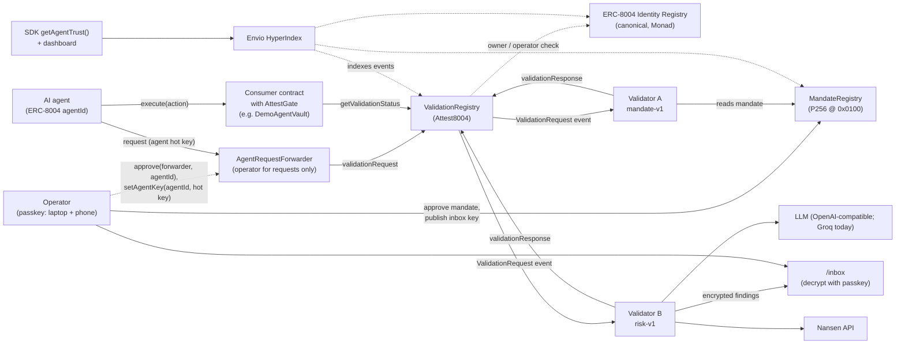
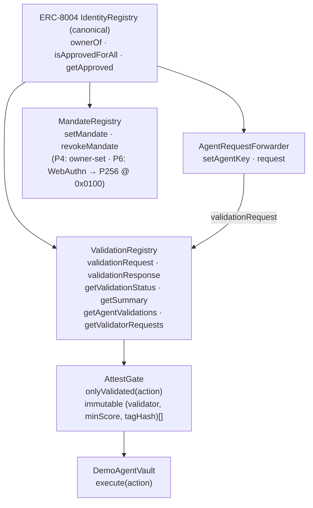
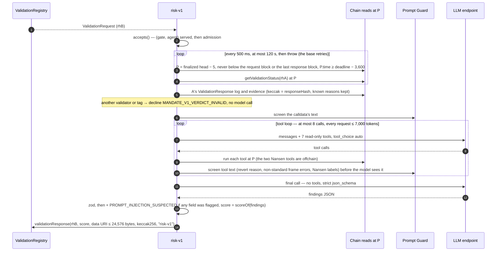

# Attest8004 — Architecture

> **Status:** design reference v0.1 (2 Oct 2026), kept in sync with the code as it is built (P4, 3 Oct 2026: the owner-set MandateRegistry, the `mandate-v1` validator and `verify`, and per-agent forwarder approvals in the demo; P5, 4 Oct 2026: `risk-v1` is built (§5.6, its evidence in §6) and tested against fakes and recorded Groq runs; the gate's tag requirement (§4.1, §4.4), the two-validator vault and the demo "risky but mandated" target `DemoPassThrough` are **deployed**; the `verify` CLI now lives in `packages/cli` and re-checks both validators' tags (§5.5); agent 1984's mandate now allowlists `DemoPassThrough` next to the deployer. **The live end-to-end run with both validators passed** on 4 Oct 2026: `risk-v1`'s first testnet verdicts, and all six verdicts `match` under `verify` (docs/deployments.md)). Passkey (WebAuthn) approval of mandates, the inbox and the indexer are still design.
> **Rule:** any change to an interface, flow, data format or trust assumption updates this file **in the same commit**.
> Build scope and acceptance criteria live in [`SPEC.md`](./SPEC.md). This file explains *how the system works and why*.

---

## 1. What it is

AI agents on Monad already have identity through the canonical **ERC-8004 Identity Registry**, and feedback through the **Reputation Registry**. What's missing is the third ERC-8004 piece, the **Validation Registry**: a neutral, onchain record that *an independent party checked this agent's action, and here is the verdict*. Monad's docs list it as "coming soon", and there is no canonical deployment on any chain. Attest8004's spec-conformant (non-canonical) registry is live on Monad testnet; see `docs/deployments.md`.

Attest8004 provides that layer:

1. **ValidationRegistry**: implements the EIP-8004 validation interface and authorises callers through the canonical Identity Registry.
2. **Passkey-approved mandates**: the agent's operator states what the agent may do (targets, functions, spend caps, expiry) and approves it with a passkey, verified onchain by Monad's P256 precompile (`0x0100`).
3. **Validators**:
   - `mandate-v1`: deterministic; anyone can re-run it and get the same verdict.
   - `risk-v1`: agentic; an OpenAI-compatible LLM (Groq today) plans tool calls over simulation, Nansen data and ERC-8004 reputation.
4. **AttestGate**: a modifier that lets any contract refuse an action unless every validator it requires has given a sufficient verdict for *exactly that action*, which then runs once.
5. **Private findings inbox**: detailed findings are encrypted to a key derived from the operator's passkey (Mera PRF). It's never stored, and can be re-derived on any device.
6. **Trust API**: Envio indexes everything into per-agent and per-validator summaries for the SDK and dashboard.

---

## 2. System context



---

## 3. Components

| Layer | Component | Path | Responsibility |
|---|---|---|---|
| Onchain | `ValidationRegistry` | `contracts/src/` | Stores validation requests and responses. EIP-8004 interface. Authorises requesters via the canonical Identity Registry. No admin, not upgradeable. |
| Onchain | `AgentRequestForwarder` | `contracts/src/` | The agent owner's ERC-721 operator for validation requests only. Forwards `validationRequest` for the hot key the agent's owner registered, while that owner still owns the agent. No admin, not upgradeable, holds no funds. |
| Onchain | `MandateRegistry` | `contracts/src/` | The current spending mandate per agent (targets, selectors, value caps, expiry). P4: owner-set, via `setMandate`/`revokeMandate`, both routed through an internal `_authorize` hook. P6 replaces that hook's body with a WebAuthn assertion verified via `0x0100`, and adds the passkey public key and the inbox public key. |
| Onchain | `AttestGate` (abstract contract with the `onlyValidated` modifier) | `contracts/src/` | For each required validator, recomputes that validator's `requestHash` from the call and checks its verdict: the named validator, the agentId and the minimum score. Every requirement must pass, and each action runs once. |
| Onchain | `DemoAgentVault` | `contracts/src/` | Example consumer, bound to one agentId: holds that agent's test funds; `execute(Action)` is gated. |
| Offchain | `@attest8004/sdk` client | `packages/sdk/` | Builds actions, computes `requestHash`, submits requests, waits for verdicts, reads trust summaries. |
| Offchain | `@attest8004/sdk` validator base | `packages/sdk/` | Polls `ValidationRequest` logs from a saved block cursor, verifies each request (data: URI only, hash, validator, agent, chain, deadline), runs `check()`, and posts a response with evidence, once, with an explicit gas limit. |
| Offchain | `mandate-v1` | `validators/mandate/` | Deterministic mandate and permission checks plus simulation at a pinned block. `verifyRequest` re-executes a posted verdict (§5.5). |
| Offchain | `risk-v1` | `validators/risk/` | Agentic risk assessment: an OpenAI-compatible LLM (Groq today) with read-only onchain tools (simulation, ERC-8004 reputation, permission history) and Nansen. Outputs JSON validated against a schema and scored by code. `verifyRiskRequest` re-checks a posted verdict without re-running the model (§5.5). |
| Offchain | `attest8004` CLI | `packages/cli/` | `pnpm attest8004 verify <requestHash>`: reads the response's tag and re-runs a `mandate-v1` verdict or re-checks a `risk-v1` one (model output recorded, not re-run). Read-only. |
| Data | Envio indexer | `indexer/` | Indexes requests, responses, mandates, inbox keys and Identity Registry permission events. Derives agent and validator summaries. Serves GraphQL. |
| Client | Web app | `web/` | `/approve` (passkey and mandate), `/inbox` (Mera decrypt), `/dashboard` (trust data). |
| Stretch | CRE workflow | `cre/` | Chainlink CRE orchestration of a validator: log trigger, HTTP call, EVM write. |

---

## 4. Onchain design

### 4.1 Contract relationships



- **ValidationRegistry** reads the Identity Registry only to check that `msg.sender` is the owner or approved operator of `agentId` (`ownerOf`, `isApprovedForAll`, `getApproved`). It never trusts its own callers for this. The Identity Registry address is a **constructor argument** stored as an `immutable`. The EIP describes an `initialize(address)` instead, as used by the reference's upgradeable proxy; we have no proxy, owner or `initialize`, and `getIdentityRegistry()` returns the address. Because the Identity Registry address is part of the init code, the registry's CREATE2 address depends on it: testnet and mainnet use different Identity Registries, so their addresses differ. All differences from the EIP are in [`docs/spec-notes.md`](./docs/spec-notes.md).
- **AgentRequestForwarder** takes the ValidationRegistry as its only constructor argument and reads that registry's Identity Registry (`getIdentityRegistry()`), so the two can't disagree about who owns an agent. The owner approves it as an ERC-721 operator. Its `request` checks the caller is the agent's registered key and that the owner who registered it still owns the agent, then makes exactly one call, `validationRequest`, which the registry accepts because the forwarder is the owner's operator (§7).
- **MandateRegistry** reads the Identity Registry to authorize every mandate change. P4: `setMandate`/`revokeMandate` route through an internal `_authorize(agentId, changeHash)` hook, called before any write, that requires `msg.sender == identityRegistry.ownerOf(agentId)` — the record stores that owner, so a mandate goes stale the moment the agent is transferred, even to an owner who already approved other operators. P6 replaces `_authorize`'s body with a WebAuthn assertion over the agent's passkey; because the hook is internal, that is a new deployment, not an upgrade, and after P6 every mandate or inbox-key change requires the passkey.
- **AttestGate** reads the ValidationRegistry. It holds an **immutable list of `(validator, minScore, tagHash)` requirements** (1 to 4), chosen by whoever deploys the consumer contract, not by Attest8004, and fixed at deployment. Every requirement must pass, including the tag: `requestHash` already binds one validator to one exact action, but not to any particular check that validator ran for it, so the gate also requires the stored tag to hash to the requirement's `tagHash` — a verdict from some other check that same validator happens to run for the same action doesn't satisfy it. The constructor rejects a zero `tagHash`, because no real tag hashes to the zero value, so it would be a requirement nothing could ever satisfy.

### 4.2 Canonical addresses used

| Contract | Monad testnet (10143) | Monad mainnet (143) |
|---|---|---|
| ERC-8004 IdentityRegistry | `0x8004A818BFB912233c491871b3d84c89A494BD9e` | `0x8004A169FB4a3325136EB29fA0ceB6D2e539a432` |
| ERC-8004 ReputationRegistry (read only) | `0x8004B663056A597Dffe9eCcC1965A193B7388713` | `0x8004BAa17C55a88189AE136b182e5fdA19dE9b63` |
| P256VERIFY precompile | `0x0100` | `0x0100` |
| Attest8004 contracts | see `docs/deployments.md` | see `docs/deployments.md` |

### 4.3 The action and its hashes (single source of truth)

```solidity
struct Action {
    uint256 agentId;
    address target;
    uint256 value;
    bytes   data;
    uint64  deadline;
    bytes32 salt;
}

// One per validator: the ERC-8004 requestHash submitted to that validator.
requestHash = keccak256(abi.encode(
    block.chainid, gate, validatorAddress, agentId, target, value, keccak256(data), deadline, salt
));

// The same action, whoever validates it. The gate marks it consumed.
actionHash = keccak256(abi.encode(
    block.chainid, gate, agentId, target, value, keccak256(data), deadline, salt
));
```

- A verdict is bound to **one chain, one gate, one validator and one exact action**, with an expiry.
- `validatorAddress` is in `requestHash` because EIP-8004 records exactly one validator per `requestHash` (spec-notes, row 5). An action that needs two validators gets two requests with two hashes.
- `actionHash` leaves the validator out, so consumption is per action: an action runs at most once, however many validators judged it.
- `salt` makes otherwise identical actions distinct.
- The ABI encoding is the "request payload" that the EIP says `requestHash` commits to (spec-notes, row 6). The request JSON at `requestURI` (§6) carries the same fields, and validators recompute the hash from it.
- It's defined once in `contracts/src/ActionHash.sol` and once in `packages/sdk/src/action.ts`. Both are checked against `packages/sdk/test/vectors.json`, whose expected values come from `cast` (`vectors.sh`), so neither implementation grades itself.

### 4.4 Gate check (in order)

`DemoAgentVault.execute` first requires `action.agentId` to be the vault's own agent. Then `onlyValidated`:

1. `block.timestamp <= deadline`.
2. `actionHash` has not been consumed.
3. For each requirement `(validator, minScore, tagHash)`, in list order (every one must pass):
   1. Recompute `requestHash` for that validator from the call arguments.
   2. `getValidationStatus(requestHash)` must exist. The registry reverts for an unknown hash, and the gate reports `ValidationNotFound`.
   3. The stored `validatorAddress` must be that validator, and the stored `agentId` must be the action's. Anyone who owns an agent can claim a `requestHash` first and name any validator (spec-notes, row 12), so the score alone proves nothing.
   4. `response >= minScore`. `minScore` is at least 1, because a pending request reads as response 0. The latest response counts, so a validator can withdraw a pass, but only if the withdrawal lands before someone executes the action (see below).
   5. (3.5) `keccak256(bytes(storedTag)) == tagHash`, checked **after** the score so a pending or low-scoring request still reverts `ScoreTooLow` first. A sufficient score under the wrong tag reverts `TagMismatch(validator, requestHash, expected, actual)` — a validator key signs only its own tag, so this is what makes that a contract rule rather than a convention (§9).
4. Mark `actionHash` consumed and emit `ActionConsumed`, **then** make the external call. `execute` also runs under a reentrancy guard (OpenZeppelin `ReentrancyGuardTransient`).

If the call reverts, the whole transaction reverts, consumption included, so the action can be retried until its deadline. `execute` is permissionless: the validated, deadline-bound action is the authorisation, and to cancel it the agent lets it expire. The requirements are packed into immutables, so the check costs one registry read per validator and one storage write.

**For integrators, because anyone can submit a validated action, with any gas limit:**
- A withdrawn pass (a validator lowering its score) can be front-run by someone executing the action first.
- If the target tolerates a failed sub-call (a `try`/`catch`, or a router that skips a failed hop), a submitter can make it fail on purpose with a low gas limit, and the action still counts as executed and consumed. Gate such targets only if a partial execution is acceptable, or restrict who may call the gated function.

`DemoAgentVault`'s actions (native and ERC-20 transfers) don't have the second problem: the call either succeeds or reverts the whole execute.

**The SDK's mirror of this check** (`Attest8004Client.isValidated`, `packages/sdk/src/client.ts`) reads the tag-aware `requirements()` (`{validator, minScore, tagHash}`). Against a pre-P5 gate, whose `Requirement` has two fields (`{validator, minScore}`: the P2 and P3 vaults), the decode fails and `isValidated` rejects with viem's decoding error (with viem 2.57, `PositionOutOfBoundsError`, or `IntegerOutOfRangeError` once a misread field is out of range): safe, since it never returns a wrong `true`, but such gates need their own ABI, as `scripts/src/gated-execute.ts` has.

---

## 5. Key flows

### 5.1 Operator setup (one time per agent)

```mermaid
sequenceDiagram
  autonumber
  actor Op as Operator
  participant W as Web /approve
  participant ID as IdentityRegistry
  participant F as AgentRequestForwarder
  participant MR as MandateRegistry
  participant P as P256 @ 0x0100
  Op->>ID: register agent (owner = operator wallet)
  Op->>ID: approve(AgentRequestForwarder, agentId)  [per agent; the demo's choice, §7]
  Op->>F: setAgentKey(agentId, agent hot key)  [owner wallet tx]
  Op->>W: create passkey (Google Password Manager / iCloud)
  W->>MR: setPasskey(agentId, qx, qy)  [owner wallet tx]
  MR->>ID: ownerOf(agentId) == msg.sender?
  Op->>W: approve mandate (targets, selectors, caps, expiry)
  W->>W: WebAuthn assertion over challenge = H(chainId, MR, agentId, mandateHash, nonce)
  W->>MR: setMandate(agentId, mandate, webauthnAuth)
  MR->>P: verify(sha256(authData ‖ sha256(clientDataJSON)), r, s, qx, qy)
  P-->>MR: 32 bytes ...01 (or empty = invalid)
  MR-->>Op: MandateSet event
  Op->>W: open /inbox → passkey PRF → X25519 public key
  W->>MR: setInboxKey(agentId, x25519Pub, webauthnAuth)
```

> **P4 vs. P6.** This diagram is the P6 target. As built in P4, there is no passkey yet: the owner sets the mandate directly, in this phase — the operator's own wallet calls `setMandate(agentId, mandate)` and `revokeMandate(agentId)` on `MandateRegistry`, authorized by `_authorize` requiring `msg.sender == IdentityRegistry.ownerOf(agentId)`. The `setPasskey`, WebAuthn-assertion and `setInboxKey` steps above (and `/inbox`) arrive in P6, which replaces `_authorize`'s owner check with WebAuthn verification.
>
> **Per-token approval in the demo.** The diagram's `approve(forwarder, agentId)` is a per-token ERC-721 approval, scoped to one agent, which is what the demo uses for both demo agents (§7 has the trade-off against the alternative, a blanket `setApprovalForAll`). An owner with many agents can still choose the blanket approval instead; either way the forwarder only ever calls `validationRequest`.

### 5.2 Validated action (happy path)

```mermaid
sequenceDiagram
  autonumber
  participant A as Agent hot key
  participant F as AgentRequestForwarder
  participant VR as ValidationRegistry
  participant VA as mandate-v1
  participant VB as risk-v1
  participant G as DemoAgentVault (AttestGate)
  A->>A: build Action; rhA = requestHash(VA), rhB = requestHash(VB)
  A->>F: request(VA, agentId, requestURI_A, rhA)
  F->>VR: validationRequest(VA, agentId, requestURI_A, rhA)
  A->>F: request(VB, agentId, requestURI_B, rhB)
  F->>VR: validationRequest(VB, agentId, requestURI_B, rhB)
  VR-->>VA: ValidationRequest event (rhA)
  VR-->>VB: ValidationRequest event (rhB)
  VA->>VA: load request JSON, recompute rhA, check mandate + permissions, simulate at block N
  VA->>VR: validationResponse(rhA, 100, evidenceURI, evidenceHash, "mandate-v1")
  VB->>VR: getValidationStatus(rhA) at its pinned block: waits until VA has answered (§5.6)
  VB->>VB: LLM plans → read-only tools (simulate, Nansen, reputation) → JSON findings → code scores
  VB->>VR: validationResponse(rhB, 100, evidenceURI, evidenceHash, "risk-v1")
  A->>G: execute(action)
  G->>VR: getValidationStatus(rhA), getValidationStatus(rhB)
  G->>G: check validator, agentId and score for each; consume actionHash
  G-->>A: executed
```

> **One request per validator.** EIP-8004 keys a request by `requestHash` and records one validator per request, so each validator gets its own `requestHash` (§4.3) and its own request JSON (§6). The gate recomputes both hashes and consumes the validator-independent `actionHash`. The testnet `DemoAgentVault` now requires both `mandate-v1` and `risk-v1` (the two-validator redeploy, 2026-10-04), so the flow above has two requests; the earlier single-validator vault, which only ever required `mandate-v1` and holds the recorded P4 executes, is superseded.
>
> **Who sends `validationRequest` (decided in P3): the agent's hot key, through `AgentRequestForwarder`.** The registry accepts a request only from the agent's owner or an ERC-721 operator (`isApprovedForAll` / `getApproved`); the `agentWallet` alone is not enough. Making the hot key itself an operator would also let it transfer the agent NFT. So the owner approves the forwarder, per agent with `approve(forwarder, agentId)` (what the demo agents use) or once for all its agents with `setApprovalForAll`, and registers the hot key with `setAgentKey(agentId, key)`. The forwarder forwards `request(...)` from that key, and only while the owner who registered it still owns the agent, as exactly one `validationRequest` call. The owner can still call the registry directly. The trade-off between the two approvals is in §7.
>
> Details: [`docs/spec-notes.md`](./docs/spec-notes.md), rows 5, 7, 10 and 12.

### 5.3 Blocked attack (demo: the Grok/Bankr pattern)
1. A permission change happens outside the mandate: a new operator approval on the agent in the Identity Registry.
2. The agent is induced to transfer funds to an unknown address.
3. `mandate-v1` sees (a) a target not on the allowlist or above the cap, and (b) a permission change after the last passkey-approved mandate. It scores 0, with machine-readable reasons.
4. `risk-v1` explains the risk from its tools (simulation, permission history, ERC-8004 reputation and Nansen data on the counterparty), and scores it low.
5. `execute(action)` reverts at the gate.
6. `risk-v1`'s evidence, including this explanation, is posted in public plaintext, the same as `mandate-v1`'s. P7 adds a separate encrypted findings inbox on top.

### 5.4 Private findings, any device

```mermaid
sequenceDiagram
  autonumber
  participant VB as Validator
  participant MR as MandateRegistry
  participant S as Validator storage (HTTP)
  actor Op as Operator (phone or laptop)
  participant W as Web /inbox
  VB->>MR: read inbox public key (X25519)
  VB->>VB: ephemeral X25519 → ECDH → HKDF → AES-256-GCM(findings)
  VB->>S: store ciphertext at its own URI (never responseURI, which stays the public plaintext evidence; P7 decides how this URI is announced)
  Op->>W: open /inbox, tap passkey
  W->>W: Mera PRF(salt = sha256("attest8004.inbox.v1")) → HKDF → X25519 private key (memory only)
  W->>S: fetch ciphertext, verify its hash
  W->>W: decrypt, show findings, zero key buffers
```

The same synced passkey gives the same PRF output on every device, so the phone decrypts exactly what the laptop does. Nothing secret is ever written to storage.

### 5.5 Re-check a verdict (why `mandate-v1` is "trust", not "opinion", and what `risk-v1`'s re-check proves)

```
pnpm attest8004 verify <requestHash> [--rpc-url URL] [--json]
```
Anyone can run this from the repo root. **It reads the response's tag once and sends the verdict to that tag's verifier:** a `mandate-v1` verdict is re-run from chain data alone, at the block its evidence pinned, and compared with what the validator posted (below); a `risk-v1` verdict is re-checked from its public evidence without re-running the model ([`risk-v1`: re-check, not re-run](#risk-v1-re-check-not-re-run)); any other tag prints `could not verify: UNKNOWN_TAG "<tag>"` and exits 2. A request with no response yet, or no request at all, goes to the `mandate-v1` verifier, which reports `RESPONSE_NOT_FOUND` or `REQUEST_NOT_FOUND` (exit 2). It is read-only and needs no `.env`: the RPC is `--rpc-url`, else `MONAD_TESTNET_RPC_URL`, else the public testnet RPC. The CLI's own output never prints the URL it was given; errors show viem's short message only. **pnpm itself echoes the command line it runs**, so a URL with an API key belongs in the environment, not in `--rpc-url`: `MONAD_TESTNET_RPC_URL=<url> pnpm attest8004 verify <requestHash>` (or set it in `.env`), or `pnpm --loglevel silent attest8004 verify … --rpc-url <url>` (pnpm 12 has no `-s` for `pnpm run`; `--loglevel silent` drops the echoed line, though pnpm still prints one `[ELIFECYCLE]` line, without the arguments, on a non-zero exit). The verifiers are `verifyRequest` in `validators/mandate/src/verify.ts` and `verifyRiskRequest` in `validators/risk/src/verify.ts`. The CLI is its own private package, `packages/cli` (`@attest8004/cli`): `src/cli.ts` (arguments, the RPC, the dispatch by tag; `chainVerifiers` wires both verifiers to one reader and the SDK's `DEPLOYMENTS`) and `src/text.ts` (the output). It is separate because it imports both validators, and `validators/risk` already depends on `validators/mandate`, so leaving it in `mandate` would make a dependency cycle. The root script runs it through a plain-JavaScript entry, `packages/cli/bin/attest8004.mjs`. The CLI is TypeScript run through Node's type stripping, on by default from Node 22.18; the entry refuses an older Node, and turns a load failure or an uncaught error into exit 2 with a fixed message (Node itself would exit 1, which means "mismatch"). There is no `npx attest8004` command: the package is private, declares no `bin` in its `package.json` and runs as TypeScript source, so shipping a CLI package is a later decision.

**`mandate-v1`: re-run.** It stops at the first problem:
1. **Status.** It reads `getValidationStatus(requestHash)` at the finalized head. If the registry has no such request, that's `REQUEST_NOT_FOUND`; if the request has no response yet, `RESPONSE_NOT_FOUND`; if the tag isn't `mandate-v1`, `NOT_MANDATE_V1` (the CLI sends `risk-v1` to its own verifier and stops at any other tag first, so through the CLI this only happens for a response with an empty tag).
2. **Response log.** It finds the `ValidationResponse` log through the status's `lastUpdate` timestamp: an interpolation search for the blocks with that timestamp, then one `eth_getLogs`. This is the same lookup spend accounting uses. If none is found, that's `RESPONSE_NOT_FOUND`.
3. **Keccak check.** The evidence must be inline JSON that `verify` decodes: a `data:` URI of at most 128 KiB (`verify` never fetches). If it isn't, nothing was compared (`EVIDENCE_NOT_DECODED`). The decoded bytes must hash to the onchain `responseHash` (`EVIDENCE_HASH_MISMATCH` otherwise). The evidence must also name a pinned block and the request's block; a document that doesn't is no `mandate-v1` evidence at all (`RESPONSE_HASH_MISMATCH`).
4. **The pin.** `P` is the evidence's `block.number`. It must be at or after the evidence's request block and at or before the block the response landed in. It must also be at or after the MandateRegistry's deployment block, recorded in the SDK's `DEPLOYMENTS` (testnet: 67,842,487). Before that the mandate can't be read (the address has no code, so the read returns no data), so no honest run pins there, and `verify` says so without reading at `P`. Any of these fails as `PIN_OUT_OF_RANGE`.
5. **Request log.** It reads the `ValidationRequest` log in the evidence's request block.
   - **A block before the ValidationRegistry existed is wrong, with no read** (`REQUEST_BLOCK_WRONG`). The deployment block is recorded in the SDK's `DEPLOYMENTS` (testnet: 67,604,893, the deploy transaction's block). Before it the registry has no code, so a status read there returns no data instead of reverting, and couldn't prove anything.
   - **If no log is returned, state decides.** The registry refuses to reuse a `requestHash` (`RequestExists`), so a request was made in exactly one block: the first at which its status exists. If the status exists at the evidence's request block and reverts `UnknownRequest` one block before it (no second read when that block is the deployment block itself), the block is right and only the log is missing (`REQUEST_NOT_FOUND`: lag, not evidence). Otherwise the evidence names the wrong block (`REQUEST_BLOCK_WRONG`). So a validator can't turn its verdict into "could not verify" by misstating that one field. Only the registry's `UnknownRequest` revert, in any of the shapes viem reports it, counts as "not made yet"; any other failure of these reads is an error (exit 2), never a mismatch.
   - The log's request JSON must hash to `requestHash`, name the validator and agent the registry records and the chain `verify` reads, and have a deadline at most 3,600 s after `P`'s time. If not (`REQUEST_INVALID`), the validator answered a request it must refuse: the SDK's base never answers one (`WRONG_CHAIN`, `DEADLINE_TOO_FAR`), and `MandateValidator` never pins where the deadline is further ahead than that (§6, `block`). `MandateValidator` pins its request size limit to the SDK's 16 KB (`MAX_REQUEST_URI_BYTES`), the same limit `verify` decodes, so it never answers a request `verify` would call invalid.
6. **Re-run.** It runs `runMandateV1` at `P`, as that validator, with an **empty cache**: every past approval's amount is rebuilt from its own posted evidence, as a restarted validator would. It uses the contracts in the SDK's `DEPLOYMENTS` for the chain, so evidence that names other contracts doesn't reproduce. These are the **current** `DEPLOYMENTS`: if a contract is ever redeployed, older verdicts need a versioned table of contracts before they re-verify. Then it rebuilds the document with `buildEvidence` and hashes its canonical JSON.
7. **Compare.** The score must match (`SCORE_MISMATCH`), and so must the `responseHash` (`RESPONSE_HASH_MISMATCH`). The report lists the top-level evidence keys whose canonical JSON differs (`differingKeys`), such as `block` for a moved pin or `params` for another contract.

| Exit | Verdict | When |
|---|---|---|
| 0 | `match` | The same score and the same `responseHash`. |
| 1 | `mismatch` | `SCORE_MISMATCH`, `RESPONSE_HASH_MISMATCH`, `EVIDENCE_HASH_MISMATCH`, `PIN_OUT_OF_RANGE`, `REQUEST_BLOCK_WRONG` or `REQUEST_INVALID`. This is public proof that the validator misbehaved, because it signed both the score and the evidence's hash, and the facts compared against are onchain. |
| 2 | could not verify | A usage or RPC error, a Node older than 22.18, a CLI that fails to load or an uncaught error (an `eth_call` answered with no hex result counts as one, never as chain state), `REQUEST_NOT_FOUND`, `RESPONSE_NOT_FOUND`, or an input log the re-run can't find. A missing log is lag, not evidence. `EVIDENCE_NOT_DECODED` lands here too: evidence that isn't an inline `data:` URI, is over 128 KiB or is malformed was never compared. So does `NOT_MANDATE_V1`: a verdict under another tag isn't a `mandate-v1` run to repeat, and its tag proves nothing against it. |

For `mandate-v1`, the output starts with the verdict (`match`, `MISMATCH` or `could not verify`), then shows the validator, the pinned block (number, hash and time), the posted and recomputed score and `responseHash`, the reasons, the spend entries, the number of permission events, the problems and the differing keys. `--json` prints the same report as one line, with bigints as decimal strings. Errors show viem's short message only.

#### `risk-v1`: re-check, not re-run

A `risk-v1` verdict can't be re-executed: the model isn't deterministic, and `verify` never calls it (or Prompt Guard). So `verify` re-checks everything in the evidence that doesn't depend on trusting the model. **A match proves three things: the score follows from the recorded findings; every onchain fact shown to the model was true at `P`; the injection rule was applied.** **It does not prove that the recorded output came from the model.** Trusting `risk-v1` means trusting validator B's operator, which is why the gate also requires `mandate-v1`, which anyone can fully reproduce (§7). The CLI prints the row `model output: recorded, not re-run` on every `risk-v1` report, whatever the verdict, and `--json` carries `"modelOutput": "recorded, not re-run"`. The classifier's scores are likewise recorded, not re-run, but its coverage and the rule are re-checked: "the injection rule was applied" means that every untrusted text the model was shown has a classifier result of its own, and that the flags and the `PROMPT_INJECTION_SUSPECTED` finding follow from those results.

It stops at the first problem:
1. **Status, response log, keccak check, strict parse.** As `mandate-v1`'s steps 1–3 (`REQUEST_NOT_FOUND`, `RESPONSE_NOT_FOUND`, `EVIDENCE_NOT_DECODED`, `EVIDENCE_HASH_MISMATCH`). The evidence must then parse with `parseRiskEvidence` and be exactly the canonical JSON of what it parses to: no honest run writes other bytes, and this rules out duplicate keys. Its tool-call records must also pair one to one with the tool calls in its recorded model responses (each record takes the first unpaired call with its id, which must have its name; Nansen and `TOOL_CALL_LIMIT` records included), because the agent records exactly one answer for every call it is sent. Anything else is `EVIDENCE_INVALID`.
2. **The pin and the request.** `P` must be at or after the evidence's request block and the MandateRegistry's deployment, and at or before the block the response landed in (`PIN_OUT_OF_RANGE`, with no read at `P`). The request log and JSON are read exactly as `mandate-v1`'s step 5 reads them, by the same function (`requestAt`: `REQUEST_BLOCK_WRONG`, `REQUEST_INVALID`, `REQUEST_NOT_FOUND`). Block `P`'s hash and timestamp on the chain must be the evidence's `block` (`PIN_MISMATCH`).
3. **The request fields.** The evidence's `request` must be `requestEvidence` of that request JSON, and its `requestHash` the request's (`REQUEST_FIELDS_MISMATCH`).
4. **The params.** The whole `params` object must be `riskParams` with the contracts in the SDK's `DEPLOYMENTS` and validator A's address, and `classifier.model` and `classifier.threshold` must be `RISK_V1`'s guard model and `"0.5"` (`PARAMS_MISMATCH`). These addresses come from the **current** `DEPLOYMENTS` (as `mandate-v1`'s re-run's do), so if a contract or validator A is ever redeployed, older verdicts need a versioned params table before they re-verify.
5. **The prerequisite.** `rhA` is `computeRequestHash` of the same action for validator A (`DEPLOYMENTS[chainId].validators.mandateV1`). `readPrerequisite` at `P`, the function validator B ran, must give exactly the recorded `prerequisite`; A pending or invalid at `P` is `PREREQUISITE_MISMATCH`. A's response log not being found is lag: `verify` rejects (exit 2), never a mismatch.
6. **The injection rule.** First, coverage: every untrusted text the model was shown must have a classifier result of its own. The texts are derived as validator B screened them: the calldata's text with `calldataFields` (the function `runRiskV1` uses), every label in a recorded Nansen answer with `untrustedFromProfile` / `untrustedFromFlows` (those `runTool` uses), and, at step 9, each re-run onchain tool's own text (a simulation's revert reason). Validator B also screens a simulation's frame `error` texts that aren't callTracer's standard outcome strings (§9); `verify` derives no field from those (evidence written before that screening has none), so their results are extras: coverage doesn't protect them, but a recorded flagged one still forces the code finding below. Each text needs a distinct result with the same source and a non-empty `text`. For the calldata's text and a re-run tool's text, which are derived exactly, that `text` must be one of the field's guard chunks (`chunkText`, 400 characters with a 40-character overlap: the guard records the highest-scoring chunk), so a harmless fragment of a flagged text can't stand in for it. For a Nansen label read back from the record, the `text` must be a substring of it, or it a prefix of the `text` (a string the output cap shortened after screening). Validator B now screens a Nansen answer's strings as the output cap left them (read from the capped output, so the recorded string is exactly what was screened); the looser match still accepts runs that screened before the cap. Extra results are allowed (a simulation's non-standard frame errors, and labels an older run screened before the cap removed them), and no order is required. An answer recorded as `TOOL_CALL_LIMIT` was never screened, so nothing is derived from it. Coverage protects a Nansen answer only as recorded: Nansen outputs are unchecked (step 9), so a forger could delete a flagged label from the recorded answer together with its classifier result and its finding. Then each recorded score, parsed with `parseGuardScore` (the grammar `classify()` checked), must give the recorded `flagged` at the 0.5 threshold, and code's findings must be exactly `injectionFinding` of the recorded results (`FINDINGS_MISMATCH`). The guard's scores themselves aren't re-run.
7. **The model's findings.** `finalOutput.raw` must be the content of the last recorded model response, and `parseModelOutput(raw, called)`, with `called` the tools that ran (not answered `TOOL_CALL_LIMIT`) plus `request` and `mandate_v1_verdict`, must give exactly the model's findings; the findings must be the model's, then code's (`FINDINGS_MISMATCH`).
8. **The score.** `scoreOf(findings)` must be the posted score and the evidence's `score`, and `reasons` the findings' codes in order (`SCORE_MISMATCH`).
9. **The onchain facts.** Every onchain tool call whose answer the model saw is re-run in order with `runTool` at `P`: from the model's raw argument string, found by tool-call id in `modelOutputs`, and with the address scope rebuilt from `initialScope` at `P` plus every earlier recorded output (Nansen's included), exactly as `runTool` adds addresses. The re-run's capped output, and the arguments it records, must equal the recorded ones as canonical JSON; every index that differs is listed (`mismatchedToolCalls`, `TOOL_OUTPUT_MISMATCH`). Then step 6's coverage is checked again with each re-run's own untrusted text added (`FINDINGS_MISMATCH`). Nansen calls are offchain and advisory: they are listed as unchecked, never a problem. Calls answered `{"error": "TOOL_CALL_LIMIT"}` aren't re-run: the model never saw that tool's answer, and nothing runs after one.

| Exit | Verdict | When |
|---|---|---|
| 0 | `match` | Every check above passed: the three things above are proven, and nothing about where the model output came from. |
| 1 | `mismatch` | `EVIDENCE_HASH_MISMATCH`, `EVIDENCE_INVALID`, `PIN_OUT_OF_RANGE`, `PIN_MISMATCH`, `REQUEST_BLOCK_WRONG`, `REQUEST_INVALID`, `REQUEST_FIELDS_MISMATCH`, `PARAMS_MISMATCH`, `PREREQUISITE_MISMATCH`, `FINDINGS_MISMATCH`, `SCORE_MISMATCH` or `TOOL_OUTPUT_MISMATCH`. This is public proof that the validator misbehaved: it signed the evidence's hash, and the evidence contradicts itself or the chain. |
| 2 | could not verify | `REQUEST_NOT_FOUND`, `RESPONSE_NOT_FOUND`, `EVIDENCE_NOT_DECODED`, an unknown tag (`UNKNOWN_TAG`), validator A's response log not found, or any RPC error, including one during a tool re-run (a `debug_traceCall` the node refuses, or history it no longer serves). A failed read is never a mismatch; only a successful re-read that differs is. |

The output starts with the verdict line: `match: the score follows from the recorded findings, every onchain fact shown to the model was true at block <P>, and the injection rule was applied`, or `MISMATCH`, or `could not verify`. Then, in order: the row `model output: recorded, not re-run`; the request, validator and tag; the model the evidence says was requested; the pinned block (number, hash and time); the posted and recomputed score and the reasons; the findings, one per line as `severity code — explanation`; the tool calls re-run at `P` (and any whose answer differs), the unchecked Nansen calls and the calls the model never saw; and the problems. The model id and each explanation are operator-controlled, so the text output collapses their whitespace runs to one space and clips them at 64 and 400 characters (with `…`), and escapes control and bidirectional characters (U+061C included). `--json` prints the report whole, as one line with `"modelOutput": "recorded, not re-run"`.

**History.** Every input is re-read from state at `P`, so the RPC must still serve that block (for `risk-v1`, it must also answer `debug_traceCall` there, as validator B's own reads did, and serve state up to 2,000,000 blocks, about 7 days, before `P` for `counterparty_onchain`'s age probes). `simulate_action`'s output carries callTracer's own text (each frame's `error`), so a node or tracer version that words it differently makes an honest re-run differ: a `TOOL_OUTPUT_MISMATCH` that isn't misbehaviour, so re-check old verdicts against a node of the same kind as validator B's. The public testnet RPC serves about 51 days of history (measured 3 Oct 2026); older blocks fail with `-32602`. Older verdicts need an archive RPC: `MONAD_TESTNET_RPC_URL=<archive url> pnpm attest8004 verify <requestHash>`.

### 5.6 Agentic verdict (`risk-v1`)

Built, tested against fakes and recorded Groq runs, and live on testnet since 4 Oct 2026 (the P5 end-to-end run in docs/deployments.md). The code is `RiskValidator` (`validators/risk/src/validator.ts`) on the SDK's `ValidatorBase`, `runRiskV1` and `readPrerequisite` (`src/run.ts`), the agent loop `runAgent` (`src/agent.ts`) and the evidence (`src/evidence.ts`).



1. **`accepts()`**, before any RPC: a gate it isn't listed to serve (`GATE_NOT_SERVED`) or a listed gate named for another agent (`GATE_NOT_FOR_AGENT`), in the same `gate:agentId,…` form as `mandate-v1`; then an `Admission` with `mandate-v1`'s limits. A decline is one `warn` line and no response.
2. **The pin and the prerequisite.** `rhA` is `computeRequestHash` of the same action for validator A (`DEPLOYMENTS[chainId].validators.mandateV1`). `P` is 5 blocks (`PIN_LAG_BLOCKS`) below the finalized head, never below the request's block or the block this process's last response landed in, and `P`'s time must be no more than 3,600 s before the deadline (§6, `block`). At `P`, `readPrerequisite` reads A's status: no request yet (`UnknownRequest`) or no response is *pending*, and `check()` keeps polling; after 120 s it throws and the base retries. **No guard or model call happens before A has answered at `P`.** An answer from another validator, a tag other than `mandate-v1`, or A's evidence not being an inline `data:` URI, not hashing to its `responseHash`, not parsing as `mandate-v1` evidence or naming another request, declines `MANDATE_V1_VERDICT_INVALID: <reason>`. A missing response log is lag: it throws, and the base retries. **A score of 0 from A still runs B**, which explains it. A's reasons are read from A's own evidence, keeping only the 12 known `mandate-v1` codes (`MANDATE_REASONS`). `readPrerequisite` is exported so that `verify` (§5.5) reads the prerequisite exactly the same way.
3. **Screening** (§9): **the calldata's printable text** — the printable-ASCII (0x20–0x7e) runs in the action's `data`, each at least `RISK_V1.calldataTextMinChars` (8) characters, at most `RISK_V1.calldataTextMaxRuns` (16) runs, at most `RISK_V1.calldataTextMaxChars` (512) characters in total — is one field, `calldata_text`, screened before the first model call. The first user message also shows the data's first `RISK_V1.calldataHeadBytes` (132) bytes as hex (`request.dataHead`); that head is too short to exhaust either cap on its own, so every run visible in it is always kept. A tool's free text (the simulation's revert reason, every distinct frame `error` text in its `calls[]` that isn't one of callTracer's standard outcome strings (`STANDARD_CALL_TRACER_ERRORS`: `execution reverted`, `out of gas`, `invalid opcode`, …), and the Nansen label strings that survive the output cap) is screened before its answer goes back to the model. No untrusted text means no guard call.
4. **The tool loop and the final call**: at most 8 tool calls, every one read-only at `P`; a call past the cap, or one the token budget refuses, is answered `{error: "TOOL_CALL_LIMIT"}`. Then one tool-free call with a strict `json_schema` response format, re-checked by zod. A final answer that calls a tool anyway is invalid output: it counts against the shared retry budget, is re-asked with a fixed error text, and isn't recorded as a turn (its usage still counts), so the record never holds a tool call without its answer. With the fixed `seed` an identical retry repeats the same failure, so no re-ask is the request that failed: a tool call the provider refused (`tool_use_failed`) is re-asked with a fixed corrective message appended (one more per further failure of that turn, dropped once it succeeds), and a final answer refused as not matching the schema (`json_validate_failed`) is re-asked with that answer and a fixed error text, as a zod failure is; every re-ask stays within the token bound. The three no-argument tools (`get_mandate`, `simulate_action`, `recent_permission_events`) declare a plain empty object schema, with no `additionalProperties: false`, and accept any JSON object, ignoring its contents (anything else is `INVALID_ARGUMENTS`), so stray arguments are never a provider refusal and `verify` re-runs the call identically. Three notes on what the records mean:
   - **The trace is complete even where the model didn't see something.** The agent keeps the record of a turn it left out of the final call (nothing ran and it didn't fit) and of an answer it discarded after running (recorded as `TOOL_CALL_LIMIT`, which is what the model saw).
   - **The 36,000-token per-check cap gates only the tool loop.** The worst case is therefore about 36,000 tokens, plus one more turn, plus 3 final attempts of about 7,000 each: roughly 60,000.
   - **Failed 400 generations aren't counted in `usage`** (`tool_use_failed`, `json_validate_failed`): the provider reports no usage for them.
5. **Findings and score**: the model's findings (`origin: "model"`), then code's one `PROMPT_INJECTION_SUSPECTED` (medium) when any screened field scored at least 0.5 (`origin: "code"`). The score is code's alone: 100 with no findings, 80 if all are low, 40 if any is medium, 0 if any is high; `reasons` are the codes in that order.
6. **Declines from `check()`** (no response, no retry, one `warn` line): `PROMPT_TOO_LARGE: <estimate> tokens` when the initial messages leave no room for 3 tool answers, before any model call; `MANDATE_V1_VERDICT_INVALID: <reason>`; `MODEL_OUTPUT_INVALID: <last error>` when the model's output still fails after its shared budget of 2 retries (`tool_use_failed`, `json_validate_failed`, or `parseModelOutput`'s own error text); `EVIDENCE_TOO_LARGE: <n> bytes` when the canonical document is over 24,576 bytes, measured exactly as the base will publish it — that size is chosen to stay under the planned 1,000,000-gas response cap (§9), not a guarantee that every accepted document fits with room to spare. Every decline from `check()` releases the request's admission reservation (`Admission.release`), so its gas stops counting against the daily budget.
7. **Failures are never verdicts.** A provider failure (429, timeout, 5xx, an unparseable guard answer), an RPC error or the pin timing out makes `check()` throw, with no partial result. The base retries the request from scratch after 15 s, doubling (15/30/60/120/240 s), and gives up after 6 failed cycles, logged, with no response; `onGaveUp()` then releases the request's admission reservation. **When the pin times out, each of those cycles also spends up to 120 s waiting for it**, so the full give-up time is about 20 minutes, not just the roughly 8 minutes of backoff between cycles — and the single base loop processes nothing else meanwhile. The status is checked again before every send, so a `requestHash` is never answered twice, also after a restart.
8. **`onResponded()`** records the block the response landed in (the next pin's floor) and settles the admission reservation to the gas limit actually sent; it never throws.

8a. **The service** (`validators/risk/src/main.ts`, `pnpm --filter @attest8004/validator-risk start`) refuses to start unless its key is `DEPLOYMENTS[chainId].validators.riskV1`, the RPC is on the expected chain, both registries use the recorded Identity Registry, and the RPC serves what the tools need (`checkRpcServesRiskV1` in `src/reader.ts`): one `debug_traceCall` of a trivial call (the zero address to itself, value 0, gas 21,000) at `latest` with `{tracer: "callTracer"}` must answer a callTracer frame, and one `eth_getCode` of the Identity Registry 2,000,000 blocks below the head must succeed. Either failing stops it with fixed text, never the URL: `the RPC must serve debug_traceCall (callTracer)` or `the RPC must serve state 2,000,000 blocks back`. It paces the main model and Prompt Guard with separate client-side limiters (`RISK_V1_LLM_REQUESTS_PER_MINUTE`/`RISK_V1_LLM_TOKENS_PER_MINUTE`, by default Groq's free tier of 30 and 8,000; the guard 30 and 15,000), and logs `caught up` each time it reaches the head.

The tag is always `risk-v1`, the request limit the SDK's 16 KB and the deadline horizon 3,600 s, whatever the options say. Logs are JSON lines through the base's logger. They carry the LLM endpoint's host at most (the service's `starting` line logs the LLM host and the model), never its URL or the key.

---

## 6. Data formats

**Request JSON v1.** Referenced by `requestURI` as a `data:application/json` URI (base64 or percent-encoded), so no hosting is needed. There is one per validator, because `validator` is part of `requestHash`.
```json
{
  "schema": "attest8004.request.v1",
  "chainId": 10143,
  "gate": "0x…",
  "validator": "0x…",
  "agentId": "42",
  "action": { "target": "0x…", "value": "0", "data": "0x…", "deadline": "1760000000", "salt": "0x…" }
}
```
`agentId`, `value` and `deadline` are decimal strings without leading zeros, so values above 2^53 survive JSON; `chainId` is a JSON number (a safe integer). Addresses may be lower-case or EIP-55 checksummed. The schema is strict: an unknown key anywhere rejects the request, so everything a validator reads is covered by the hash. It is defined once, in zod, in `packages/sdk/src/request.ts` (`buildRequestJson`, `parseRequestUri`).

`requestURI` is attacker-controlled. `parseRequestUri` accepts only a `data:application/json[;charset=utf-8][;base64],…` URI of at most **16 KB (16,384 bytes)**, printable ASCII, that decodes to valid UTF-8 JSON. It **never fetches** anything: an `https://` or `ipfs://` request URI is rejected, not followed.

Validators **must** recompute `requestHash` from this JSON (§4.3) and reject it on mismatch. They must also reject it if `validator` isn't themselves, or if `agentId` differs from the `agentId` in the `ValidationRequest` event (someone else's agent may have claimed the hash first; spec-notes, row 12). The hash commits to the ABI encoding of these fields, not to the JSON bytes, so whitespace and key order don't matter.

**How the SDK's `ValidatorBase` applies this** (`packages/sdk/src/validator.ts`):
1. It finds requests by polling `eth_getLogs` for `ValidationRequest` with its own `validatorAddress`, from a saved block cursor (the last block it fully processed), at most 100 blocks per query, up to the `finalized` head. A crash at any point re-reads blocks rather than skipping them.
2. If `getValidationStatus` shows a response already (a non-zero `responseHash` or a tag; its own responses always have both), it does nothing more: `ALREADY_RESPONDED`.
3. It **doesn't respond at all**, and logs one of these reasons, when the URI isn't an acceptable `data:` URI (`URI_NOT_DATA`, `URI_TOO_LARGE`, `URI_MALFORMED`), the JSON is invalid (`JSON_INVALID`, `SCHEMA_INVALID`), the JSON hashes to another `requestHash` (`HASH_MISMATCH`), names another validator (`WRONG_VALIDATOR`), another agent than the event (`AGENT_MISMATCH`) or another chain (`WRONG_CHAIN`), or the deadline is before the head block's time (`DEADLINE_PASSED`) or more than `maxDeadlineAheadSeconds` (default 3,600) after it (`DEADLINE_TOO_FAR`).
4. A subclass may turn a valid request away without responding, either before `check()` runs (`accepts()`) or from inside `check()` itself, by returning `{ decline: "<reason>" }` instead of a `CheckResult`. `accepts()` returning `false` declines silently: no response, no retries, logged as `DECLINED` with no detail. `accepts()` or `check()` returning `{ decline: "<reason>" }` does the same but carries that reason: it becomes the outcome's `detail` and is logged once at `warn` (e.g. a per-agent rate limit, a daily gas budget exhausted, or — from `check()` — model output that never passed validation after its retry budget). Either way, the cursor moves past the request: it is not retried in a later cycle. `mandate-v1` declines this way (from `accepts()`) for a gate it doesn't serve, a served gate named for an agent it isn't listed with, a missing, expired or stale mandate, and its admission limits; `risk-v1` declines from `accepts()` for an unserved (gate, agent) pair and its admission limits, and from `check()` when the initial messages would leave no room for 3 tool answers (`PROMPT_TOO_LARGE`, before any model call), when validator A's verdict is one it must not run on (`MANDATE_V1_VERDICT_INVALID`), when the model's output still fails validation after its retries (`MODEL_OUTPUT_INVALID`), or when its evidence would be over 24,576 bytes (`EVIDENCE_TOO_LARGE`) (§5.6).
5. Otherwise it runs the subclass's `check()` and builds the evidence JSON v1 with `buildEvidence()` (the base's fields, then the subclass's own), publishes it as **canonical JSON** so `responseHash = keccak256` of those exact bytes, checks the status again, and sends `validationResponse` with a gas limit resolved from either a literal or an evidence-sized headroom policy (`writeWithGasGuard`), after the estimate guard. Once the send lands, it calls the subclass's `onResponded()` once with the block the response landed in and the gas limit that was sent. It never calls it when a status check found the request already answered, and that includes a send of its own that landed but whose call failed (for example a dropped connection), which the retry then finds answered. So a subclass must not rely on the hook alone: `Admission` reserves each response's gas cap up front, so a missed settle over-counts, never under-counts (one known exception: a request whose reservation was released on a decline or give-up, then re-read in the same process after a later request's failure, is re-admitted with no new reservation, so a missed settle on it counts 0 gas — parked for a later fix), and `mandate-v1` records its last approval when it checks, not in the hook, and waits for it before pinning. A subclass can use the hook to record spend or update a rate-limit counter; a throw from it is logged and swallowed, because the response already landed and retrying would double-post. A failed send is retried, after checking that it didn't land. A request that keeps failing stops the cursor just before its block, and the next cycle retries it after a wait that doubles each time (2 s, 4 s, 8 s, … by default); after 5 failed cycles it is logged as given up and skipped, and the subclass's `onGaveUp(requestHash)` is called once (a no-op by default; a throw from it is logged and swallowed, as for `onResponded`). `Admission.release(requestHash)` drops a request's gas reservation for a request that will get no response (it still counts toward its agent's rate limit; unknown hashes are a no-op): `mandate-v1` and `risk-v1` call it from `onGaveUp`, and `risk-v1` also on every decline from `check()`. Errors are logged with viem's short message, never the full one, which can contain the RPC URL and its API key.

**Evidence JSON v1.** Referenced by `responseURI`, as **canonical JSON** (the "Reproducibility" constraint: sorted keys, no whitespace, integers above 2^53 as decimal strings — `packages/sdk/src/canonical.ts`; in practice every `bigint` in code, such as a block number, a timestamp, a wei amount or a gas figure, is written as a decimal string, while `chainId` and `logIndex` are JSON numbers). `responseHash = keccak256` of those exact bytes, so a `verify` command can recompute a `CheckResult`, rebuild the document byte for byte with the same `buildEvidence()` the base used, and get the same hash. Every validator's document starts with the base's keys (`schema`, `validator`, `requestHash`, `score`, `reasons`); the validator adds its own after them and may not reuse those. `mandate-v1`'s document (`mandateEvidence()` in `validators/mandate/src/evidence.ts`) is shown here with whitespace for readability; the real bytes have none, and sort these keys alphabetically.
```json
{
  "schema": "attest8004.evidence.v1",
  "validator": "mandate-v1",
  "requestHash": "0x…",
  "score": 0,
  "reasons": ["TARGET_NOT_ALLOWED", "VALUE_OVER_TX_CAP"],
  "block": { "number": "67900000", "hash": "0x…", "timestamp": "1790000000" },
  "request": {
    "block": "67899990", "chainId": 10143, "gate": "0x…", "agentId": "1984", "target": "0x…",
    "value": "3000000000000000", "dataHash": "0x…", "selector": "0x00000000", "deadline": "1790000600", "salt": "0x…"
  },
  "params": {
    "permissionWindowBlocks": "6000", "spendWindowSeconds": "90000", "maxDeadlineAheadSeconds": "3600",
    "simulationGas": "1000000", "identityRegistry": "0x…", "agentRequestForwarder": "0x…", "mandateRegistry": "0x…"
  },
  "mandate": {
    "allowedTargets": ["0x…"], "allowedSelectors": ["0x00000000"], "maxValuePerTx": "2000000000000000",
    "maxValuePerDay": "5000000000000000", "validUntil": "1793404800", "mandateHash": "0x…", "owner": "0x…",
    "setAtBlock": "67890000", "currentOwner": "0x…"
  },
  "spend": {
    "since": "1789910000", "total": "1000000000000000",
    "entries": [{ "requestHash": "0x…", "approvedAt": "1789990000", "gate": "0x…", "value": "1000000000000000",
                  "deadline": "1789990600", "consumed": true, "counted": true }]
  },
  "permissions": { "fromBlock": "67894001", "toBlock": "67900000", "events": [] },
  "simulation": { "ok": true }
}
```
- `block` is the pinned block `P`. Every input is read at `P`, and the verdict's clock is `P`'s timestamp. `P` is 5 blocks (`PIN_LAG_BLOCKS`) below the finalized head when the check ran, but never below the request's own block, the block this validator process's last response landed in, or the MandateRegistry's deployment block (until the head is that far ahead, the check waits); it also waits until `P`'s time is no more than 3,600 s before the action's deadline (the base checked that horizon at the cycle's head, which can be later than `P`, and `verify` checks it at `P`), and until the process's last approval is visible there; so two requests checked back to back see each other's approval, and `P` always falls between the request's block and the response's. This assumes one validator process per key.
  - **Why 5 blocks below the head.** A load-balanced RPC can answer `finalized` from one node and `eth_getLogs` from another that is a few blocks behind it, and a log range that straddles the serving node's head comes back empty or truncated without an error (measured on the public testnet RPC: a query for `[H − 3, H + 20]` returned logs only up to `H + 5`). Ending every log read at `P` 5 blocks under the reported head means a node lagging by fewer blocks than that can't silently drop a permission event near `P`, which would turn a 0 into a 100 that `verify`, on a complete node, later reports as a mismatch. **The limit:** a node lagging more than 5 blocks can still truncate the last window (P10). The cost is about 1.5 s per check.
- `request` is the action as its `requestHash` commits to it: `dataHash` instead of the raw `data`, plus the request's block and its `selector` (`0x00000000` for empty data, `null` when the data holds no selector an allowlist can match: 1–3 bytes, or non-empty data starting with `0x00000000`). Spend accounting reads past approvals back from this object (`parseApprovalParts`), so its form is strict: it must recompute to `requestHash`.
- `params` record four of `mandate-v1`'s constants (N, the spend window, the deadline horizon and the simulation gas cap) and three of the contracts it reads (the Identity Registry, the forwarder and the MandateRegistry). Not everything is recorded: the `consumed()` gas cap (100,000) and the ValidationRegistry's address are fixed by the tag and the SDK's `DEPLOYMENTS` instead. **The `mandate-v1` evidence format is frozen:** changing any constant or contract, recorded or not, or adding, removing or renaming a key, or changing how a value is encoded, needs a new tag; otherwise the recorded verdicts stop verifying.
- `mandate` is the record at `P` plus the agent's `currentOwner` there, or `null` when there is none.
- `spend` lists this validator's `mandate-v1` approvals of the agent in the 25 h window, each with whether it counts toward the daily cap (`counted`); it is `{ "unreadable": "…" }` when an approval's evidence was found but failed its checks, and `null` without a mandate.
- `permissions` covers the window `(P − 6,000, P]`, each event with whether it came after the current mandate (`afterMandate`).
- `simulation` is `{ "ok": true }` or `{ "ok": false, "error": "REVERTED" | "INSUFFICIENT_FUNDS" | "OUT_OF_GAS", "revertSelector": "0x…" | null }`.

Because spend accounting and `verify` read it, `mandate-v1`'s evidence stays public plaintext at `responseURI`.

**`risk-v1`'s document** (`riskEvidence()` in `validators/risk/src/evidence.ts`) is public plaintext too, in the same canonical-JSON `data:` URI form, and at most **24,576 bytes**: a larger one is declined before sending (`EVIDENCE_TOO_LARGE`). A typical run (four tool calls, two findings) is about 8 KB. Abridged, with whitespace:
```json
{
  "schema": "attest8004.evidence.v1",
  "validator": "risk-v1",
  "requestHash": "0x…",
  "score": 0,
  "reasons": ["FUNDS_FORWARDED", "NEW_CONTRACT"],
  "block": { "number": "67957232", "hash": "0x…", "timestamp": "1790000000" },
  "request": {
    "block": "67957229", "chainId": 10143, "gate": "0x…", "agentId": "1984", "target": "0x…",
    "value": "1000000000000000", "dataHash": "0x…", "selector": "0x00000000", "deadline": "1790001800", "salt": "0x…"
  },
  "params": {
    "maxToolCalls": 8, "invalidOutputRetries": 2, "reasoningEffort": "low", "temperature": "0.2", "seed": 8004,
    "guardThreshold": "0.5", "toolOutputMaxBytes": 1536, "maxEvidenceBytes": 24576, "simulationGas": "1000000",
    "ageProbeBlocks": ["1000", "10000", "100000", "1000000", "2000000"], "scores": { "none": 100, "low": 80, "medium": 40, "high": 0 },
    "…": "every other RISK_V1 constant",
    "contracts": { "identityRegistry": "0x…", "reputationRegistry": "0x…", "validationRegistry": "0x…", "mandateRegistry": "0x…", "forwarder": "0x…" },
    "mandateValidator": "0x…"
  },
  "prerequisite": { "validator": "0x…", "requestHash": "0x…", "score": 100, "responseHash": "0x…", "tag": "mandate-v1", "reasons": [] },
  "llm": {
    "host": "api.groq.com", "model": "openai/gpt-oss-120b", "servedModels": ["openai/gpt-oss-120b"], "systemFingerprints": ["fp_…"],
    "promptVersion": "risk-v1/4", "promptHash": "0x…", "usage": { "prompt": 22900, "completion": 300, "total": 23200 }
  },
  "classifier": { "model": "meta-llama/llama-prompt-guard-2-86m", "threshold": "0.5", "results": [] },
  "tools": { "nansen": { "available": false, "reason": "NANSEN_API_KEY is not set" } },
  "toolCalls": [{ "id": "call_1", "name": "simulate_action", "arguments": {}, "output": { "ok": true, "calls": ["…"], "valueFlows": ["…"] }, "onchain": true }],
  "modelOutputs": [{ "content": null, "toolCalls": [{ "id": "call_1", "name": "simulate_action", "arguments": "{}" }],
                     "finishReason": "tool_calls", "servedModel": "openai/gpt-oss-120b", "systemFingerprint": "fp_…",
                     "usage": { "prompt": 2350, "completion": 50, "total": 2400 } }],
  "finalOutput": { "raw": "{\"findings\":[…]}", "attempts": 1 },
  "findings": [{ "code": "FUNDS_FORWARDED", "severity": "high", "explanation": "The target forwards all 0.001 MON to 0x…, which is not in the mandate.",
                 "sources": ["simulate_action", "get_mandate"], "origin": "model" }]
}
```

| Key | Contents |
|---|---|
| `block` | `P`: `{number, hash, timestamp}`, as `mandate-v1`'s. |
| `request` | **Exactly `mandate-v1`'s request object**, built by the same function (`requestEvidence`): `{block, chainId, gate, agentId, target, value, dataHash, selector, deadline, salt}`. |
| `params` | **Every `RISK_V1` constant** except `tag` (it is `validator`), `promptVersion` (in `llm`) and `guardModel` (`classifier.model`), plus the five contracts the tools read and validator A's address. `verify` compares the whole object with the constants (`riskParams`; §5.5). |
| `prerequisite` | Validator A's verdict at `P` (§5.6, step 2): its address, `rhA`, its score and `responseHash` from the status at `P`, the tag, and the known reason codes from A's own evidence. |
| `llm` | The endpoint's **host only** (never the URL or the key), the model requested, the distinct models the provider says it served and the distinct `system_fingerprint`s (first-seen order), `promptVersion`, `promptHash` (keccak256 of the canonical JSON of the initial messages, the tool definitions and the model parameters) and the summed usage. |
| `classifier` | The guard model, the threshold and every screened field: `{source, text, score, flagged}`, `text` being the highest-scoring chunk and `score` the guard's answer exactly as it returned it (a string). |
| `tools` | Whether the Nansen tools could answer, and why not. |
| `toolCalls` | Every answered call in order: `{id, name, arguments, output, onchain}`. `arguments` is the parsed JSON the model sent, or the raw argument string when that string isn't JSON, isn't canonical-JSON-safe (a float, or an integer past 2^53), or contains an own `__proto__` key anywhere; `output` is the capped answer. `onchain` is `false` exactly for the two Nansen tools. An `output` of exactly `{"error": "TOOL_CALL_LIMIT"}` is an answer the model never saw. `verify` re-runs each onchain call from the **raw argument string** in `modelOutputs[].toolCalls`, matched by id (§5.5, step 9) — not from this field, which may already be parsed. The strict evidence parser (`parseRiskEvidence`) rejects an own `__proto__` key anywhere in free-form JSON, in `arguments` or `output`. |
| `modelOutputs` | Every model response recorded as a turn, tool turns and final attempts alike: content, raw tool-call arguments, finish reason, served model, fingerprint and usage. Never reasoning text: it is neither requested nor recorded. Two kinds of response are **not** recorded as a turn here: a final answer that called a tool (invalid output, §5.6) and a failed 400 generation (`tool_use_failed`, `json_validate_failed`) — so every recorded tool call has exactly one `toolCalls` record, and `modelOutputs` can hold fewer entries than `finalOutput.attempts` counts (below). Neither kind is counted in `usage` either: the provider reports no usage for a failed 400 generation. |
| `finalOutput` | The last final answer's raw text, and `attempts`: how many final calls were made (1-3), **counting every attempt**, including a final answer that called a tool and a failed 400 generation — so `attempts` can exceed the number of recorded final turns in `modelOutputs`. |
| `findings` | The model's findings, then code's, each with `origin: "model" \| "code"`. |

Encodings are `mandate-v1`'s: every `bigint` (block numbers, timestamps, wei, gas) is a decimal string; addresses are EIP-55 and hashes lower-case; the two non-integer constants are decimal strings, `"temperature": "0.2"` and `"guardThreshold": "0.5"`, because canonical JSON has no floats; every other number is a safe integer. `parseRiskEvidence` reads it back strictly: every key is required, an unknown key anywhere outside a tool's `arguments` and `output` is invalid, any float is invalid, every value must have exactly the encoding above, and a tool call must be `onchain` exactly when it isn't a Nansen tool (so a verifier can't be told to skip re-running an onchain one). A parsed document passed back through `riskEvidence` and `buildEvidence` gives the same bytes. **The format froze with the first live verdict** (4 Oct 2026, block 68,023,090), as `mandate-v1`'s did: the tag, the keys, the encodings and every constant `verify` uses. Only the prompt can still change, under a new `promptVersion`; any other change needs a new tag, `risk-v2`.

**Findings envelope.** Encrypted to the operator's inbox key, served at a URI of its own — **never `responseURI`**, which stays each validator's public plaintext evidence (`mandate-v1`'s and `risk-v1`'s alike; `verify` and spend accounting depend on it, so P7 must not replace it). How that URI is announced (a field inside the evidence, a separate event, or the indexer) is P7's decision, not yet made.
```json
{ "schema": "attest8004.findings.v1", "epk": "<x25519 ephemeral pub>", "nonce": "…", "ct": "…" }
```

**Tags:** `mandate-v1` and `risk-v1`. The tag goes in `validationResponse(..., tag)` and is used by `getSummary` and the indexer.

---

## 7. Trust model

| Component | Trusted for | Not trusted for | How it's checked |
|---|---|---|---|
| ValidationRegistry | Faithfully storing requests and responses | Judging anything | Open source, no admin, test suite |
| AgentRequestForwarder | Forwarding `validationRequest` for an agent only from the key its current owner registered | Any other action on the agents it operates for | Open source, immutable, no admin, no funds. Tests pin that `request` makes exactly one call (`validationRequest` on the fixed registry), that the compiled ABI has nothing else, and that ERC-721 calls sent to it fail |
| Canonical Identity Registry | Who owns or operates an `agentId` | — | Canonical ERC-8004 deployment. **It is an upgradeable (UUPS) proxy with an owner**, so its owner can change ownership and approval logic. Our ValidationRegistry pins its address as an `immutable` and inherits that trust. |
| P256 precompile `0x0100` | Raw ECDSA P-256 verification | WebAuthn semantics, low-s | Our contract checks the challenge, flags, rpIdHash and low-s, and checks the return length |
| `mandate-v1` | A deterministic verdict | — | **Anyone can re-execute it** (§5.5) |
| `risk-v1` | Advisory risk score and explanation; and its operator, for the claim that the recorded model output is what the model returned | Being "correct". LLMs can be wrong or manipulated | Evidence hash committed onchain and the full trace in public evidence. Re-checking that evidence (`pnpm attest8004 verify`, §5.5) proves three things: **the score follows from the recorded findings; every onchain fact shown to the model was true at `P`; the injection rule was applied.** It does **not** prove that the recorded output came from the model: trusting `risk-v1` means trusting validator B's operator, which is why the gate also requires `mandate-v1`, which anyone can fully reproduce. Never the only gate |
| Validator storage (HTTP) | Availability | Integrity | `responseHash` onchain |
| Consumer (gate deployer) | Choosing which validators to require and each one's minimum score | — | Fixed at deployment in immutables, readable with `requirements()` |

**The demo uses least privilege: a per-token `approve(forwarder, agentId)` for each demo agent, not a blanket operator approval.** The registry accepts a token-approved address the same way it accepts an operator (`getApproved`), so the forwarder works unchanged. The exposure is then that one agent, and a transfer clears the approval (pinned by `test_Request_WorksWithPerTokenApproval_OnlyForThatAgent`). The cost is one approval per agent, renewed after any transfer. Owners can also call `validationRequest` from the owner wallet directly. The deployer's earlier blanket `setApprovalForAll(forwarder, true)` has been revoked (`setApprovalForAll(forwarder, false)`; `docs/deployments.md` has the transactions); agent 1982 (the P1/P2 test agent) was never individually approved and `scripts/src/gated-execute.ts` calls `validationRequest` as the owner directly, so it's unaffected.

**Two risks apply the same way under either approval mode — per-token (what the demo uses) or blanket — because both just decide who may call `validationRequest` for an agent; they don't change what a compromised key or a transfer can do:**
- **A stolen hot key** can create validation requests for its own agent only, spending its own MON. It can't move the agent or touch the owner's other agents, and a validator still judges each request. The owner revokes it with `setAgentKey(agentId, address(0))`, or by clearing whichever approval the forwarder is relying on for that agent (`approve(address(0), agentId)` for a per-token approval, `setApprovalForAll(forwarder, false)` for a blanket one).
- **Ownership changes:** a key stops working when the agent leaves the owner who registered it, even if the new owner also approved the forwarder (by either mode). If the agent comes back to that owner, the key works again until revoked.

**An owner who'd rather not manage one approval per agent can still choose a blanket `setApprovalForAll(forwarder, true)` instead (trade-off, not what the demo does).** It's the only ERC-721 approval that lets a contract act for an agent without a per-token `approve`, but it makes the forwarder an operator for **every** agent that owner holds, now and later, with the power to transfer them. The forwarder never uses that power: its only functions are `setAgentKey` (current owner only) and `request`, which makes one call, `validationRequest`, on a registry fixed at deployment. It has no admin, no upgrade path, no `delegatecall` and no payable function. What's specific to that choice, beyond the two risks above:
- **A bug in the forwarder** would expose every agent of every owner who approved it that way. That is why it is about 30 lines and pinned by tests (one call per request, the ABI, ERC-721 calls refused, fuzzed calldata). Under per-token approval the same bug is scoped to just the one agent that approved it — which is why the demo uses per-token approval.

**Two trust modes:**
- **Verifiable** (`mandate-v1`): anyone can reproduce the verdict.
- **Advisory** (`risk-v1`): adds context but must never be the only check. Its score, its onchain facts and its injection rule can be re-checked, but not that the model produced the recorded output.

The recommended gate policy is *require `mandate-v1` = 100 **and** `risk-v1` ≥ threshold*.

---

## 8. Keys and secrets

| Key | Type | Lives in | Who controls it | Onchain footprint |
|---|---|---|---|---|
| Operator passkey | P-256 WebAuthn credential | Authenticator (Google Password Manager / iCloud Keychain) | Operator | Public key `(qx, qy)` in MandateRegistry |
| Inbox key | X25519, derived from passkey PRF | **Nowhere.** Derived on demand in the browser, buffers zeroed after use | Operator | Public key in MandateRegistry |
| Operator wallet | secp256k1 | Operator's wallet | Operator | Agent owner in the Identity Registry |
| Agent hot key | secp256k1 | Agent runtime (demo: `.env`, made by `scripts/src/hot-keys.ts`, funded for a few requests) | Agent | Registered with `AgentRequestForwarder.setAgentKey`. Calls `forwarder.request` for its own agent only. It is not an ERC-721 operator, so it can't transfer the agent NFT. `execute` is permissionless, so it may also submit validated actions. |
| Validator A / B keys | secp256k1 | Validator service env (`.env`, never committed) | Validator operator | `validatorAddress` in requests and responses |
| Deployer | secp256k1 | `.env` | Builder | Deploys only. No admin rights afterwards. |
| LLM API key (`LLM_API_KEY`: an OpenAI-compatible endpoint, Groq today; also used for Prompt Guard) | Bearer token | Validator B's service env (`.env`, never committed), read by `validators/risk/src/config.ts`; also by `record-fixtures` | Validator B operator | None. Never logged or recorded: logs and evidence carry the endpoint's host only, and fixtures hold request and response bodies, never headers |
| Nansen API key (`NANSEN_API_KEY`, optional) | API key header | Validator B's service env | Builder | None. Without it both Nansen tools answer "unavailable" |
| Envio API token | Bearer token | Indexer env | Builder | None |

The LLM never sees or holds any private key. Validators sign; the model only proposes a structured verdict, which is checked against a schema.

---

## 9. Security design decisions

- **The P256 return check:** `0x0100` returns *empty bytes* for an invalid signature. We require `returndata.length == 32 && uint256(returndata) == 1`.
- **Low-s enforced** (the precompile doesn't), so a passkey signature can't be altered into a second valid form.
- **WebAuthn binding:** the challenge commits to the chain, the contract, the agent, the payload hash and a nonce. Checks cover `type == "webauthn.get"`, the UP and UV flags, and the rpIdHash.
- **Replay:** a per-agent nonce on mandate and inbox changes. At the gate, each `actionHash` is single use, marked before the external call, under a reentrancy guard.
- **Verdict reuse** across actions, gates, chains or validators is impossible: the gate recomputes each validator's `requestHash` from the call. It also checks the stored validator and `agentId`, so a hash that another agent claimed first doesn't pass. Execution is permissionless, so a validator's withdrawn pass can be front-run (§4.4).
- **Agent requests:** an agent's hot key never becomes an ERC-721 operator. The owner approves `AgentRequestForwarder`, which forwards only `validationRequest`, only from the key the current owner registered (§5.2, §7).
- **Gas:** Monad charges on the *gas limit*, so every transaction sets an explicit, tight limit. `mandate-v1`'s response evidence varies in size, so its limit is the estimate plus 20 %, capped at 400,000 (SPEC §4.5). `risk-v1`'s evidence is larger (typically about 8 KB) and capped at 24,576 bytes: anything larger is declined before sending (`EVIDENCE_TOO_LARGE`), and that size was chosen to stay under its planned response cap of 1,000,000 gas (SPEC §4.6) — by calculation, about 0.9M gas for a maximal 24,576-byte document. That is a calculation, not a measurement: the first live response's actual gas will be recorded once the e2e runs.
- **`mandate-v1`'s daily cap** (SPEC §4.5):
  - **The window is 25 h on approval time** (`lastUpdate > P.timestamp − 90,000`). The registry records when an action was approved, not when it ran. `mandate-v1` fixes the deadline horizon at 1 h, so an approved action runs within an hour, and 25 h of approvals covers every execution in the last 24 h. It can over-count by up to an hour, never under-count.
  - **Spend is this validator's own `mandate-v1` approvals** (score 100) of the agent. An approval counts if the gate consumed it, if it is unconsumed and its deadline hasn't passed at `P`, or if its `consumed()` read gives no answer at `P` (it reverts, runs out of gas, or returns no data, as from a gate with no code): unknown counts, fail closed. One that expired unconsumed never counts, because it can never run.
  - **Which approvals exist comes from state at `P`** (`getAgentValidations` and each status), not from a log scan, which at 100 blocks per `eth_getLogs` would take minutes per verdict. Each amount comes from that approval's own posted evidence, used only if it hashes to the approval's `responseHash` and its request fields recompute to its `requestHash`. A log that can't be found and an RPC failure (including a reply with no hex result) are never evidence: the check fails and is retried, and `verify` exits 2.
  - **Caps cover native MON only.** `maxValuePerTx` and `maxValuePerDay` bound the action's `value`. A mandate that allowlists a token-moving selector (`transfer`, `approve`, `transferFrom`, …) doesn't cap the token amount: the agent can move any amount of that token to the allowed targets. Allowlist such selectors only with targets you'd trust with the whole balance; this is on the P10 threat-model list.
- **A validator key signs only its own validator's verdicts, and the gate enforces it.** Spend counts only `mandate-v1`-tagged approvals, and validator A's key signs nothing but `mandate-v1` (the P3 stub validator, which signed with it, is deleted). This is now also a **contract rule**, not just key discipline: each `AttestGate` requirement carries its own `tagHash` (the constructor rejects a zero one, because no real tag hashes to it), and `execute` reverts `TagMismatch` when a sufficient score arrives under another tag (§4.1, §4.4). `requestHash` already binds one validator to one exact action, but not to any particular check that validator ran for it, so without the tag a gate naming a validator by address alone would accept a verdict from any other check that same key happens to answer for this action. The tag is what turns "validator A's key signs only `mandate-v1` verdicts" into a rule the gate itself enforces, rather than a property of how the key happens to be used today.
- **Validator gas is a public resource:** anyone who owns an agent can name our validator. A gate allowlist alone wouldn't protect the budget: anyone can register an agent, set their own mandate and request through our allowlisted vault, which would refuse the action (`NotVaultAgent`), but each answer would still cost validator A about 150,000 gas, and a few such agents could use up the validator-wide daily budget and lock agent 1984 out for 24 h. So `mandate-v1` answers only allowlisted **(gate, agent) pairs** (`MANDATE_V1_GATES=<gate>:<agentId>,…`, by default the demo vault with agent 1984, the one agent it is bound to) and declines anything else before any RPC: an unlisted gate (`GATE_NOT_SERVED`) or a listed gate named for another agent (`GATE_NOT_FOR_AGENT`). Then it answers only agents with an unexpired mandate set by their current owner, under a per-agent rate limit and a validator-wide daily gas budget (in memory, so a restart resets them). A declined request gets no response and one log line.
- **LLM output** is untrusted data: schema-validated (a strict `json_schema` response format, then zod), and scored by code, never by the model itself. Capped tool calls and tokens, temperature 0.2, full trace kept in the public evidence.
- **Prompt-injection defence (`risk-v1`)**, in layers, because an agent controls its own calldata and a target controls its own revert strings:
  - **Delimiting.** Every piece of untrusted data reaches the model as canonical JSON inside `<untrusted_data source="…">…</untrusted_data>`, with `<`, `>` and `&` written as JSON escapes, so the data can't close its own block. Tool results go back as `tool` messages, encoded the same way. The system prompt says that data is never instructions. Only our own fixed text, decimal block numbers and fixed source names reach the trusted part of a message.
  - **Screening.** Every untrusted text field (the calldata's printable text, the simulation's revert reason, each distinct frame `error` text in the simulation that isn't one of callTracer's standard outcome strings, the Nansen label strings left after the output cap) is screened by Prompt Guard before the model sees it, in 400-character chunks with a 40-character overlap, scored by its highest chunk. A guard failure is a provider failure: retried, never an unscreened verdict.
  - **A score cap the model can't lift.** Any field scoring at least 0.5 makes code add one `PROMPT_INJECTION_SUSPECTED` finding (medium), so the score is at most 40 and the vault (B minimum 80) refuses, **whatever the model returns**: an obedient model that reports nothing still scores 40. The model can't emit that code itself. Flagged text isn't redacted, since the delimiting already contains it.
  - **Read-only tools.** Every tool reads the chain at `P` (or Nansen); none signs, sends or writes. An address argument must already be in scope (the target, the gate, the owner, a mandate target, or an address an earlier tool returned), so injected text can't steer paid Nansen calls to arbitrary addresses.
  - **No keys.** The model never sees a private key, the LLM key or the Nansen key; the validator signs only after code has scored the findings, and the evidence records the endpoint's host only.
- **Secrets:** gitleaks runs as a pre-commit hook and over the full history before the repo goes public. Only `.env.example` is committed.
- **No upgradeability or admin** in our registries, so nothing can be swapped out after deployment. The canonical Identity Registry they read *is* upgradeable by its owner (§7).

---

## 10. Why Monad

- **The native P256 precompile (`0x0100`)** makes passkey-approved mandates cheap to verify onchain (6,900 gas).
- **Canonical ERC-8004 Identity and Reputation registries are live on Monad**, so Attest8004 completes the trio rather than inventing a parallel identity system.
- **Sub-second finality and low fees** make *per-action* validation practical: request, verdict and gated execution fit inside an agent's normal latency budget.
- **Monad's agent focus** (ERC-8004 docs, an x402 facilitator, Mera passkeys) means the first users are already building here.

---

## 11. Environments

| Env | Chain | Used for |
|---|---|---|
| Local | Anvil (fork of Monad testnet) | Unit and fork tests |
| Testnet | Monad testnet `10143` | Main deployment, demo, external integrations |
| Mainnet | Monad `143` | Only if Envio requires it for indexing |

The web app is deployed early to a **fixed domain**, because passkeys are bound to the rpId. Demo passkeys are created on that domain, not on localhost.

---

## 12. Extension points and roadmap

- **Canonical registry migration:** the same EIP-8004 interface, so offchain clients only switch the address when the official Validation Registry ships. An `AttestGate` consumer has the registry as an immutable and no owner, so it is redeployed pointing at the new registry.
- **Economic security:** validator staking and slashing for provably wrong `mandate-v1` verdicts (proved by re-execution).
- **More validator types:** TEE-attested validators and zk proofs of model inference, using the ERC-8004 `supportedTrust` modes.
- **Paid validations:** validators charge per request via x402 (Monad facilitator).
- **Orchestration:** a Chainlink CRE workflow as a decentralised validator runner.
- **BTX encrypted mempool (future):** submit validation requests encrypted until ordering, so attackers can't front-run a pending verdict. *Not live; design note only.*
- **Red-team attestations:** security audit and red-team results posted as validations, so an agent's "audited" status becomes machine-checkable.

---

## 13. Repo map

```
attest8004/
  ARCHITECTURE.md   ← this file
  SPEC.md           build scope + acceptance criteria
  CLAUDE.md         rules for the AI coding agent
  STATUS.md         progress log
  contracts/        Foundry: src/, test/, script/
  packages/sdk/     @attest8004/sdk (client, validator base, admission, canonical JSON, deployments)
  packages/cli/     @attest8004/cli (`pnpm attest8004 verify`: re-checks mandate-v1 and risk-v1 verdicts)
  validators/       mandate/ (mandate-v1: the service and verifyRequest), risk/ (risk-v1, P5: the validator and verifyRiskRequest)
  indexer/          Envio HyperIndex
  web/              /approve, /inbox, /dashboard
  cre/              (stretch) Chainlink CRE workflow
  scripts/          @attest8004/scripts: operational scripts (round trip, hot keys, demo agents, end to end)
  docs/             quickstart, API ref, threat model, deployments, spec-notes.md, nansen.md, mera.md, security-review.md
```
