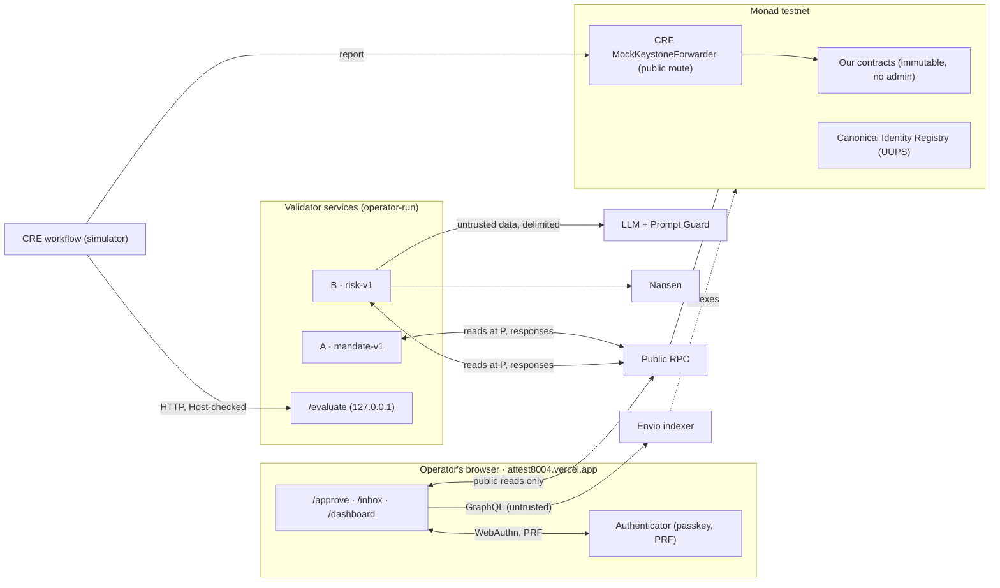

# Threat model

This page sets out what Attest8004 protects, who it protects it from, where the trust boundaries are, and what risk
remains. It covers the system as deployed on Monad testnet ([deployments.md](./deployments.md)), as audited in the
[security review](./security-review.md) at commit `32b55a1`, plus that review's fixes.

How each mechanism works is in [ARCHITECTURE.md](../ARCHITECTURE.md): [§7 trust model](../ARCHITECTURE.md#7-trust-model),
[§8 keys](../ARCHITECTURE.md#8-keys-and-secrets) and
[§9 security design decisions](../ARCHITECTURE.md#9-security-design-decisions). This page links there rather than
repeating it. IDs such as `AUD-03` are the security review's findings.

## 1. Scope

- **In scope:**
  - the contracts in `contracts/src`, as deployed;
  - validators A (`mandate-v1`), B (`risk-v1`) and C (the CRE workflow and `CreValidator`);
  - the SDK and the `verify` CLI;
  - the web app at attest8004.vercel.app (`/approve`, `/inbox`, `/dashboard`);
  - the Envio indexer;
  - the scripts and CI.
- **Out of scope:**
  - SPEC §7's list: tokens, staking and slashing, TEE or zk validators, live BTX, and the rest.
  - The security of the canonical ERC-8004 registries, Monad itself, the browser, the authenticator, Groq, Nansen, Envio
    Cloud, Vercel and CRE's own infrastructure, beyond the assumptions in §7.
- **Funds:** testnet MON only. Where the same code would behave differently with real value, the row says so.

## 2. Assets

| Asset | Where it lives | What protects it |
|---|---|---|
| The vault's MON | `DemoAgentVault` (`AttestGate`) | `execute` needs, from every required validator, a verdict for that exact action (`requestHash`), under the right tag, before the deadline. Each action runs once (`actionHash`). See [§4.4](../ARCHITECTURE.md#44-gate-check-in-order). |
| What an agent may do: its mandate | `MandateRegistry` v2 | Every change needs two factors: the owner's transaction, and a passkey assertion bound to the chain, the registry, the agent, the change and a nonce. |
| Verdict integrity | `ValidationRegistry` | Only the named validator can respond. Anyone can re-run a `mandate-v1` verdict with `verify` (since P12 that includes the pin rule, AUD-02). `risk-v1`'s evidence can be re-checked (since P12 that includes its prompt, AUD-14). |
| Single use of an approved action | `AttestGate.consumed` | Marked before the external call, under a reentrancy guard. Pinned by stateful invariants: each action executes at most once, and MON leaves the vault only through a validated `execute`. |
| Inbox confidentiality | `FindingsBoard` posts | X25519 + HKDF + AES-256-GCM to a key derived from the passkey. The AAD binds each envelope to one post. See [§6](../ARCHITECTURE.md#6-data-formats). |
| Keys | The passkey (authenticator); the inbox key (derived per ceremony, never stored); the operator wallet; the hot, validator, deployer and CRE keys (`.env`, testnet only); the LLM, Nansen and Envio tokens (`.env`) | See [§8](../ARCHITECTURE.md#8-keys-and-secrets). gitleaks runs on every commit and, in CI, over the whole history. |
| The validators' gas budget | The validator A and B services | The (gate, agent) allowlist, checked before any read (AUD-05); a per-agent rate limit; a daily budget; explicit gas caps. |
| Trust API availability | Envio Cloud | Nothing depends on it for safety: the indexer is never a trust root (§6.10). |

## 3. Actors

| Actor | Can | Wants |
|---|---|---|
| **Agent** (its hot key) | Call `forwarder.request` for its own agent, naming any validator. Submit any validated action (`execute` is permissionless). | To run actions outside its mandate |
| **Operator** (agent owner + passkey) | Set, rotate and revoke; approve mandates with the passkey | Nothing harmful: this is the party we protect |
| **Rogue operator key** (a stolen owner wallet, passkey still safe) | Every owner-only call: revoke, `setAgentKey`, approvals, transferring the agent NFT | To widen the mandate, or drain the vault |
| **Validator** (A, B or C's operator) | Answer requests that name it, with any score and evidence | To pass something it shouldn't, or to block |
| **Forger through the mock route** | Call CRE's MockKeystoneForwarder `route()` with any report to `CreValidator` | To plant a verdict as C |
| **RPC** (the public endpoint, or a lying one) | Answer reads wrongly, late or partially | To flip a verdict |
| **Indexer** (Envio, or anything posing as it) | Return wrong, stale or missing rows | To make a reader trust a false verdict or report |
| **LLM prompt-injector** (whoever controls calldata, a target's revert strings, or labels) | Put text in front of `risk-v1`'s model | To make B pass a harmful action |
| **Front-runner** (anyone watching the chain or the mempool) | Copy transactions; claim `requestHash`es first; execute validated actions first | To grief, or to race a withdrawn pass |
| **Identity Registry owner** (canonical ERC-8004, a UUPS proxy) | Upgrade the ownership and approval logic | Nothing against us: this is inherited trust |
| **Hosting and providers** (Vercel, Groq, Nansen, Envio Cloud) | Serve or answer anything they like | Varies |
| **A local process on the operator's machine** | Reach 127.0.0.1 services; read other processes' command lines | To disrupt validator C, or read a key |

## 4. Trust boundaries

| Boundary | What crosses it | The check at it |
|---|---|---|
| Browser and authenticator | WebAuthn assertions; PRF output | The browser fixes the rpId to `attest8004.vercel.app`. The contract checks `rpIdHash`, UP, UV, the challenge and low-s. `crossOrigin` isn't checked on chain: `frame-ancestors 'none'` and `X-Frame-Options: DENY` stop the page being framed. |
| Browser and chain (through the RPC) | Public keys, assertions, logs, statuses | Nothing secret leaves the browser. Reports are re-checked against `getValidationStatus` and the transaction receipt. |
| Agent and gate | `execute(action)` | The gate recomputes `requestHash` for each validator, checks the stored validator, agent, score and tag, the deadline, and single use. |
| Validator service and RPC | Every fact a verdict rests on | Reads are pinned at `P` (5 blocks below finalized). `verify` re-runs them on any node. |
| Validator B and the LLM | Untrusted calldata text, revert strings, labels | Delimiting, Prompt Guard, a score cap the model can't lift, schema validation and scoring in code. A posting gate refuses outputs that break the rubric (AUD-04). |
| CRE workflow and `/evaluate` | A `mandate-v1` answer | The workflow's own reads cross-check the block, the request and the evidence hash. The `Host` header is checked (AUD-11). `verify` proves the score. |
| Mock forwarder and `CreValidator` | Any report, from anyone | Nothing that protects: the mock checks no signature. No gate requires C. |
| Reader and indexer | Rows, counts, posts | Never a trust root: every verdict and post is re-checked on chain. |

## 5. Threats, mitigations and residual risk

### 5.1 Agent (hot key)

| Threat | Mitigation | Residual risk |
|---|---|---|
| Runs an action outside its mandate | Validator A scores it 0. The vault requires A = 100 and B ≥ 80. | Token amounts aren't capped (§6.2) |
| Reuses a pass for another action, gate, chain or validator | `requestHash` binds all of them, and the gate recomputes it | None |
| Replays a consumed action | `actionHash` is marked before the call (invariant-tested) | None |
| Moves the agent NFT | The hot key is no ERC-721 operator. The forwarder forwards only `validationRequest`. | None |
| Names its own address as the validator, answers, and posts a report the inbox's trust rule accepts (AUD-03) | No gate accepts the verdict, since a gate names its validators. `/inbox` lists A, B and C first; other validators' verdicts go in a collapsed, labelled section (at most 5), shown as plain text. | `getSummary(agentId, [], tag)` counts these verdicts, so pass the validators you trust. The junk entries stay in `getAgentValidations` for good, and each `mandate-v1` check and `verify` reads one status per entry. Revoking the key stops the growth but can't undo it. |
| Drains the validators' gas | The (gate, agent) allowlist, before any read (AUD-05); a per-agent rate limit; a daily budget | The budgets are in memory, so a restart resets them. Request spam still arrives through the shared log scan, in order. |

### 5.2 Rogue operator key (owner wallet stolen, passkey safe)

| Threat | Mitigation | Residual risk |
|---|---|---|
| Widens the mandate | Needs a passkey assertion bound to the change and the nonce | None |
| Replays an old, public approval file | The nonce increments on success and on `revokeMandate` | With no mandate set, revoke can't move the nonce. A pending approval can still only set the exact mandate its passkey signed. |
| Registers a rogue hot key | Validators still judge each request against the mandate | Actions within the mandate pass; that is what the mandate allows |
| Transfers the agent | Possible: this is an owner power | The passkey stays bound to the agent, so the new owner can't change the mandate without it |
| Gets actions validated, then the owner revokes (AUD-06) | Revoke stops new approvals | Already-validated actions stay executable by anyone until their deadline: at most an hour, within the mandate they were judged against. A gate-side check is on the roadmap. |

### 5.3 Validators

| Threat | Mitigation | Residual risk |
|---|---|---|
| A lies about a verdict | `verify` re-runs `mandate-v1` from chain state | Detected after the fact, not prevented |
| A pins before its own earlier approval and under-counts the daily spend (AUD-02) | `verify` reports `PIN_SKIPS_APPROVAL`. A's pin waits for its own last approval, read from the chain, so a restarted process can't miss it. | A response still in flight from a crashed process can land after a new pin. `verify` then reports it, which is right. |
| B lies about a verdict | The gate also requires A. B's evidence can be re-checked: the score from the findings, the facts at `P`, the injection rule, the prompt. | Trusting B means trusting its operator for "the model said this" |
| The model skips the simulation or downgrades a severity (AUD-04) | B's posting gate declines `SIMULATION_NOT_RUN`, `FORWARDING_NOT_FLAGGED_HIGH` and `SEVERITY_BELOW_RUBRIC`. A decline posts nothing, so the vault refuses. | A target that detects the simulation (§6.15) |
| A key signs another check's verdict | Each gate requirement carries a `tagHash` | None |
| Withdraws a pass after the fact | The latest response counts | A front-runner can execute the action first |

### 5.4 Forger through the mock route

| Threat | Mitigation | Residual risk |
|---|---|---|
| Plants a verdict as C, or fills C's write-once slot first (§6.4–§6.6) | No gate requires C. `verify` re-runs any C verdict. C's own workflow always pins the request's block. | C's slot can be griefed; this affects C only |

### 5.5 RPC

| Threat | Mitigation | Residual risk |
|---|---|---|
| A lagging node drops a permission event | Every log read ends at `P`, 5 blocks under the reported head | A node lagging more than 5 blocks (§6.3) |
| A lying node | `verify` on another node reports a mismatch | Detected, not prevented |
| A node words an out-of-gas error differently | `mandate-v1` classifies a failed simulation by the RPC's code and message text | An honest verdict could re-verify as a mismatch on such a node. This is the auditor's hunch, unobserved. |
| Rate limiting (`-32011`) | `rateLimitedFetch`, with a doubling wait | Slower checks |

### 5.6 Indexer

See §6.10.

### 5.7 LLM prompt-injector

| Threat | Mitigation | Residual risk |
|---|---|---|
| Instructions hidden in calldata, revert strings or labels | Untrusted data in delimited blocks. Prompt Guard screens every untrusted text field. A flag caps the score at 40, below B's 80, whatever the model says. | An injection that Prompt Guard misses can still sway the model's findings, and A's verdict still applies. Calldata text interleaved with non-printable bytes isn't screened (AUD-09, §6.15). |
| Steers paid Nansen calls with addresses | Tool arguments must already be in scope | A target can widen the scope through what its calls return, such as a revert reason or a reputation answer (AUD-08). Bounded by the tool-call cap, and Nansen is off today. |
| Malformed or out-of-range model output | A strict JSON schema, then zod. Code maps findings to the score. | None |
| Untrusted text rendered as HTML, or as reordering characters | React text nodes only. A source test forbids raw-HTML sinks. Decrypted report text goes through `reportText`, which replaces bidi, C0/C1 and zero-width characters (AUD-03). | The guard tests are lexical; an AST lint is on the roadmap (AUD-12) |

### 5.8 Front-runner

| Threat | Mitigation | Residual risk |
|---|---|---|
| Claims an action's other `requestHash` from the first landed request (AUD-01) | The SDK signs all of an action's requests first and sends them on consecutive nonces, so they land in one block. A claimed hash raises `RequestSquattedError` ("re-salt and retry"). The gate checks the stored validator and agent, so a squatted hash can never pass. | Denial of service, through the mempool or through a pair that still splits (§6.11) |
| Executes a validated action first | The action itself is the authorisation | A withdrawn pass can be front-run |
| Starves a target that tolerates failed sub-calls of gas | Documented for integrators ([§4.4](../ARCHITECTURE.md#44-gate-check-in-order)) | Applies to such targets only, not to `DemoAgentVault` |

### 5.9 Hosting and providers

| Threat | Mitigation | Residual risk |
|---|---|---|
| A compromised web deployment swaps the inbox key the passkey approves (AUD-10) | The footer shows the build's commit, and the docs say to check it or re-derive the key on a second device | The WebAuthn prompt shows no content, so the code must be trusted at the moment of signing |
| An injected script on the passkey origin | A CSP of `'self'` with no third-party code, a Permissions-Policy (AUD-12), no URL input, no storage | The CSP's `'self'` is the only barrier; Trusted Types is on the roadmap |
| Groq or Nansen answer wrongly | Results are recorded in the evidence. On-chain facts are re-read at `P`. | B stays advisory |

### 5.10 Identity Registry owner

See §6.14.

### 5.11 A local process on the operator's machine

| Threat | Mitigation | Residual risk |
|---|---|---|
| Fills `/evaluate`'s queue, or reaches it from a DNS-rebinding page (AUD-11) | A foreign `Host` gets 421. A pin far above the finalized head is answered `unavailable` at once, without taking a queue slot. | A local process can still send valid requests; this delays C only |
| Reads the deployer key from a deploy's command line (AUD-07) | `deploy-testnet.sh` hands the key to forge only in its environment and never sources `.env` | Same-user processes can read another process's environment; the key is testnet-only |

## 6. Open items

Each item says what remains, the residual risk, and its status: **accepted** (documented, and stays), or **roadmap**
([ARCHITECTURE §12](../ARCHITECTURE.md#12-extension-points-and-roadmap)).

### 6.1 `risk-v1`'s ERC-20 blind spot

Tokens moved inside an action show the model each inner call's selector, but never a recipient or an amount. A direct
`transfer` reaches it only as raw calldata hex.
- **Residual risk:** a token drain made inside an allowlisted target passes B unseen in substance.
- **Status:** roadmap. `risk-v2` would decode `Transfer` logs from the call trace. Monad's public RPC serves
  `debug_traceCall` with `withLog`, checked in P12.

### 6.2 `mandate-v1`'s caps cover MON only

`maxValuePerTx` and `maxValuePerDay` bound the action's `value`, not token amounts.
- **Residual risk:** with a token-moving selector allowlisted, the agent can move any amount of that token to allowed
  targets.
- **Status:** accepted, with guidance: allowlist such selectors only for targets you'd trust with the whole balance.

### 6.3 The 5-block lag

Log reads end 5 blocks under the reported head.
- **Residual risk:** a node lagging more than 5 blocks can truncate the last window, and `verify` on a complete node
  then reports a mismatch.
- **Status:** accepted.

### 6.4 Validator C on the mock forwarder

CRE's mock checks no DON signature, and its `route()` is public.
- **Residual risk:** anyone can deliver any report to C.
- **Status:** accepted for testnet: no gate requires C, and every C verdict is re-run by `verify`. The production path
  is on the roadmap: the KeystoneForwarder and the real workflow owner and name
  ([docs/cre.md §11](./cre.md#11-the-production-path)).

### 6.5 Write-once griefing

`CreValidator` refuses a second response.
- **Residual risk:** a forged verdict can fill C's slot first, after which the real workflow can't write. This affects
  C only.
- **Status:** accepted. Such a verdict shows as a mismatch, as "could not verify", or as a match at a later pin (C's
  rule is the request's block).

### 6.6 What consensus covers

Identical aggregation makes the DON agree on what `/evaluate` answered. It doesn't compute the score.
- **Residual risk:** in production a single `/evaluate` would be the one source of the score.
- **Status:** accepted. `verify`'s re-execution proves the score.

### 6.7 `getSummary` mixes validators

`getSummary(agentId, [], "mandate-v1")` counts C's verdicts, and those of any validator an agent's key named (AUD-03),
together with A's.
- **Residual risk:** a summary over all validators is meaningless for trust.
- **Status:** accepted, with guidance: pass the validators you trust. `AttestGate` always names them.

### 6.8 C's spend is judged at the request's block

C's stateless workflow pins at the request's block.
- **Residual risk:** two requests made before C answers the first are each judged against C's spend as of their own
  block.
- **Status:** accepted. `verify` reproduces exactly that, and exempts C from `PIN_SKIPS_APPROVAL`. C's approvals never
  count toward A's spend, and no gate requires C.

### 6.9 The inbox AEAD doesn't authenticate the sender

Anyone with an agent's public inbox key can seal an envelope.
- **What covers it:** the reader's trust rule keeps only a post whose transaction sender is the validator that
  `getValidationStatus` names for that request and agent, and whose receipt carries that exact `FindingsPosted` log.
- **Residual risk:** that proves "sent by the validator this request names", not "sent by a validator you trust". An
  agent's key can name itself (AUD-03).
- **Status:** accepted, mitigated in the UI: `/inbox` lists A, B and C first and labels everything else.

### 6.10 The indexer is not a trust root

No validator, CLI or CRE source reads the indexer. Every indexed verdict and post is re-checked on chain
(`confirmIndexedVerdict`, `confirmIndexedReport`, `postMatchesReceipt`).
- **Residual risk:** a lagging, lying or absent indexer can hide data or show stale data. It can't change a verdict or
  forge a report a reader accepts.
- **Status:** accepted.

### 6.11 `requestHash` squatting

The registry keys requests by hash alone ([spec-notes row 12](./spec-notes.md#differences-and-decisions)). Since P12
the SDK sends an action's requests together (AUD-01).
- **Residual risk:** a repeatable denial of service, by a front-runner reading pending transactions or on a pair that
  still splits across blocks.
- **Status:** roadmap: one transaction for all of an action's requests, through an EIP-7702 batch from the hot key
  (Monad testnet accepts EIP-7702 transactions).

### 6.12 Nansen outputs in public evidence

`risk-v1`'s public evidence records every tool output. No recorded run has had Nansen enabled, so no Nansen data is
public ([docs/mera.md §4](./mera.md#4-what-the-report-contains-and-why-it-is-private)).
- **Decision:** if Nansen is ever enabled, licensed outputs should stay out of public evidence and go only into the
  encrypted report, which needs a `risk-v2`.
- **Status:** roadmap. Until then, keep `NANSEN_API_KEY` unset for any public deployment.

### 6.13 No passkey recovery

A lost passkey locks every mandate, passkey and inbox-key change; revoke still works.
- **Status:** roadmap: a timelocked owner reset.

### 6.14 The Identity Registry is upgradeable

The canonical ERC-8004 Identity Registry is a UUPS proxy, and its owner can change ownership logic.
`ValidationRegistry` pins its address.
- **Status:** accepted: this is the trust any ERC-8004 deployment inherits.

### 6.15 `risk-v1`'s simulation can be fooled

The validators trace an action from the gate at `P`. An allowlisted target that detects the simulation (by
`tx.origin`, gas price, time, state it flips later, or an upgrade) can behave in the trace and forward funds in reality.
Calldata text interleaved with non-printable bytes also escapes screening (AUD-09).
- **Residual risk:** bounded by the mandate's passkey-approved target and selector allowlist, plus its MON caps.
- **Status:** roadmap (`risk-v2`), with guidance: allowlist only targets that are immutable or that you control.

### 6.16 Revoke doesn't cancel validated actions

See §5.2 (AUD-06).
- **Status:** roadmap: a gate that also requires a live mandate at execute time, or an owner-bumped cancellation epoch.
  Either needs a new vault.

## 7. Assumptions

- The browser enforces WebAuthn's origin and rpId rules. `vercel.app` is a public suffix, and Vercel's preview URLs
  are siblings, not subdomains.
- Monad's P256 precompile at `0x0100` behaves as specified: an empty return on failure.
- OpenZeppelin 5.7's `P256` and `WebAuthn` are correct.
- Testnet keys are hackathon-only and funded for a few requests.
- The validator services run one process per key.
